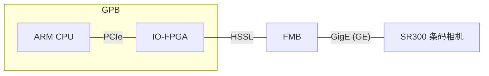

整理下我的ETH驱动的设计文档, 先不要填充其他细节,先整理下文档,同时搜索SR300获取诊断图像是否可以通过TCP协议,目前了解到只有FTP

GPB 上的CPU是一个ARM服务器芯片
FMB是一个FPGA处理板
SR300为基恩士条码扫描相机

SR300分为两种工作模式
1. 业务场景
   1. 功能
      1. 打开相机
      2. 设置参数
      3. 关闭相机
   2. 协议
      1. TCP
      2. 大小应该在一个GE帧或者HSSL帧以内
      3. 一收一发模式
2. 诊断场景
   1. 功能
      1. 读取异常的图像数据,图像为JPG格式
   2. 协议
      1. TCP协议
      2. 需要通过写寄存器的方式通知FMB, 从业务场景切换为诊断场景
      3. 一幅图分成多个GE帧, 每个GE帧分成多个HSSL帧, 每个GE帧带一个中断(每个HSSL帧FLGA_CNT+1)
      4. GPB负责解析GE包, 然后组包成图片
      5. 如果GE包不完整, GPB上的驱动发起重试(3次), SR300需要支持重复读取某一特定的图像
      6. 应该算更为复杂的一收一发模式
