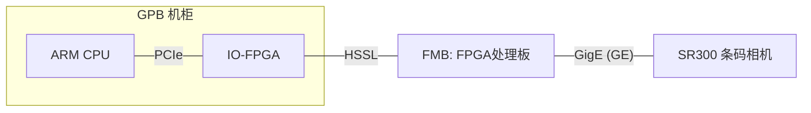
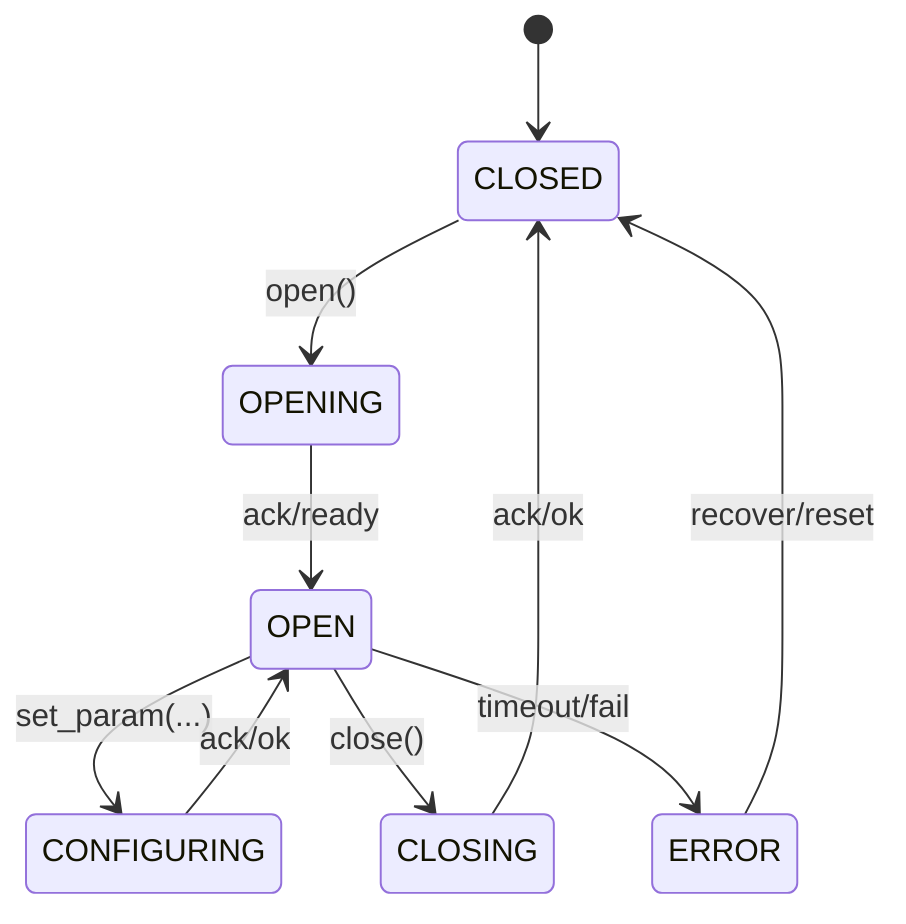
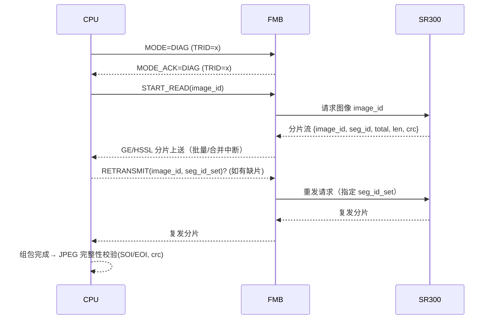

好的，我先把你现有内容按“工程化驱动设计文档”的结构梳理成一版可直接评审的提纲，再给出“问题清单（红/黄/蓝灯）”与“可落地的修改建议”。你可以把下面整段当成 v0.1 草案。

# ETH 驱动设计文档（v0.1 草案）

## 1. 系统与链路拓扑



* CPU：ARM 服务器芯片（运行 ETH 驱动与上层业务/诊断服务）
* IO-FPGA：PCIe 侧桥，HSSL 向 FMB
* FMB：与 SR300 建立以太网（GigE）链路
* SR300：基恩士条码扫描相机

## 2. 术语与假设

* GE：Gigabit Ethernet 以太网帧（L2）
* HSSL：高速串行链路（板间）
* “业务模式”面向配置/触发等小报文；“诊断模式”面向大图像（JPEG）搬运
* 时钟域、缓存一致性、端序：默认小端（Little Endian），需在寄存器/头部中明确

## 3. 模式一：业务场景

### 3.1 功能

* 打开相机
* 设置参数
* 关闭相机
  （均为“一收一发”事务性请求）

### 3.2 报文与约束

* 传输层：**（待决策：端到端 TCP 或自定义 L2/L3）**
* 单次请求/响应尺寸：**不超过 1 个 GE 帧**，同时 **不超过 1 个 HSSL 负载帧**
* 时限：每笔事务超时 T_req（建议 50–200 ms 可配），失败重试 N_req（建议 2–3 次）

### 3.3 业务状态机（CPU 侧）



## 4. 模式二：诊断场景（JPEG 大图）

### 4.1 切换流程

1. CPU 写 FMB 寄存器：`MODE=DIAG`（带事务 ID）
2. FMB 完成模式切换并回写 `MODE_ACK=DIAG & MODE_TRID=...`
3. CPU 发起图像读取会话（image_id）

### 4.2 分片与中断模型

* 一幅图 → 若干 GE 帧；每个 GE 帧 → 若干 HSSL 片段
* **建议** 中断在 **HSSL 聚合后** 或 **GE 粒度** **合并触发**（见§8）
* 每幅图配唯一 `image_id`，每片段配 `seg_id`（0..N-1）

### 4.3 组包与重试

* CPU 侧按 `image_id/seg_id` 组包；缺片触发重传
* 重试策略：同一缺片 `≤3` 次；失败则会话失败并可整幅重取
* 去重：收到重复片段按 `seg_id` 丢弃或覆盖（开关可选）

### 4.4 诊断会话时序



## 5. FMB 寄存器/消息接口（草案）

| 寄存器/消息           | 位段/字段                                      | 说明                       |
| ---------------- | ------------------------------------------ | ------------------------ |
| MODE             | 0:BUSINESS, 1:DIAG                         | 模式选择（只读/读写需定义）           |
| MODE_TRID        | 32b                                        | 模式切换事务 ID                |
| MODE_ACK         | 同上                                         | 模式切换应答                   |
| CMD              | OPEN/CLOSE/SET_PARAM/START_READ/RETRANSMIT | 复用命令通道（或分开寄存器/消息队列）      |
| IMG_ID           | 32b                                        | 当前会话 image_id            |
| SEG_REQ_BASE/NUM | 多段                                         | 缺片起始/数量（或 bitset/bitmap） |
| STAT/INT         | 位标志                                        | RX 就绪/溢出/CRC 错/会话完成 等    |
| DOORBELL         | 写1触发                                       | 触发 FMB 取数或 DMA 推送        |

> 实际实现可改为 **消息队列 + 门铃**（减少轮询）；地址/位宽/原子性需在正式版细化。

## 6. 诊断分片头（建议，网络序）

```c
#pragma pack(push,1)
typedef struct {
  uint8_t  ver;          // 协议版本 (version)
  uint8_t  flags;        // 末片/重发标志等 (flags)
  uint16_t hdr_len;      // 头长 (bytes)
  uint32_t image_id;     // 图像ID (image_id)
  uint32_t seg_id;       // 片段序号 (segment_id)
  uint32_t seg_len;      // 片段数据长度 (bytes)
  uint32_t total_segs;   // 总片段数 (total segments)
  uint32_t img_size;     // 原图总字节数 (JPEG total size)
  uint32_t seg_crc32;    // 片段CRC (crc)
  uint32_t img_crc32;    // 可选：整图CRC（末片校验）
} diag_seg_hdr_t;
#pragma pack(pop)
```

## 7. 驱动分层（CPU 侧）

```
pcie_if (BAR/DMA/MSI-X)
  └─ hssl_if（面向 FMB 的队列/门铃）
      └─ ge_bridge（若有 L2/L3 透传/封装）
          └─ session_mgr（业务/诊断会话）
              ├─ diag_engine（分片/重传/完整性）
              ├─ rx_assembler（环形缓冲、零拷贝 mmap）
              ├─ retry_ctrl（缺片检测、窗口/超时）
              └─ user_api（char dev + ioctl / netlink）
```

## 8. 性能与中断

* **中断合并**：每 N 个 GE 帧或 M µs 聚合触发；N/M 可配（例如 N=8、M=150µs）
* NAPI/轮询：高吞吐时转轮询以降 IRQ/上下文切换
* MTU：业务建议 ≤1500B；诊断建议启用 **Jumbo（如 9KB）** 或在 GE 内继续分片（取决于 FMB 与 SR300 能力）

## 9. 超时/重试与错误码

* 业务：T_req 超时 → 重试 ≤N_req → 报错 `-ETIMEDOUT`
* 诊断：T_seg（片段等待）/T_img（整图）双层超时，缺片重传 ≤3 次，失败 `-EIO`
* 重复片/乱序：按 `image_id/seg_id` 去重/排序
* 错误码：`-EAGAIN/-EBUSY/-ECANCELED/-EINVAL/-EBADMSG` 等分场景定义

## 10. 监控与日志

* 计数器：丢包、重传次数、IRQ 合并比、吞吐/延迟 P50/P99
* 事件：模式切换、会话开始/完成、CRC 错、中止

## 11. 测试矩阵（摘要）

* 功能：开/关/设参、模式切换、整图读取
* 边界：最小/最大图、跨 MTU/Jumbo、随机缺片/乱序/重复
* 压力：高帧率/并发会话深度（若支持）
* 故障：SR300 拉掉、重连；FMB 复位；PCIe 错误注入

---

# 发现的问题清单

## 红灯（必须澄清/修正）

1. **协议层级混淆**：文档写“TCP”，又要求“按 GE 帧完整性解析并驱动重试”。

   * 若 **端到端 TCP（SR300↔CPU）**：TCP 已保证可靠性，驱动不应以 GE 帧为单位做重组/重试。
   * 若 **自定义 L2/L3**：就不应称 TCP，需自带可靠传输与分片头。
     → **必须在 A/B 两种架构中二选一（见下方建议）。**
2. **重试对象不明确**：说“重复读取某一特定图像”，但缺少 `image_id` 等唯一标识，以及“重传片段”还是“整图重抓”的明确语义与接口。
3. **中断过于频繁**： “每个 GE 帧一个中断”在大图/高帧率下会造成 **IRQ 风暴**，需要合并或转 NAPI 轮询。
4. **寄存器/握手缺失**：模式切换、会话开始/结束、缺片请求等，没有地址、位域、ACK/忙状态与时序，存在竞态风险。
5. **完整性校验缺失**：JPEG 仅有 SOI/EOI 并不足以兜底，缺少分片 CRC、整图 CRC 或哈希。

## 黄灯（重要改进）

1. **尺寸与 MTU 未定**：业务报文“在一个 GE/HSSL 帧内”需给出 **MTU/Jumbo** 约束；诊断模式要么开 Jumbo，要么明确 GE 级分片策略。
2. **并发/队列深度未定义**：所谓“一收一发”是**严格串行**还是允许 **pipeline**？允许多少未决请求？背压策略？
3. **时序/超时策略未量化**：请求/片段/整图超时、重试退避、失败阈值、恢复策略未给出数值。
4. **乱序/重复处理**：未定义是否可能乱序、如何去重、是否接受重复最后覆盖。
5. **端序/对齐/缓存一致性**：PCIe/HSSL/CPU 对齐与 cache 写回策略未说明。
6. **拼写**：`FLGA_CNT+1` 疑似 `FLAG_CNT+1`，计数定义不清。

## 蓝灯（可优化/建议）

1. **日志与指标**：缺标准化计数器与可观测性项。
2. **安全/版本化**：未给协议 `ver` 字段、兼容性策略。
3. **扩展点**：未来多相机/多会话、多流隔离未预留。

---

# 可落地的修改建议

## 方案选择（强烈建议先锁定其一）

**A. 端到端 TCP 方案（更简单，复用可靠性）**

* SR300↔CPU 建立 TCP（FMB/IOFPGA 做透传/桥接）；
* 业务与诊断都走 TCP 流：业务小包直接 req/resp；诊断大图在 TCP 流内做**应用层分片头**（避免 GE/MTU 细节外泄）；
* CPU 不再以 GE 帧为单位做重试；仅在应用层检测缺片/完整性并**在应用层重拉 image_id**。
* FMB 主要提供 **DMA/门铃/中断合并** 和模式寄存器。

**B. 自定义可靠传输（Raw L2/L3，无 TCP）**

* 明确定义上文 `diag_seg_hdr_t`；所有分片带 `image_id/seg_id/total/img_crc/seg_crc`；
* 缺片由 CPU 通过寄存器/消息 `RETRANSMIT(image_id, seg_set)` 指定；
* GE/HSSL 分片/合并在 FMB 完成，CPU 面向“分片流”；
* 业务小包走“单帧事务通道”，诊断走“分片通道”。

> 两方案都要：**中断合并、会话/超时/重试策略、寄存器握手、监控指标**。

## 关键参数（建议初值）

* 业务超时 T_req=100ms，重试 N_req=2；
* 诊断：T_seg=20ms、T_img=3s，缺片重试 ≤3；
* 中断合并：`N=8` 或 `M=150µs`，两者择一触发；
* MTU：业务 1500B；诊断优先 Jumbo 9000B（若不可用，则继续 GE 侧分片）。

## 寄存器/消息最小集（示例）

* `MODE`/`MODE_TRID`/`MODE_ACK`
* `CMD`：`OPEN/CLOSE/SET_PARAM/START_READ/RETRANSMIT/ABORT`
* `IMG_ID`、`SEG_BITMAP_BASE + LEN`（或稀疏列表）
* `STAT/INT`：`RX_READY, BUF_LOW, CRC_ERR, IMG_DONE, MODE_DONE`
* `DOORBELL`：写1触发取数/下行

## 用户态接口

* 字符设备 `/dev/sr300_eth` + `ioctl`：

  * `IOCTL_MODE_SET/GET`、`IOCTL_OPEN/CLOSE/SET_PARAM`
  * `IOCTL_DIAG_START(image_id)`、`IOCTL_DIAG_RETRANS(image_id, seg_set)`
  * `mmap` 只读环形缓冲导出 JPEG 数据；`poll` 获取事件
* 或 **netlink** 发布事件与统计

## 组包与重试（简伪码）

```c
// (algorithm: sliding window + bitmap missing segments)
for (seg_id in 0..total_segs-1) bitmap[seg_id]=0;
deadline_img = now()+T_img;

while (!all_segments_received() && now()<deadline_img) {
  rx = poll_ring(T_seg);
  for (each seg in rx) {
    if (crc_ok(seg) && !bitmap[seg.id]) {
      copy_to_image(seg);
      bitmap[seg.id]=1;
    }
  }
  if (missing_count(bitmap) && timeout_on_missing()) {
    build_seg_set_from_bitmap_missing();
    if (++retry_cnt > 3) break;
    ioctl_retrans(image_id, seg_set);
  }
}
if (!all_segments_received()) return -EIO;
if (!jpeg_integrity_ok(image)) return -EBADMSG;
return 0;
```

## 可观测性（最小指标）

* `rx_bytes, rx_frames, irq_count, irq_coalesce_hits`
* `img_ok, img_fail, seg_retx, crc_err, timeout_req/seg/img`
* `p50/p99 img_latency, cpu_util`

---

如果你愿意，我可以把上面这份草案直接导出成一份 Markdown 文档（含更详细的寄存器表与错误码枚举），并且分别给出 **方案A（端到端 TCP）** 与 **方案B（自定义可靠传输）** 的最小可行差异清单，便于评审对齐。
