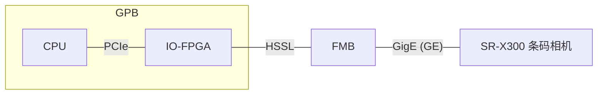

诊断场景的TCP或者FTP模式可行吗
## ETH 驱动设计文档（整理版）

### 1. 系统拓扑

### 2. 硬件/模块说明

- **GPB / CPU**：ARM 服务器芯片（运行驱动与上层逻辑）。
- **IO-FPGA**：通过 PCIe 与 CPU 互连；对下通过 HSSL 与 FMB 互连。
- **FMB**：FPGA 处理板；对下与 SR-X300 通过 GigE（GE）互连。
- **SR-X300**：基恩士条码扫描相机。

### 3. SR-X300 工作模式划分

SR-X300 分为两种工作模式：

1. **业务场景**
2. **诊断场景**

---

## 4. 业务场景（TCP，一收一发）

### 4.1 功能

1. 打开相机
2. 设置参数
3. 关闭相机

### 4.2 协议与约束

- 协议：TCP
- 报文大小：应在一个 **GE 帧** 或一个 **HSSL 帧** 以内
- 交互模式：一收一发模式

---

## 5. 诊断场景（读取异常图像，JPG）

### 5.1 功能

- 读取异常的图像数据（图像为 JPG 格式）

### 5.2 协议与切换

- 协议：TCP
- 场景切换：通过“写寄存器”的方式通知 FMB，从业务场景切换为诊断场景

### 5.3 分帧与中断关系

- 一幅图分成多个 **GE 帧**
- 每个 **GE 帧** 再分成多个 **HSSL 帧**
- 每个 **GE 帧** 带一个中断（每个 HSSL 帧 `FLGA_CNT + 1`）

### 5.4 GPB 侧处理职责

- GPB 负责解析 GE 包，并组包成图片

### 5.5 重试与一致性要求

- 若 GE 包不完整：GPB 上的驱动发起重试（3 次）
- SR-X300 需要支持“重复读取某一特定图像”
- 交互模式：应属于更复杂的一收一发模式

