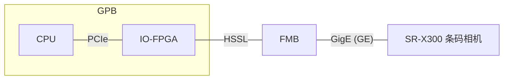

驱动设计可行吗
## ETH 驱动设计文档

### 1. 系统拓扑

```mermaid
graph LR
subgraph GPB[GPB]
CPU[CPU] ---|PCIe| IOFPGA[IO-FPGA]
end
IOFPGA ---|HSSL| FMB[FMB]
FMB ---|"GigE (GE)"| SR-X300[SR-X300 条码相机]
```

### 2. 硬件/模块说明

- **GPB / CPU**：ARM 服务器芯片（运行驱动与上层逻辑）。
- **IO-FPGA**：通过 PCIe 与 CPU 互连；对下通过 HSSL 与 FMB 互连。
- **FMB**：FPGA 处理板；对下与 SR-X300 通过 GigE（GE）互连。
- **SR-X300**：基恩士条码扫描相机。

### 3. SR-X300 工作模式划分

SR-X300 分为两种工作模式：

1. **业务场景**
2. **诊断场景**

---

## 4. 业务场景（TCP，一收一发）

### 4.1 设置功能

1. 打开相机
2. 设置参数
3. 关闭相机
TCP/IP协议, 一个 **GE 帧** 或一个 **HSSL 帧** 以内

### 4.2 业务功能

1. 条码扫描
TCP/IP协议 与FTP协议混合
FMB逻辑透传扫描结果(只有一帧TCP/IP协议帧)与图片(多个FTP协议帧,数量不变)
FMB逻辑每DMA搬运一帧,更新计数, 并在上一帧尾继续DMA搬运下一帧
驱动负责扫描结果结果的解析 (只有一帧TCP/IP协议帧)与图片帧解析与拼接(多个FTP协议帧,数量不变)

### 5.4 GPB 侧驱动处理职责

- GPB驱动 负责解析 GE 包，并组包成图片

### 5.5 重试与一致性要求

- 若 GE 包不完整：GPB 上的驱动发起重试（3 次）
- SR-X300 需要支持“重复读取某一特定图像”
- 交互模式：应属于更复杂的一收一发模式

