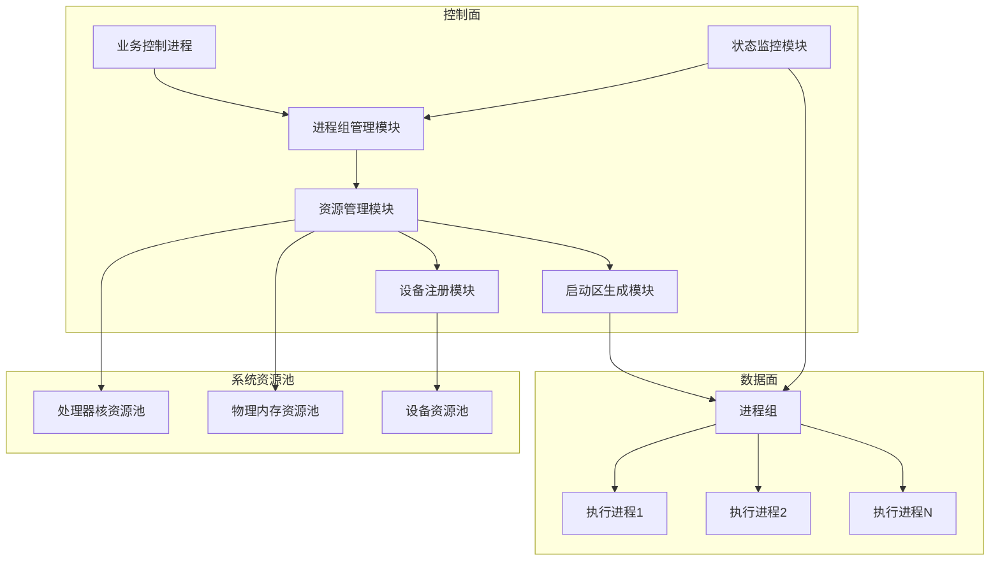
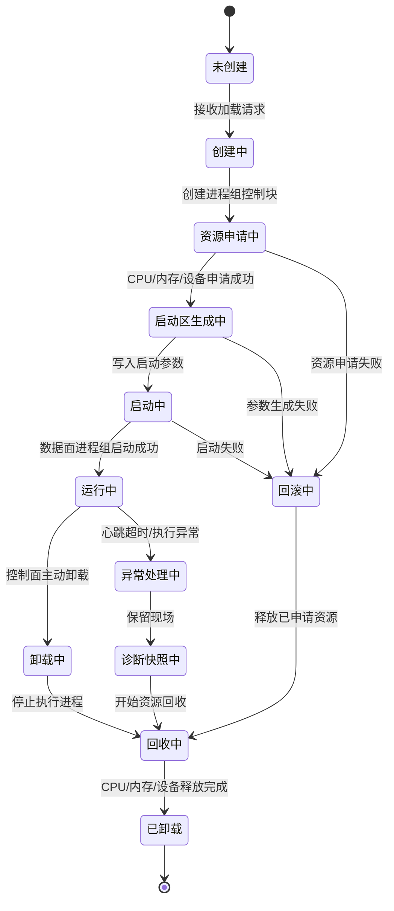
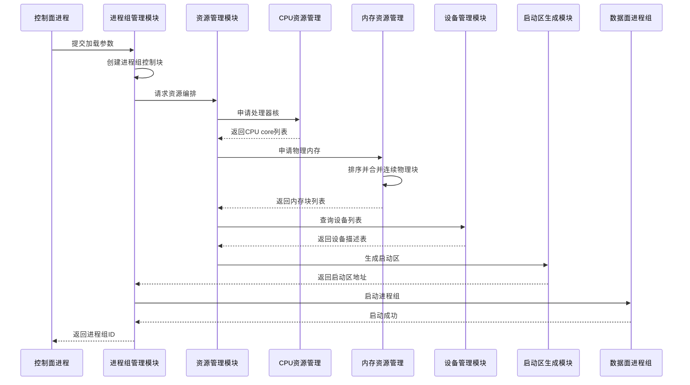
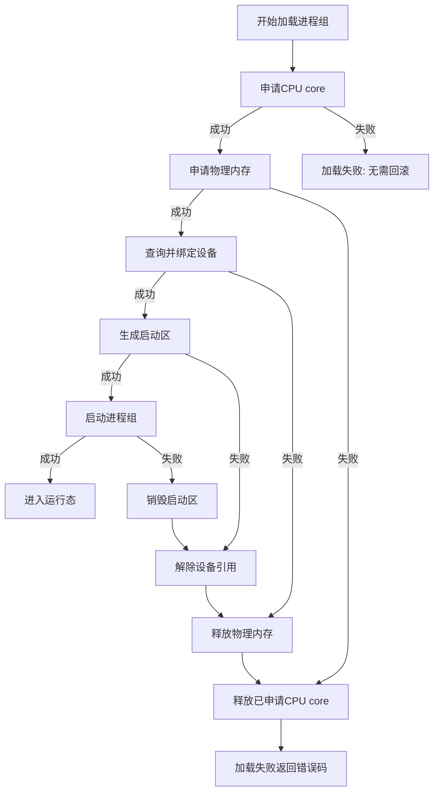
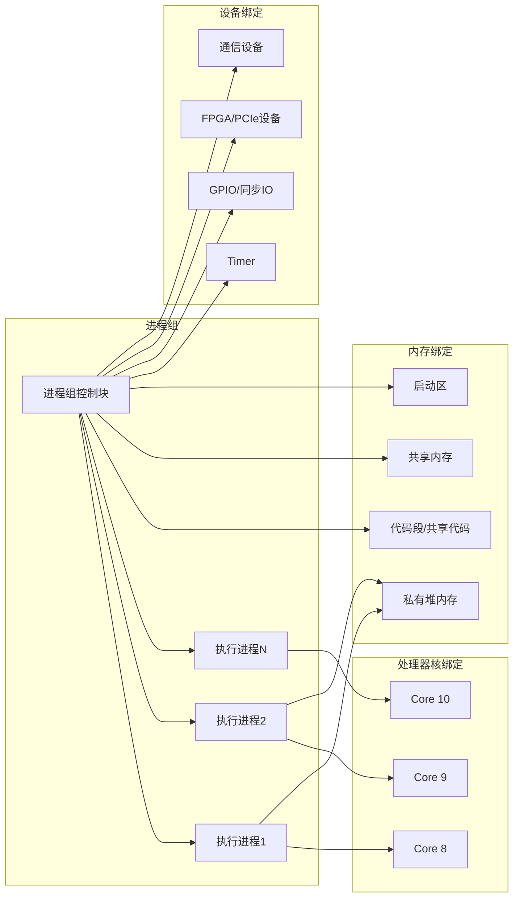
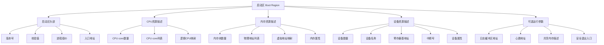
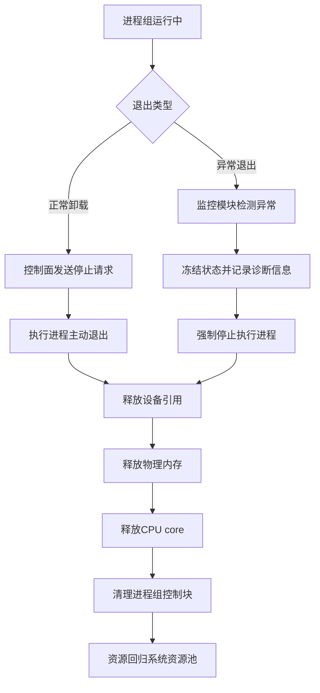
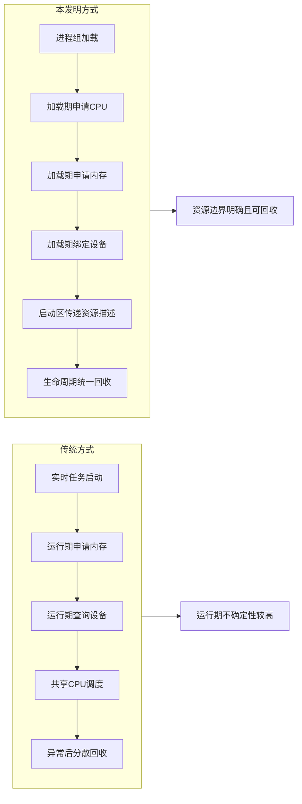

可以。这个选题建议多放图，而且**不只是画流程图**，最好形成这几类图：

1. **总体架构图**：说明控制面、资源管理、进程组、硬件资源之间的关系。
2. **生命周期状态机图**：突出“进程组生命周期”这个主保护点。
3. **加载时序图**：把 CPU、内存、设备、启动区生成串起来。
4. **异常回滚图**：强化可靠性和工程闭环。
5. **资源绑定关系图**：说明一个进程组独占哪些资源。
6. **启动区内容图**：体现设备列表、内存块、CPU 列表如何传递给数据面。

这些图都能支撑第一篇的核心：**在进程组加载、运行、卸载、异常退出过程中，对处理器核、物理内存和设备资源进行确定性编排**。这个方向和原文里 CPU hotplug 获取 offline cores、伙伴系统申请物理内存、设备列表写入 BOOT 区、进程组卸载后释放资源的设计基础一致。

下面可以直接追加到“本发明创造的主要实施方式”里。

---

## 补充图 1：系统总体架构图

**图文说明：**
控制面并不直接让执行进程临时申请资源，而是先由进程组管理模块创建进程组控制块，再由资源管理模块统一申请处理器核、物理内存和设备资源。启动区生成模块将这些资源描述写入启动区，数据面进程组启动后只使用启动区声明的资源集合。

---

## 补充图 2：进程组生命周期状态机图

**图文说明：**
本发明的关键不是“启动一个实时任务”，而是把进程组从未创建、加载、运行、卸载、异常回收的完整生命周期都纳入资源编排。这样可以保证异常路径和正常路径共用同一套资源回收逻辑，避免 CPU 未归还、内存泄漏或设备占用残留。

---

## 补充图 3：进程组加载时序图

**图文说明：**
该时序体现了“加载期资源固化”。CPU、内存、设备并不是在执行进程运行后再动态发现，而是在启动前统一整理成启动区，由数据面进程组按启动区执行。

---

## 补充图 4：资源申请失败回滚图

**图文说明：**
该图适合放在“其他实施方式：资源申请失败回滚”下。它强调本发明不是简单顺序申请资源，而是支持按相反顺序确定性回滚，避免半加载状态。

---

## 补充图 5：进程组与资源绑定关系图

**图文说明：**
一个进程组不是单一进程，而是一个资源容器式的执行单元。进程组控制块记录其 CPU core 列表、内存块列表、设备列表和启动参数。进程组卸载时，也依据这些记录统一释放资源。

---

## 补充图 6：启动区数据结构示意图

**图文说明：**
启动区是控制面向数据面传递资源编排结果的核心载体。它把 CPU、内存、设备和可选运行参数固化成数据面可直接读取的结构，避免数据面启动后再走复杂查询路径。

---

## 补充图 7：正常卸载与异常回收对比图

**图文说明：**
正常卸载和异常回收最终进入同一套资源释放路径。区别在于异常回收会先冻结状态并记录诊断信息，再进入资源释放流程。这能增强专利里的可靠性论证。

---

## 补充图 8：资源确定性编排前后对比图

**图文说明：**
该图适合放在“现有技术不足”和“有益效果论证”之间。它直观说明：传统方式的问题是资源行为发生在运行期，而本发明把资源行为提前到加载期，并把释放行为绑定到生命周期结束。

---

## 可以插入到原文的位置

我建议这样安排：

* **发明背景与现有技术**：放“图 8：传统方式与本发明方式对比图”
* **主要创新技术点说明**：放“图 1：系统总体架构图”“图 2：生命周期状态机图”
* **主要实施方式**：放“图 3：加载时序图”“图 5：资源绑定关系图”“图 6：启动区结构图”
* **其他实施方式**：放“图 4：资源申请失败回滚图”“图 7：正常卸载与异常回收对比图”

如果只保留 4 张，优先级是：**图 1、图 2、图 3、图 6**。这四张最能支撑独立权利要求。
