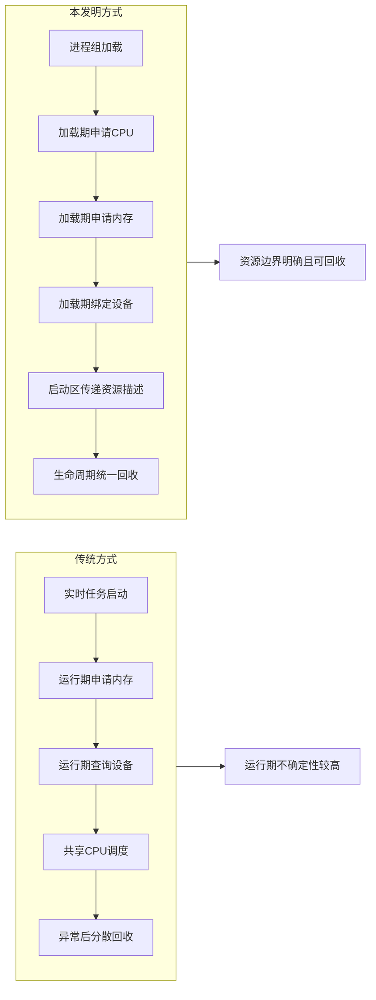
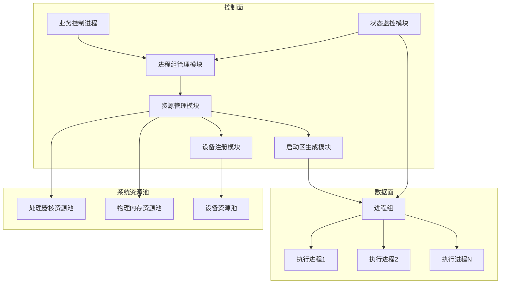
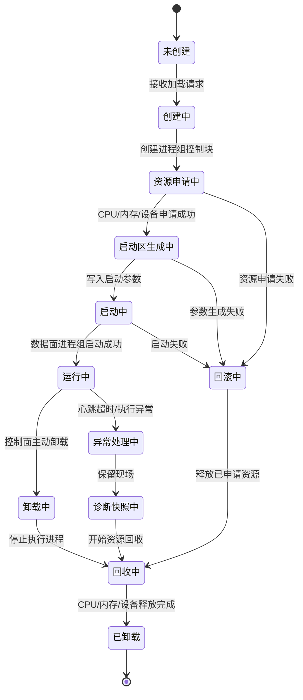
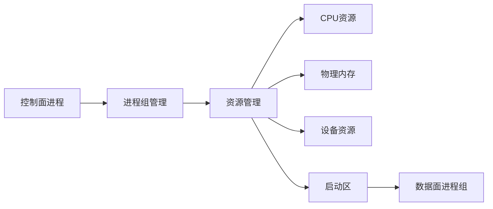
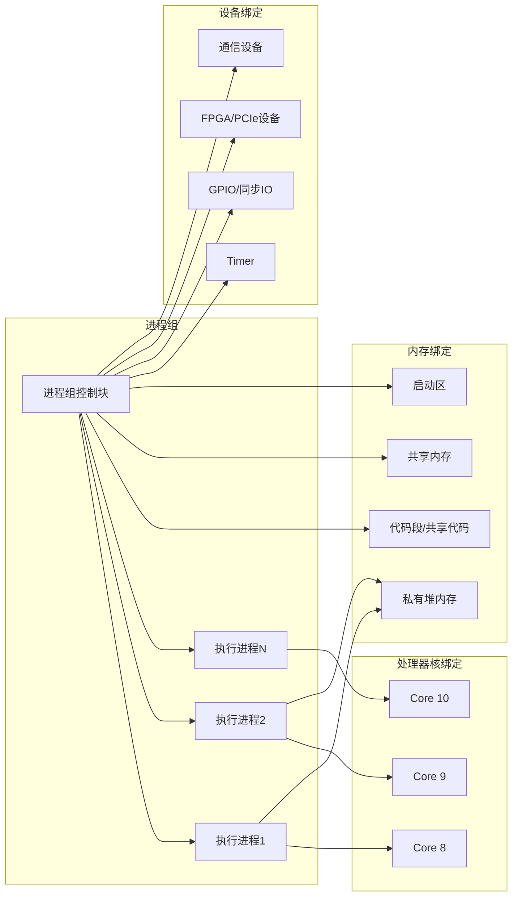
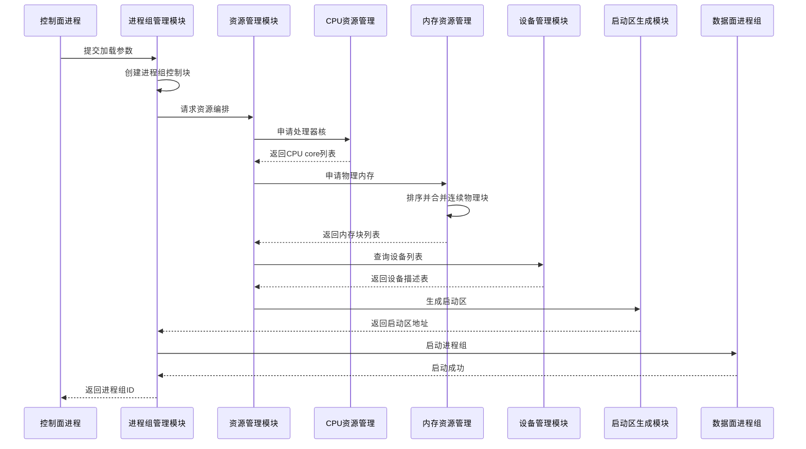
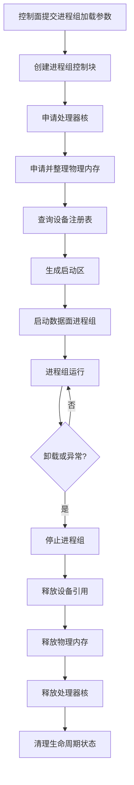
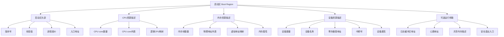
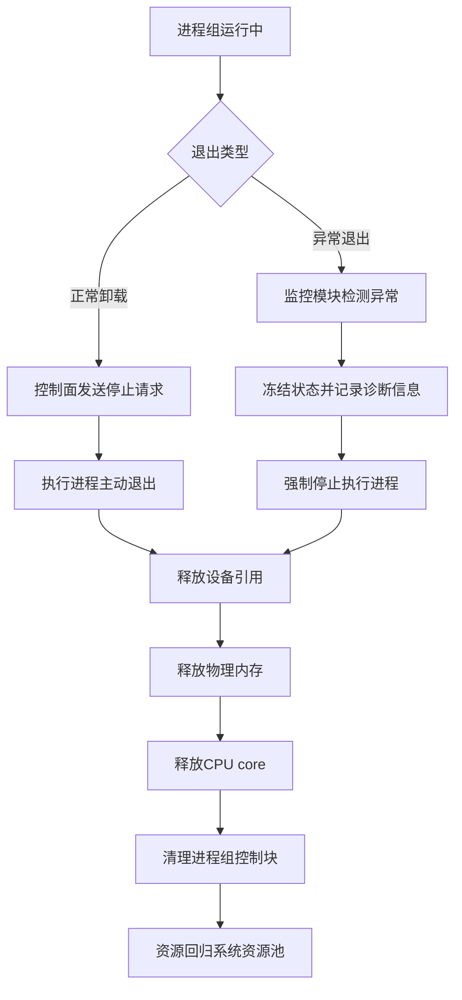
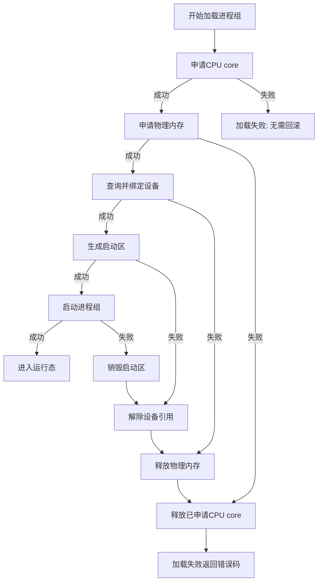

下面是按 `模板.md` 的章节结构压缩后的 **PPT 可直接粘贴版**。本版以 `pata1.md` 为技术依据，融合其中的 Mermaid 图，并将 `pata1提示词.md` 中的正式附图生成提示词放入对应正式 Slide。

---

## Slide 1｜标题页

**一种基于进程组生命周期的处理器核、内存与设备资源确定性编排方法及系统**

**核心一句话：**
将 CPU core、物理内存、设备资源和启动参数绑定到进程组完整生命周期，实现加载期固化、运行期隔离、退出期确定性回收。

**适用场景：**
半导体装备、精密运动控制、实时采样、低时延通信、多核异构执行环境。

---

## Slide 2｜发明背景与问题

**背景：**
高精度运动控制、伺服控制、同步采样等场景要求关键执行任务具备确定性响应能力。

**现有问题：**

* 通用 OS / 普通 RTOS 环境中，任务调度、tick、中断迁移、缺页、驱动栈都会引入抖动。
* CPU、内存、设备通常由不同子系统分散管理，难以形成统一低时延边界。
* 若关键任务运行后再申请资源，会拉长关键路径并放大最坏时延。
* 异常退出后，CPU、内存、设备和监控状态可能回收不一致。

**PPT 图示 / Mermaid 图：**

**图文说明：**
传统方式的问题是资源行为发生在运行期，而本方案把资源行为提前到加载期，并把释放行为绑定到生命周期结束。

**图片生成提示词：**

> 黑白专利对比图，左侧为传统方式：实时任务启动、运行期申请内存、运行期查询设备、共享 CPU 调度、异常后分散回收；右侧为本发明方式：进程组加载、加载期申请 CPU、加载期申请内存、加载期绑定设备、启动区传递资源描述、生命周期统一回收；使用方框和箭头，突出运行期不确定性较高与资源边界明确且可回收的对比，无颜色、无渐变、工程线框风格。

---

## Slide 3｜现有技术不足

**主要不足：**

1. **生命周期解耦**
   资源申请、任务启动、异常回收没有绑定到统一进程组对象。

2. **处理器核隔离不彻底**
   普通绑核或实时优先级不能消除系统调度、tick 和非关键中断干扰。

3. **内存缺少加载期预编排**
   运行期缺页、动态分配、物理内存碎片会放大最坏情况时延。

4. **设备传递路径不稳定**
   运行期查询设备、动态枚举和复杂驱动路径增加不确定性。

5. **异常回收不一致**
   进程异常后可能残留 CPU 占用、内存泄漏、设备引用和监控状态。

---

## Slide 4｜主要创新点

**核心创新：以进程组为资源编排单位。**

本方案不是单独“绑核”、不是单独“预分配内存”，而是将多个底层资源动作统一绑定到进程组生命周期中。

**创新点压缩版：**

* **进程组级资源编排**：以 Process Group 为单位申请、绑定、运行和释放资源。
* **加载期资源固化**：启动前完成 CPU、内存、设备、启动区参数配置。
* **处理器核剥离**：运行期使关键执行进程脱离普通 OS 调度干扰。
* **物理内存预申请与合并**：提前申请物理页块，并合并连续物理块。
* **设备注册表 + 启动区传递**：设备信息在加载期写入启动区，数据面直接使用。
* **正常 / 异常路径统一回收**：卸载、异常、回滚共用资源释放逻辑。

**PPT 图示 / Mermaid 图 1：系统总体架构图**

**图文说明：**
控制面先由进程组管理模块创建进程组控制块，再由资源管理模块统一申请处理器核、物理内存和设备资源。启动区生成模块将资源描述写入启动区，数据面进程组启动后只使用启动区声明的资源集合。

**图片生成提示词：**

> 黑白专利线稿风格，系统架构图，左侧为控制面，包含业务控制进程、进程组管理模块、资源管理模块、状态监控模块；中间为资源编排层，包含 CPU 管理、内存管理、设备管理、启动区生成模块；右侧为数据面进程组，包含多个执行进程；下方为资源池，包含处理器核资源池、物理内存资源池、设备资源池；使用方框和箭头，简洁、清晰、无渐变、无装饰背景。

**PPT 图示 / Mermaid 图 2：进程组生命周期状态机图**

**图文说明：**
本方案把进程组从未创建、加载、运行、卸载、异常回收的完整生命周期纳入资源编排，使异常路径和正常路径共用同一套资源回收逻辑。

**图片生成提示词：**

> 黑白专利状态机图，展示进程组生命周期状态转换，包括未创建、创建中、资源申请中、启动区生成中、启动中、运行中、卸载中、异常处理中、回滚中、回收中、已卸载；用箭头表示正常加载路径、正常卸载路径和异常回收路径；线条清晰，节点为圆角矩形，无颜色填充。

---

## Slide 5｜总体技术方案

**系统组成：**

* **控制面进程**：发起加载、卸载、状态查询和异常处理。
* **进程组管理模块**：维护进程组 ID、状态机、生命周期和运行状态。
* **CPU 资源管理模块**：申请 / 释放处理器核。
* **内存资源管理模块**：申请、合并、记录和释放物理内存块。
* **设备资源管理模块**：维护设备注册表，按设备名查询设备描述。
* **启动区生成模块**：生成 CPU、内存、设备、入口地址等启动参数。
* **数据面进程组**：在已编排资源集合上执行低时延业务。

**PPT 图示 / Mermaid 图 1：总体技术方案简图**

**PPT 图示 / Mermaid 图 2：进程组与资源绑定关系图**

**图文说明：**
一个进程组不是单一进程，而是一个资源容器式执行单元。进程组控制块记录 CPU core 列表、内存块列表、设备列表和启动参数，卸载时依据这些记录统一释放资源。

**图片生成提示词：**

> 黑白专利资源绑定关系图，中心为进程组控制块，连接多个执行进程；右侧或周围分别展示处理器核绑定、内存绑定和设备绑定，处理器核包含 Core 8、Core 9、Core 10，内存包含代码段、私有堆内存、共享内存、启动区，设备包含 Timer、GPIO 或同步 IO、FPGA 或 PCIe 设备、通信设备；使用方框和箭头，线框工程图风格，无颜色。

---

## Slide 6｜关键加载流程

**加载期完成资源固化：**

1. 控制面提交进程组名称、镜像路径、CPU 数量、内存规格、设备列表。
2. 创建进程组控制块，生成进程组 ID。
3. 申请处理器核，并从通用 OS 侧剥离。
4. 申请物理内存页块，排序并合并连续物理块。
5. 查询设备注册表，生成设备描述表。
6. 将 CPU、内存、设备、入口地址等写入启动区。
7. 启动数据面进程组，进入运行态。

**一句话总结：**
CPU、内存、设备不是在执行进程运行后再动态发现，而是在启动前统一整理成启动区。

**PPT 图示 / Mermaid 图 1：加载时序图**

**图文说明：**
该时序体现“加载期资源固化”。CPU、内存、设备并不是在执行进程运行后再动态发现，而是在启动前统一整理成启动区。

**PPT 图示 / Mermaid 图 2：加载阶段资源编排流程图**

**图片生成提示词：**

> 黑白专利流程图，展示进程组加载阶段资源编排流程：提交加载参数、创建进程组控制块、申请处理器核、申请物理内存、排序并合并连续物理块、查询设备注册表、生成启动区、启动数据面进程组、返回进程组 ID；每个步骤为矩形框，箭头从上到下，结构清晰。

---

## Slide 7｜运行与卸载机制

**运行期原则：**

* 数据面进程只访问启动区声明的资源集合。
* 关键执行进程优选独占物理 CPU core。
* 关键路径不再进行大规模内存申请、设备枚举和资源发现。
* 控制面通过状态查询、心跳、共享内存或轻量通知进行监控。

**卸载 / 异常回收流程：**

1. 控制面发起卸载，或监控模块检测异常。
2. 停止数据面业务循环，进入安全退出状态。
3. 解除设备引用。
4. 按内存块列表释放物理内存。
5. 将处理器核释放回通用 OS。
6. 清理进程组控制块、启动区和监控状态。

**PPT 图示 / Mermaid 图 1：启动区数据结构示意图**

**图文说明：**
启动区是控制面向数据面传递资源编排结果的核心载体，把 CPU、内存、设备和可选运行参数固化成数据面可直接读取的结构。

**图片生成提示词：**

> 黑白专利数据结构图，一个大矩形表示启动区 Boot Region，内部划分为启动区头部、CPU 资源描述、内存资源描述、设备资源描述、可选运行参数五个区域；每个区域包含若干字段框，例如版本号、校验值、进程组 ID、入口地址、CPU core 数量、CPU core 列表、物理地址列表、虚拟地址映射、设备名称、寄存器基地址、中断号、日志缓冲区地址、心跳地址；线框风格，结构规整。

**PPT 图示 / Mermaid 图 2：正常卸载与异常回收对比图**

**图文说明：**
正常卸载和异常回收最终进入同一套资源释放路径。区别在于异常回收会先冻结状态并记录诊断信息，再进入资源释放流程。

**图片生成提示词：**

> 黑白专利流程图，展示正常卸载与异常回收对比；从进程组运行中进入退出类型判断，正常卸载路径包括控制面发送停止请求、执行进程主动退出、释放设备引用、释放物理内存、释放 CPU core、清理进程组控制块；异常退出路径包括监控模块检测异常、冻结状态并记录诊断信息、强制停止执行进程，然后汇入同一资源释放路径；使用矩形、菱形和箭头，结构清晰。

---

## Slide 8｜其他实施方式

**可扩展实施方式：**

* **资源描述表复用**：保存 CPU、内存、设备、入口信息，支持重复加载。
* **异常分阶段回收**：冻结状态、采集诊断快照，再释放资源。
* **多进程组隔离**：不同进程组拥有独立 CPU 列表、内存块和设备列表。
* **控制面保留核策略**：预留部分 CPU core 给控制面，其余由资源管理模块分配。
* **启动区扩展字段**：可加入中断号、定时器、心跳、日志、共享内存、安全退出入口。
* **失败回滚机制**：任一加载步骤失败，则按相反顺序释放已申请资源。
* **按业务角色划分进程组**：运动控制、采样、通信、诊断分别独立编排。

**PPT 图示 / Mermaid 图 1：资源申请失败回滚图**

**图文说明：**
该图强调本方案不是简单顺序申请资源，而是支持按相反顺序确定性回滚，避免半加载状态。

**图片生成提示词：**

> 黑白专利流程图，展示资源申请失败回滚流程；开始加载进程组后依次申请 CPU core、申请物理内存、查询并绑定设备、生成启动区、启动进程组；每个步骤包含成功路径和失败路径，失败时按相反顺序释放已申请资源，包括释放 CPU core、释放物理内存、解除设备引用、销毁启动区，最后返回加载失败错误码；使用矩形、分支箭头和回退箭头，无颜色。

**PPT 图示 / 图片生成提示词 2：CPU core 剥离、绑定与回归图**

> 黑白专利示意图，左侧为通用操作系统处理器核资源池，包含 Core0 到 Core7；中间为资源管理模块，标注处理器核剥离与绑定；右侧为数据面进程组，占用 Core4 到 Core7；下方用回退箭头表示进程组卸载后 Core4 到 Core7 回归通用操作系统资源池；使用方框、箭头和简单 CPU core 图标，不使用颜色。

**PPT 图示 / 图片生成提示词 3：物理内存块申请与合并图**

> 黑白专利流程示意图，展示物理内存资源编排过程；第一行表示从伙伴系统申请多个物理页块，页块标注不同物理地址；第二行表示按物理地址排序；第三行表示将连续物理页块合并成大内存块；第四行表示生成进程组内存块列表；使用矩形块、编号和箭头，工程图风格。

**PPT 图示 / 图片生成提示词 4：设备注册与启动区传递图**

> 黑白专利流程示意图，左侧为设备驱动注册设备，进入设备注册表；中间为进程组加载请求，包含设备名称列表；右侧为启动区 Boot Region，写入设备名称、设备标识、寄存器基地址、中断号和设备属性；最右侧为数据面进程组读取启动区中的设备描述；使用方框和箭头，突出设备信息在加载期传递，无颜色、无装饰背景。

---

## Slide 9｜有益效果

**本方案的主要收益：**

1. **降低运行期不确定性**
   资源在加载期完成编排，减少运行期申请和动态发现。

2. **提高低时延执行环境可构造性**
   关键执行单元以可重复、可检查、可回收方式构造。

3. **减少资源竞争**
   CPU、内存和设备在加载阶段绑定到进程组。

4. **提高异常恢复能力**
   异常退出后可依据控制块记录进行确定性回收。

5. **增强系统扩展性**
   不同业务子系统可通过统一接口配置不同资源规格。

6. **便于形成性能与安全边界**
   每个进程组资源边界明确，便于分析最坏时延和故障影响范围。

---

## Slide 10｜发明创造价值自评

| 维度       |  分数 | PPT版理由                                                  |
| -------- | --: | ------------------------------------------------------- |
| 创新性      | 4.4 | 将 CPU hotplug、内存预分配、设备注册统一绑定到进程组生命周期，形成确定性资源编排闭环。       |
| 市场价值     | 4.5 | 适用于光刻机、半导体装备、高速运动控制、实时采样和低时延通信平台。                       |
| 技术价值     | 4.8 | 解决资源隔离、确定性构造、运行期抖动和异常回收问题。                              |
| 可规避程度    | 4.1 | 若覆盖“生命周期 + CPU 剥离 + 物理内存预申请 + 启动区传递 + 回收”，较难通过替换单一模块规避。 |
| 侵权证据可获得性 | 3.2 | 可通过加载参数、进程组状态、CPU online/offline、内存块记录、启动区和异常回收行为辅助证明。  |

---

## 一页极简版｜适合放最后总结页

**本发明将 CPU、内存、设备和启动参数统一绑定到进程组生命周期。**

**核心机制：**

* 加载期：申请 CPU、内存、设备，生成启动区。
* 运行期：数据面只使用已声明资源，减少动态不确定性。
* 卸载期：按进程组控制块统一释放资源。
* 异常期：正常卸载与异常回收共用确定性回收路径。

**核心价值：**
构造稳定、隔离、可回收的低时延执行环境，降低运行期抖动，提高系统可靠性与扩展性。
