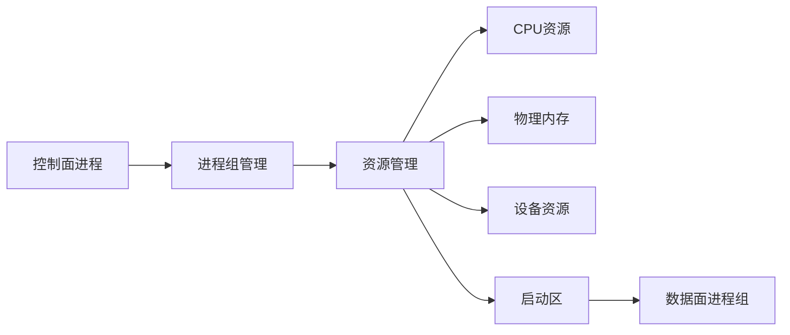

下面是按 `模板.md` 的章节结构压缩后的 **PPT 可直接粘贴版**。我保留了 `pata1` 的主保护点：**以进程组生命周期统一编排 CPU、内存、设备与启动区，实现确定性低时延执行环境**；模板结构来自“发明背景—创新点—技术方案—有益效果—价值自评”这套框架。 原文核心依据为 `pata1.md` 中的进程组生命周期、加载期资源固化、启动区传递和统一回收设计。

---

## Slide 1｜标题页

**一种基于进程组生命周期的处理器核、内存与设备资源确定性编排方法及系统**

**核心一句话：**
将 CPU core、物理内存、设备资源和启动参数绑定到进程组完整生命周期，实现加载期固化、运行期隔离、退出期确定性回收。

**适用场景：**
半导体装备、精密运动控制、实时采样、低时延通信、多核异构执行环境。

---

## Slide 2｜发明背景与问题

**背景：**
高精度运动控制、伺服控制、同步采样等场景要求关键执行任务具备确定性响应能力。

**现有问题：**

* 通用 OS / 普通 RTOS 环境中，任务调度、tick、中断迁移、缺页、驱动栈都会引入抖动。
* CPU、内存、设备通常由不同子系统分散管理，难以形成统一低时延边界。
* 若关键任务运行后再申请资源，会拉长关键路径并放大最坏时延。
* 异常退出后，CPU、内存、设备和监控状态可能回收不一致。

**PPT 图示建议：**
左侧画“传统方式：实时任务 → 运行期申请资源 → 共享 CPU → 分散回收”；右侧画“本方案：进程组加载 → 资源固化 → 独占运行 → 生命周期统一回收”。

---

## Slide 3｜现有技术不足

**主要不足：**

1. **生命周期解耦**
   资源申请、任务启动、异常回收没有绑定到统一进程组对象。

2. **处理器核隔离不彻底**
   普通绑核或实时优先级不能消除系统调度、tick 和非关键中断干扰。

3. **内存缺少加载期预编排**
   运行期缺页、动态分配、物理内存碎片会放大最坏情况时延。

4. **设备传递路径不稳定**
   运行期查询设备、动态枚举和复杂驱动路径增加不确定性。

5. **异常回收不一致**
   进程异常后可能残留 CPU 占用、内存泄漏、设备引用和监控状态。

---

## Slide 4｜主要创新点

**核心创新：以进程组为资源编排单位。**

本方案不是单独“绑核”、不是单独“预分配内存”，而是将多个底层资源动作统一绑定到进程组生命周期中。

**创新点压缩版：**

* **进程组级资源编排**：以 Process Group 为单位申请、绑定、运行和释放资源。
* **加载期资源固化**：启动前完成 CPU、内存、设备、启动区参数配置。
* **处理器核剥离**：运行期使关键执行进程脱离普通 OS 调度干扰。
* **物理内存预申请与合并**：提前申请物理页块，并合并连续物理块。
* **设备注册表 + 启动区传递**：设备信息在加载期写入启动区，数据面直接使用。
* **正常 / 异常路径统一回收**：卸载、异常、回滚共用资源释放逻辑。

---

## Slide 5｜总体技术方案

**系统组成：**

* **控制面进程**：发起加载、卸载、状态查询和异常处理。
* **进程组管理模块**：维护进程组 ID、状态机、生命周期和运行状态。
* **CPU 资源管理模块**：申请 / 释放处理器核。
* **内存资源管理模块**：申请、合并、记录和释放物理内存块。
* **设备资源管理模块**：维护设备注册表，按设备名查询设备描述。
* **启动区生成模块**：生成 CPU、内存、设备、入口地址等启动参数。
* **数据面进程组**：在已编排资源集合上执行低时延业务。

**PPT 图示建议：**

---

## Slide 6｜关键加载流程

**加载期完成资源固化：**

1. 控制面提交进程组名称、镜像路径、CPU 数量、内存规格、设备列表。
2. 创建进程组控制块，生成进程组 ID。
3. 申请处理器核，并从通用 OS 侧剥离。
4. 申请物理内存页块，排序并合并连续物理块。
5. 查询设备注册表，生成设备描述表。
6. 将 CPU、内存、设备、入口地址等写入启动区。
7. 启动数据面进程组，进入运行态。

**一句话总结：**
CPU、内存、设备不是在执行进程运行后再动态发现，而是在启动前统一整理成启动区。

---

## Slide 7｜运行与卸载机制

**运行期原则：**

* 数据面进程只访问启动区声明的资源集合。
* 关键执行进程优选独占物理 CPU core。
* 关键路径不再进行大规模内存申请、设备枚举和资源发现。
* 控制面通过状态查询、心跳、共享内存或轻量通知进行监控。

**卸载 / 异常回收流程：**

1. 控制面发起卸载，或监控模块检测异常。
2. 停止数据面业务循环，进入安全退出状态。
3. 解除设备引用。
4. 按内存块列表释放物理内存。
5. 将处理器核释放回通用 OS。
6. 清理进程组控制块、启动区和监控状态。

---

## Slide 8｜其他实施方式

**可扩展实施方式：**

* **资源描述表复用**：保存 CPU、内存、设备、入口信息，支持重复加载。
* **异常分阶段回收**：冻结状态、采集诊断快照，再释放资源。
* **多进程组隔离**：不同进程组拥有独立 CPU 列表、内存块和设备列表。
* **控制面保留核策略**：预留部分 CPU core 给控制面，其余由资源管理模块分配。
* **启动区扩展字段**：可加入中断号、定时器、心跳、日志、共享内存、安全退出入口。
* **失败回滚机制**：任一加载步骤失败，则按相反顺序释放已申请资源。
* **按业务角色划分进程组**：运动控制、采样、通信、诊断分别独立编排。

---

## Slide 9｜有益效果

**本方案的主要收益：**

1. **降低运行期不确定性**
   资源在加载期完成编排，减少运行期申请和动态发现。

2. **提高低时延执行环境可构造性**
   关键执行单元以可重复、可检查、可回收方式构造。

3. **减少资源竞争**
   CPU、内存和设备在加载阶段绑定到进程组。

4. **提高异常恢复能力**
   异常退出后可依据控制块记录进行确定性回收。

5. **增强系统扩展性**
   不同业务子系统可通过统一接口配置不同资源规格。

6. **便于形成性能与安全边界**
   每个进程组资源边界明确，便于分析最坏时延和故障影响范围。

---

## Slide 10｜发明创造价值自评

| 维度       |  分数 | PPT版理由                                                  |
| -------- | --: | ------------------------------------------------------- |
| 创新性      | 4.4 | 将 CPU hotplug、内存预分配、设备注册统一绑定到进程组生命周期，形成确定性资源编排闭环。       |
| 市场价值     | 4.5 | 适用于光刻机、半导体装备、高速运动控制、实时采样和低时延通信平台。                       |
| 技术价值     | 4.8 | 解决资源隔离、确定性构造、运行期抖动和异常回收问题。                              |
| 可规避程度    | 4.1 | 若覆盖“生命周期 + CPU 剥离 + 物理内存预申请 + 启动区传递 + 回收”，较难通过替换单一模块规避。 |
| 侵权证据可获得性 | 3.2 | 可通过加载参数、进程组状态、CPU online/offline、内存块记录、启动区和异常回收行为辅助证明。  |

---

## 一页极简版｜适合放最后总结页

**本发明将 CPU、内存、设备和启动参数统一绑定到进程组生命周期。**

**核心机制：**

* 加载期：申请 CPU、内存、设备，生成启动区。
* 运行期：数据面只使用已声明资源，减少动态不确定性。
* 卸载期：按进程组控制块统一释放资源。
* 异常期：正常卸载与异常回收共用确定性回收路径。

**核心价值：**
构造稳定、隔离、可回收的低时延执行环境，降低运行期抖动，提高系统可靠性与扩展性。
