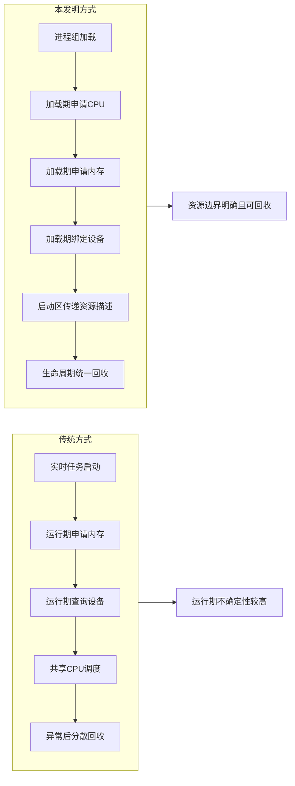
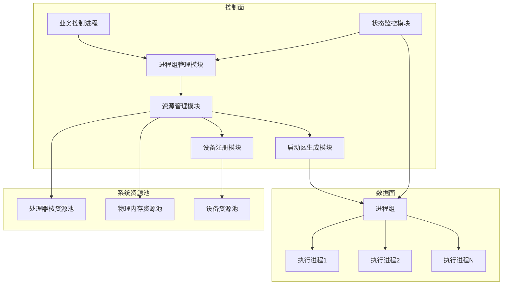
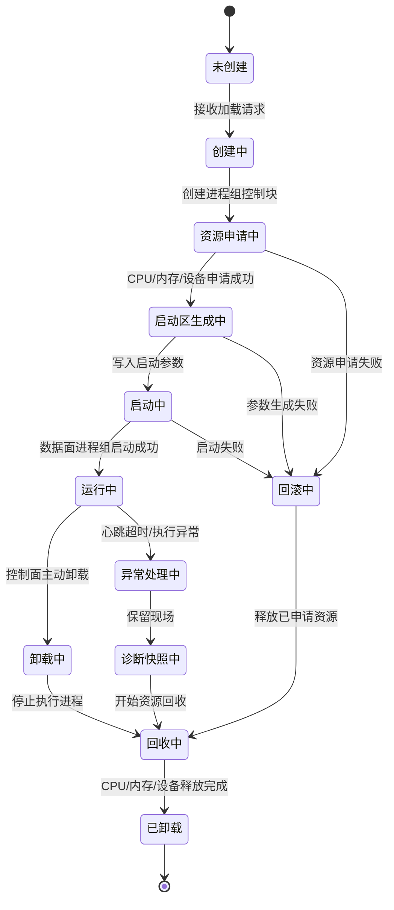
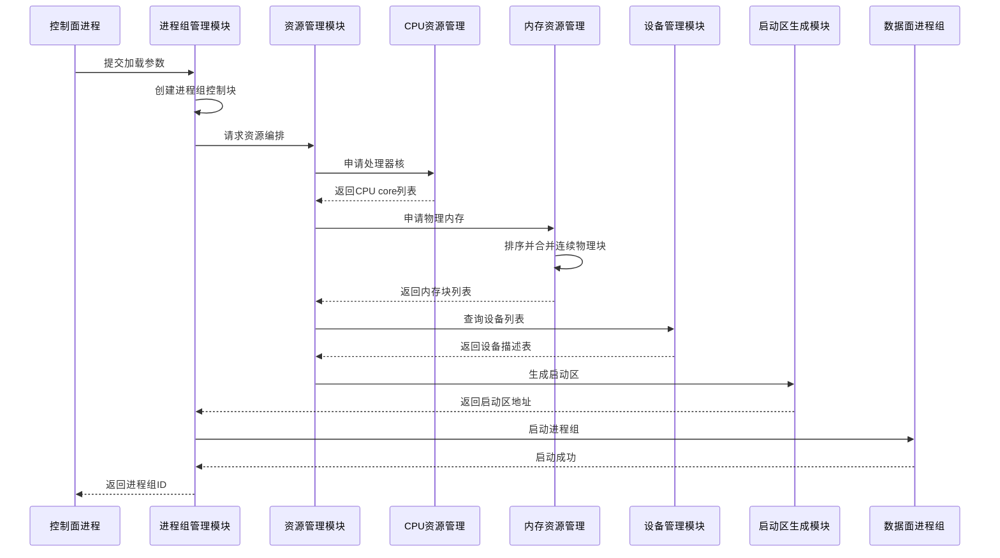
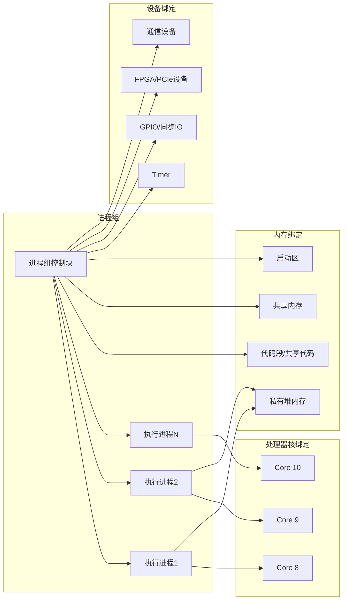
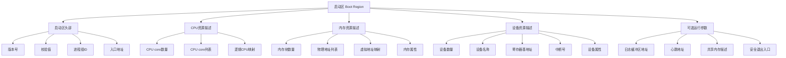
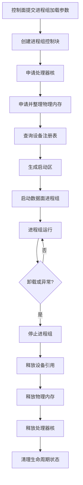
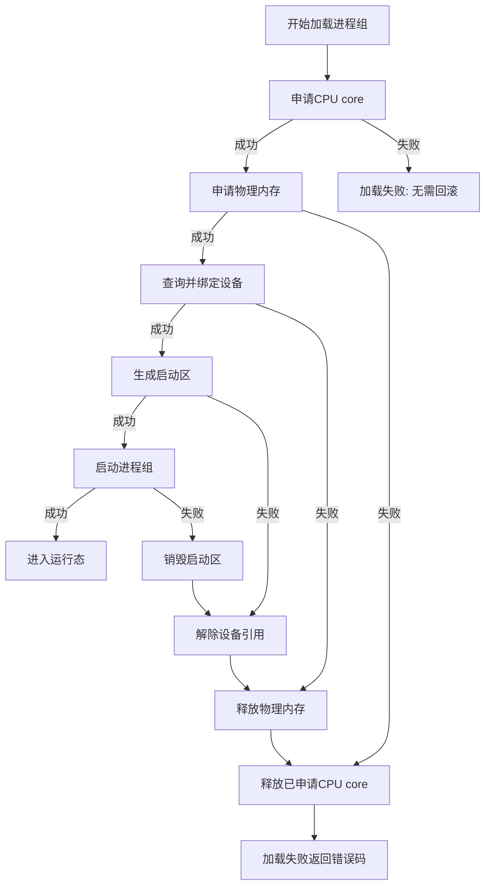
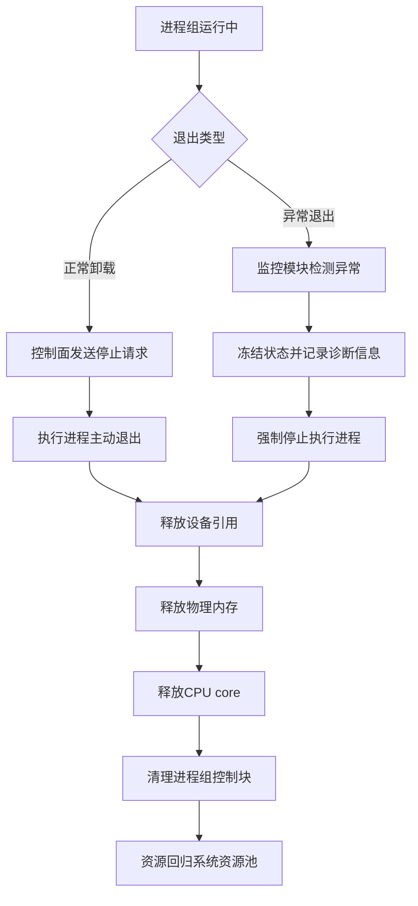

# 一种基于进程组生命周期的处理器核、内存与设备资源确定性编排方法及系统

# 发明背景与现有技术

## 发明背景技术简介

本发明涉及半导体制造装备、精密运动控制系统、实时控制系统及多核异构运行环境领域，尤其涉及一种在控制面与低时延数据面协同工作场景下，基于进程组生命周期统一编排处理器核、物理内存和外设资源的方法及系统。

在高精度运动控制、伺服控制、同步采样、实时通信、低时延驱动等场景中，关键执行任务通常要求具备确定性响应能力。若关键任务直接运行在通用操作系统或普通实时任务环境中，其运行过程可能受到任务调度、系统 tick、中断迁移、内存缺页、驱动栈路径、资源竞争等因素影响，导致最坏情况时延和周期抖动难以收敛。

一种可行的工程思路是：由控制面负责加载、配置、监控和回收关键执行单元；由数据面负责执行低时延业务逻辑；并在执行单元启动前，将其所需的处理器核、内存、设备和中断等资源统一准备完成。已有内部技术资料中，相关运行环境面向执行器提供超低时延基础能力，包括进程组加卸载、内存管理、设备管理、中断管理、时间管理、多进程组部署、高性能日志和心跳监控等能力；其目标包括为数据面提供超低时延裸核运行环境，并满足伺服中断响应和周期抖动要求。

现有方案中，处理器核、内存、设备和进程生命周期往往分别由不同子系统管理。虽然这些机制各自可以工作，但在低时延场景中，如果没有把它们绑定到统一的“进程组生命周期”上，就容易出现资源申请路径长、运行期资源竞争、异常退出后资源回收不完整、设备信息传递不一致、控制面与数据面状态不同步等问题。

因此，需要一种面向确定性执行的资源编排方法：在进程组创建、加载、运行、卸载和异常退出的完整生命周期内，对处理器核、物理内存、设备资源和启动参数进行统一管理，使关键执行单元在运行期间拥有稳定、可预测、可回收的资源集合。

**图文说明：**
该图适合放在“现有技术不足”和“有益效果论证”之间。它直观说明：传统方式的问题是资源行为发生在运行期，而本发明把资源行为提前到加载期，并把释放行为绑定到生命周期结束。

## 现有技术的不足之处

现有技术至少存在以下不足：

1. **资源申请与执行单元生命周期解耦。**
   处理器核、内存和设备通常分别由调度器、内存管理模块、设备驱动或配置文件管理，未必与一个执行进程组的创建、运行和卸载形成强绑定关系。关键任务启动后仍可能依赖运行期动态申请资源，增加不确定性。

2. **处理器核隔离不彻底。**
   传统绑核或实时优先级只能减少任务迁移，并不能必然使该处理器核脱离通用操作系统调度、tick、中断迁移和普通进程干扰。内部资料中提到，通过 CPU hotplug 从 Linux 获取 offline cores，并使进程组运行在相对独立的 CPU cores 上，才能更接近确定性隔离。

3. **内存资源缺少加载期预编排。**
   若关键执行单元在运行期发生缺页、频繁分配、物理内存不连续或共享区域临时扩展，会放大最坏情况时延。更适合低时延场景的方式是在加载阶段按规格申请物理内存，并对连续物理块进行合并和管理。

4. **设备资源传递路径不稳定。**
   传统设备访问路径可能依赖复杂驱动栈、动态枚举或运行期查询。对于低时延执行单元，更合适的方式是在进程组加载时将设备列表、设备标识和设备信息传递给目标执行环境，避免运行期反复发现和适配设备。

5. **异常退出后的资源回收缺乏一致性。**
   关键执行单元异常退出后，如果 CPU、内存、设备引用、共享内存或监控状态不能按同一生命周期回收，可能导致资源泄漏、下一次加载失败、控制面状态不一致或多用户调试冲突。

6. **多业务子系统部署缺少统一抽象。**
   不同子系统可能需要不同数量的 CPU core、不同内存规格和不同设备组合。若缺少统一的进程组级资源编排机制，系统版本容易针对不同业务反复适配，降低可维护性和可扩展性。

# 主要创新技术点说明

## 本发明创造要保护的创新技术与现有技术的区别

**图文说明：**
控制面并不直接让执行进程临时申请资源，而是先由进程组管理模块创建进程组控制块，再由资源管理模块统一申请处理器核、物理内存和设备资源。启动区生成模块将这些资源描述写入启动区，数据面进程组启动后只使用启动区声明的资源集合。

**图文说明：**
本发明的关键不是“启动一个实时任务”，而是把进程组从未创建、加载、运行、卸载、异常回收的完整生命周期都纳入资源编排。这样可以保证异常路径和正常路径共用同一套资源回收逻辑，避免 CPU 未归还、内存泄漏或设备占用残留。

本发明提出一种基于进程组生命周期的处理器核、内存与设备资源确定性编排方法及系统。其核心不是简单“创建一个实时任务”，也不是单独的“绑核”或“预分配内存”，而是将多个底层资源动作统一绑定到进程组的完整生命周期中。

本发明与现有技术的主要区别包括：

1. **以进程组为资源编排单位。**
   将一个或多个关键执行进程组织为进程组（Process Group），并以进程组为单位申请、绑定、运行和释放 CPU core、物理内存、设备资源及启动参数。

2. **在加载阶段完成资源固化。**
   控制面在加载进程组前接收进程组名称、镜像路径、CPU 数量、内存规格、设备列表等参数；随后统一完成处理器核获取、物理内存申请、设备信息收集和启动信息生成。内部资料中已有“启动前指定内存规格、设备列表、CPU 资源和镜像文件；启动时进入管理模块并获取 CPU 与内存资源”的工程基础。

3. **通过处理器核剥离实现运行期隔离。**
   在进程组加载过程中，从通用操作系统侧获取可用处理器核，使其在运行期间不再承载普通调度任务和非必要系统活动；进程组卸载或异常退出时，再将对应处理器核回归通用操作系统管理。

4. **通过物理内存预申请与块合并实现内存确定性。**
   在进程组加载阶段按规格从内核伙伴系统申请物理页块；对物理地址连续的页块进行排序和合并，形成供进程组使用的内存块列表；卸载时按申请记录释放回内核。

5. **通过设备注册表和启动区传递设备资源。**
   设备驱动预先向管理模块注册设备；加载进程组时，根据用户指定的设备名列表查询设备信息，并将设备列表或设备描述信息写入启动区，供数据面进程组启动后直接使用。内部资料中已有“设备注册/解注册接口”和“加载时将设备列表写入 BOOT 区”的设计基础。

6. **生命周期闭环管理。**
   进程组正常卸载、控制面进程退出或进程组异常退出时，统一触发 CPU、内存、设备引用、监控状态等资源回收，确保资源状态与进程组生命周期一致。

7. **支持多进程组、多用户或多业务子系统部署。**
   通过进程组 ID、容器 ID、设备名、内存块列表、CPU core 列表等元数据，将不同业务子系统的执行环境相互隔离，同时由统一资源管理模块屏蔽各子系统资源差异。

# 技术方案及有益效果

## 本发明创造的主要实施方式

**图文说明：**
该时序体现了“加载期资源固化”。CPU、内存、设备并不是在执行进程运行后再动态发现，而是在启动前统一整理成启动区，由数据面进程组按启动区执行。

**图文说明：**
一个进程组不是单一进程，而是一个资源容器式的执行单元。进程组控制块记录其 CPU core 列表、内存块列表、设备列表和启动参数。进程组卸载时，也依据这些记录统一释放资源。

**图文说明：**
启动区是控制面向数据面传递资源编排结果的核心载体。它把 CPU、内存、设备和可选运行参数固化成数据面可直接读取的结构，避免数据面启动后再走复杂查询路径。

本实施方式提供一种基于进程组生命周期的资源确定性编排方法，包括控制面管理模块、资源管理模块、进程组管理模块、设备注册模块、启动信息生成模块和数据面执行进程组。

### 1. 系统组成

系统至少包括：

* **控制面进程**：负责发起进程组加载、卸载、状态查询和异常处理；
* **进程组管理模块**：维护进程组 ID、状态机、生命周期、所属控制面进程、进程数量和运行状态；
* **CPU 资源管理模块**：根据进程组规格申请和释放处理器核；
* **内存资源管理模块**：根据进程组规格申请、合并、记录和释放物理内存块；
* **设备资源管理模块**：维护设备注册表，根据设备名查询设备描述信息；
* **启动区生成模块**：生成包含 CPU、内存、设备、入口地址、进程组参数等信息的启动区；
* **数据面进程组**：由一个或多个执行进程组成，运行在已编排的资源集合上。

### 2. 加载流程

进程组加载时，执行以下步骤：

1. 控制面接收或构造进程组加载参数，包括进程组名称、镜像文件路径、CPU core 数量、内存大小、设备名称列表及可选属性；
2. 进程组管理模块创建进程组控制块，生成进程组 ID，并将其状态置为“加载中”；
3. CPU 资源管理模块根据请求数量和系统保留策略，从通用操作系统侧获取可用处理器核；
4. 内存资源管理模块根据请求大小，从内核伙伴系统申请物理内存页块；
5. 内存资源管理模块对申请到的物理页块按物理地址排序，并将连续页块合并为较大的物理内存块；
6. 设备资源管理模块根据设备名称列表查询已注册设备，并生成设备描述表；
7. 启动区生成模块将 CPU core 列表、内存块列表、设备描述表、进程组入口地址、进程数量等信息写入启动区；
8. 进程组管理模块启动数据面进程组，使其在指定处理器核和指定内存范围内运行；
9. 加载完成后，将进程组状态置为“运行中”。

### 3. 运行流程

进程组运行期间：

1. 数据面执行进程只访问启动区中声明的资源集合；
2. 每个执行进程可绑定一个或多个指定处理器核，优选为关键执行进程独占一个物理 core；
3. 运行期不再进行关键路径上的大规模内存申请、设备枚举和资源发现；
4. 控制面通过状态查询、心跳、共享内存或轻量通知机制监控进程组状态；
5. 若检测到异常，进程组管理模块进入异常处理流程。

### 4. 卸载流程

进程组正常卸载或异常退出时，执行以下步骤：

1. 控制面发起卸载请求，或监控模块检测到进程组异常；
2. 进程组管理模块将进程组状态置为“卸载中”或“异常回收中”；
3. 通知数据面执行进程停止业务循环，并进入安全退出状态；
4. 释放或解除设备引用；
5. 按内存块列表释放物理内存；
6. 将处理器核释放回通用操作系统；
7. 清理进程组控制块、启动区、状态记录和监控记录；
8. 将进程组状态置为“已卸载”。

### 5. 关键流程图

## 本发明创造的其他实施方式

**图文说明：**
该图适合放在“其他实施方式：资源申请失败回滚”下。它强调本发明不是简单顺序申请资源，而是支持按相反顺序确定性回滚，避免半加载状态。

**图文说明：**
正常卸载和异常回收最终进入同一套资源释放路径。区别在于异常回收会先冻结状态并记录诊断信息，再进入资源释放流程。这能增强专利里的可靠性论证。

### 其他实施方式一：基于资源描述表的可重复加载

在控制面保存进程组资源描述表，包括 CPU 数量、内存规格、设备列表、启动入口和版本信息。再次加载相同进程组时，可复用该描述表，提高配置一致性，减少人为配置差异。

### 其他实施方式二：异常退出后的分阶段回收

当数据面进程组异常退出时，资源回收可分为停止执行、冻结状态、采集诊断快照、释放设备、释放内存、释放 CPU、清理元数据等阶段，避免在异常状态下直接释放全部资源导致诊断信息丢失。

### 其他实施方式三：多进程组资源隔离

多个进程组可分别拥有独立的 CPU core 列表、内存块列表和设备列表。资源管理模块在加载阶段进行冲突检查，防止不同进程组重复占用同一处理器核、同一设备或同一独占内存区域。

### 其他实施方式四：控制面保留核策略

系统可预留一定数量处理器核给控制面，剩余处理器核由资源管理模块按进程组请求进行分配。内部资料中已有“预留一定最小 CPU core 数量给控制面，其余 CPU cores 由管理模块管理”的设计基础。

### 其他实施方式五：启动区扩展字段

启动区除 CPU、内存和设备信息外，还可包括中断号、定时器配置、共享内存描述、日志缓冲区地址、心跳地址、版本号、校验值和安全退出入口，以支持更复杂的实时执行场景。

### 其他实施方式六：资源申请失败回滚

若加载阶段任一资源申请失败，则按照相反顺序回滚已经完成的资源申请。例如，设备查询失败时释放已申请内存和 CPU；内存申请失败时释放已获取 CPU；启动失败时释放设备引用、内存和 CPU。

### 其他实施方式七：按业务角色划分进程组

不同业务子系统可分别配置为不同进程组，例如运动控制进程组、采样进程组、通信进程组、诊断进程组。各进程组通过统一资源编排机制获得不同的 CPU、内存和设备组合。

## 本发明创造的有益效果论证

本发明至少具有以下有益效果：

1. **降低运行期不确定性。**
   CPU、内存和设备在加载阶段完成编排，减少运行期资源申请、设备发现和内存扩展带来的不确定时延。

2. **提高低时延执行环境的可构造性。**
   通过进程组生命周期统一管理资源，使关键执行单元不再依赖松散配置，而是以可重复、可检查、可回收的方式构造执行环境。

3. **减少资源竞争。**
   处理器核、内存块和设备列表在加载阶段即与进程组绑定，可防止其他进程组或控制面任务误用关键资源。

4. **提高异常恢复能力。**
   进程组异常退出后，可依据进程组控制块中的资源记录进行确定性回收，减少 CPU 未释放、内存泄漏、设备占用残留等问题。

5. **增强系统可扩展性。**
   不同业务子系统可通过统一接口配置不同资源规格，而无需修改底层系统版本。内部资料中也提到，CPU、内存和设备资源可面向不同业务子系统灵活部署，由统一机制屏蔽资源差异。

6. **便于形成性能与安全边界。**
   由于每个进程组的 CPU、内存和设备资源均有明确边界，因此更容易分析最坏情况时延、资源占用、故障影响范围和安全退出路径。

# 发明创造价值自评

满分 5 分

| 自评维度     | 自评分数 | 自评理由                                                                              |
| -------- | ---: | --------------------------------------------------------------------------------- |
| 创新性      |  4.4 | 单独的 CPU hotplug、内存预分配、设备注册并非全新，但将其绑定到进程组生命周期，形成加载、运行、卸载、异常回收的确定性资源编排闭环，具有较强组合创新性。 |
| 市场价值     |  4.5 | 适用于光刻机、半导体装备、高速运动控制、实时采样、低时延通信和多核嵌入式控制平台，属于底层平台型能力。                               |
| 技术价值     |  4.8 | 直接解决低时延系统中的资源隔离、确定性构造、运行期抖动和异常回收问题，是后续独占核执行、共享内存通信、低扰动诊断等方案的基础。                   |
| 可规避程度    |  4.1 | 若权利要求覆盖“进程组生命周期 + CPU 剥离 + 物理内存预申请 + 设备列表启动区传递 + 卸载回收”，竞争方案较难只通过替换单一模块规避。         |
| 侵权证据可获得性 |  3.2 | 内部软件机制取证有一定难度，但可通过加载参数、进程组状态、CPU online/offline 行为、内存块分配记录、设备启动区和异常回收行为进行辅助证明。    |
