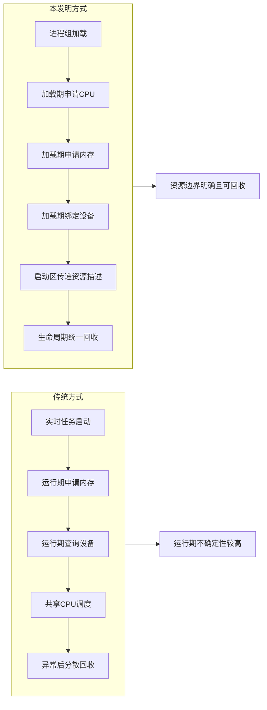
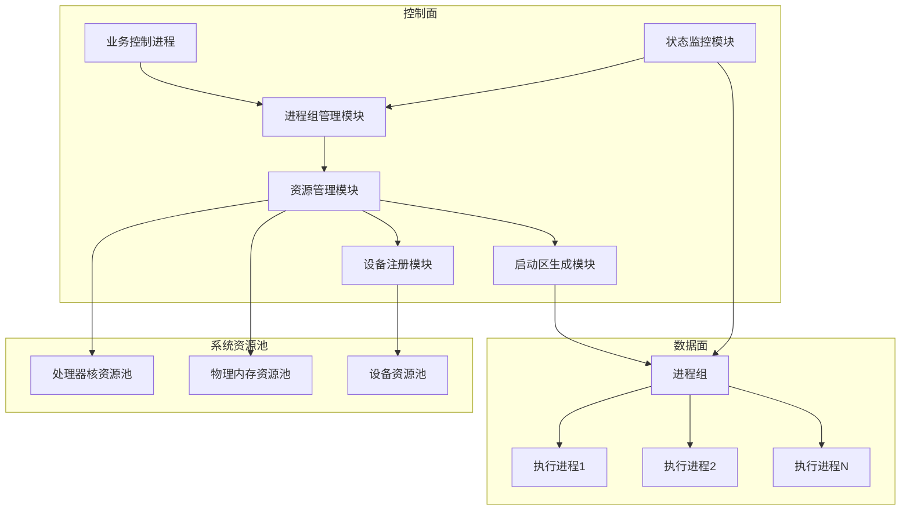
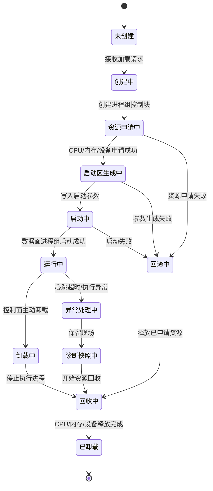
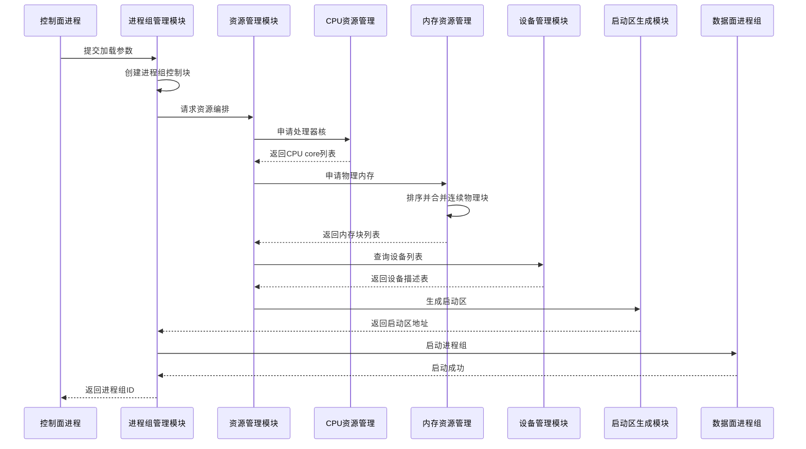
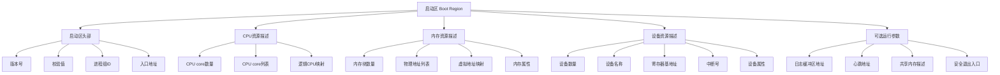

<!-- _class: lead -->
# 一种基于进程组生命周期的处理器核、内存与设备资源确定性编排方法及系统

PPT 压缩版 · 已整合 pata1 中最适合展示的 Mermaid 图

进程组生命周期
加载期资源固化
启动区传递
统一回收闭环

---

# 本版整合的 Mermaid 图

| 序号 | 图 | 放置位置 | PPT 价值 |
|---:|---|---|---|
| 1 | 传统方式 vs 本发明方式 | 背景 / 现有问题 | 快速建立问题对比 |
| 2 | 控制面-资源池-数据面总体架构 | 核心方案 | 说明系统组成与资源流向 |
| 3 | 进程组生命周期状态机 | 创新点 | 强化“全生命周期闭环”主保护点 |
| 4 | 加载期资源编排时序 | 实施方式 | 展示 CPU/内存/设备/BOOT 区固化流程 |
| 5 | 启动区 Boot Region 结构 | 技术落地点 | 说明资源描述如何传递给数据面 |

未纳入：关键流程图、失败回滚图、异常回收图等，信息与状态机/时序图有重复，适合放备份页。

---

# 1. 发明背景与现有技术

## 发明背景技术简介

本发明面向半导体装备、精密运动控制和低时延数据面执行场景。

核心矛盾：关键执行任务若直接运行在通用 OS 或普通实时任务环境中，容易受到：

- 调度、tick、中断迁移影响；
- 内存缺页、运行期分配、驱动栈路径影响；
- CPU、内存、设备资源竞争影响。

**目标：在执行单元启动前完成 CPU、内存、设备和启动参数的确定性编排。**

---

# 图 1：传统方式 vs 本发明方式

这张图适合放在开场问题页：传统方式的问题在于资源行为发生在运行期；本发明将资源动作前移到加载期，并绑定生命周期结束时的统一回收。

---

# 1. 发明背景与现有技术

## 现有技术的不足之处

<h3>运行期不确定性</h3>
<ul>
<li>资源申请与执行生命周期解耦</li>
<li>内存、设备、CPU 分散管理</li>
<li>关键路径仍可能动态申请资源</li>
</ul>

<h3>隔离与回收不足</h3>
<ul>
<li>绑核不等于脱离 OS 调度</li>
<li>设备查询路径不稳定</li>
<li>异常退出后回收不一致</li>
</ul>

**归纳：缺少一个以进程组为中心的统一资源生命周期模型。**

---

# 2. 主要创新技术点说明

## 本发明创造要保护的创新技术与现有技术的区别

**核心创新：以“进程组生命周期”为资源编排单位，而不是分别管理 CPU、内存、设备。**

关键区别：

1. 以进程组为资源边界；
2. 加载阶段完成资源固化；
3. 处理器核剥离，降低普通调度干扰；
4. 物理内存预申请与连续块合并；
5. 设备注册表 + 启动区传递；
6. 正常卸载与异常回收共用闭环。

---

# 图 2：控制面-资源池-数据面总体架构

这张图适合作为总架构图：控制面不让执行进程临时申请资源，而是由资源管理模块统一申请 CPU、物理内存和设备资源，再由启动区生成模块传递给数据面进程组。

---

# 图 3：进程组生命周期状态机

这张图最能体现主保护点：将未创建、加载、运行、卸载、异常、回滚、回收纳入同一个生命周期状态机。

---

# 3. 技术方案及有益效果

## 本发明创造的主要实施方式：系统组成

<h3>控制面</h3>
<ul>
<li>控制面进程</li>
<li>进程组管理模块</li>
<li>资源管理模块</li>
<li>状态监控模块</li>
<li>启动区生成模块</li>
</ul>

<h3>数据面与资源</h3>
<ul>
<li>处理器核资源池</li>
<li>物理内存资源池</li>
<li>设备资源池</li>
<li>数据面进程组</li>
<li>多个执行进程</li>
</ul>

**进程组控制块记录：PG ID、状态机、CPU core 列表、内存块列表、设备列表、启动参数。**

---

# 图 4：加载期资源编排时序

这张图适合讲实施路径：CPU、内存、设备不是运行后动态发现，而是在启动前统一整理成启动区，由数据面进程组按启动区执行。

---

# 图 5：启动区 Boot Region 结构

启动区是控制面向数据面传递资源编排结果的核心载体，用于固化 CPU、内存、设备、中断号、心跳、日志和安全退出入口等信息。

---

# 3. 技术方案及有益效果

## 运行与卸载流程

**运行期原则：**

- 数据面执行进程只访问启动区声明的资源集合；
- 关键路径不再进行大规模内存申请、设备枚举和资源发现；
- 控制面通过心跳、共享内存或轻量通知机制监控进程组状态。

**卸载 / 异常回收原则：**

1. 停止数据面执行进程；
2. 释放或解除设备引用；
3. 按内存块列表释放物理内存；
4. 将处理器核释放回通用 OS；
5. 清理控制块、启动区和监控状态。

---

# 3. 技术方案及有益效果

## 本发明创造的其他实施方式

- **可重复加载**：保存资源描述表，复用 CPU、内存、设备规格。
- **分阶段异常回收**：停止执行 → 冻结现场 → 诊断快照 → 释放设备/内存/CPU。
- **多进程组资源隔离**：不同 PG 拥有独立 CPU core、内存块和设备列表。
- **控制面保留核策略**：预留控制面 core，剩余 core 由资源管理模块分配。
- **资源失败回滚**：按申请相反顺序释放已申请资源，避免半加载状态。
- **按业务角色划分 PG**：运动控制、采样、通信、诊断分别编排资源。

---

# 3. 技术方案及有益效果

## 本发明创造的有益效果论证

<h3>确定性</h3>
<ul>
<li>减少运行期资源申请</li>
<li>降低设备发现与内存扩展抖动</li>
<li>便于分析最坏情况时延</li>
</ul>

<h3>可靠性</h3>
<ul>
<li>CPU、内存、设备边界清晰</li>
<li>异常后可按控制块确定性回收</li>
<li>减少资源泄漏和残留占用</li>
</ul>

**价值总结：把低时延执行环境从“松散配置”变为“可重复、可检查、可回收”的生命周期闭环。**

---

# 4. 发明创造价值自评

满分 5 分

| 自评维度 | 分数 | 理由 |
|---|---:|---|
| 创新性 | 4.4 | 将 CPU hotplug、内存预分配、设备注册绑定到进程组生命周期，形成组合创新。 |
| 市场价值 | 4.5 | 适用于光刻机、半导体装备、高速运动控制、低时延通信平台。 |
| 技术价值 | 4.8 | 直接解决资源隔离、确定性构造、运行期抖动和异常回收问题。 |
| 可规避程度 | 4.1 | 若覆盖“生命周期 + CPU 剥离 + 内存预申请 + 启动区 + 回收”，较难单点规避。 |
| 侵权证据可获得性 | 3.2 | 可通过加载参数、CPU online/offline、内存块记录、启动区和异常回收行为辅助证明。 |

---

<!-- _class: lead -->
# 一页总结

**进程组生命周期 = 低时延资源编排的主轴**

加载前编排 → 启动区固化 → 独占 / 隔离运行 → 统一卸载 / 异常回收

本方案的保护重点不是单一资源动作，而是“进程组全生命周期 + 多资源确定性闭环”。

