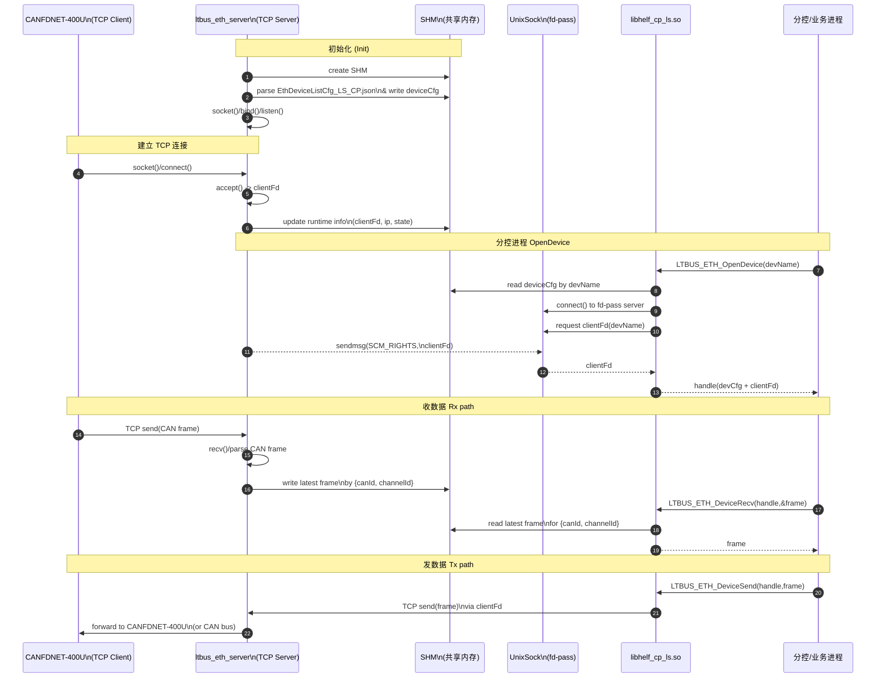
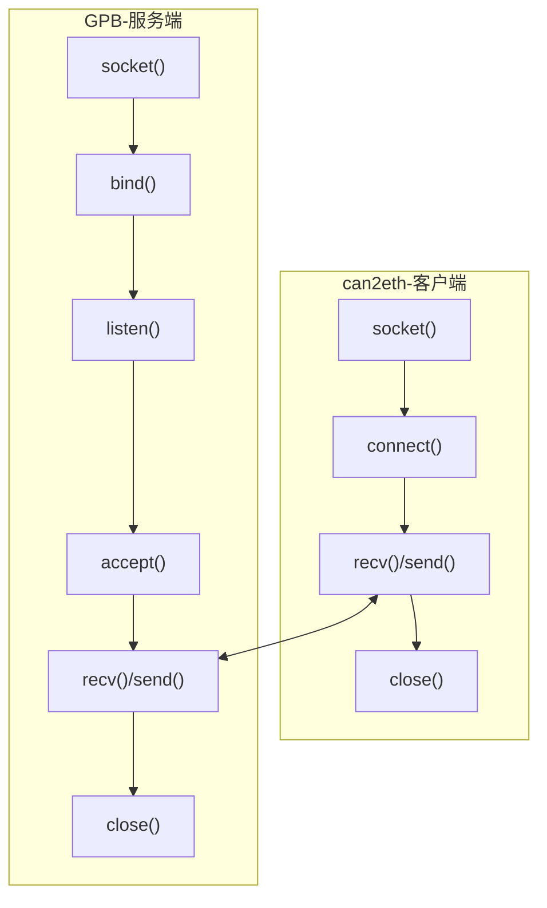
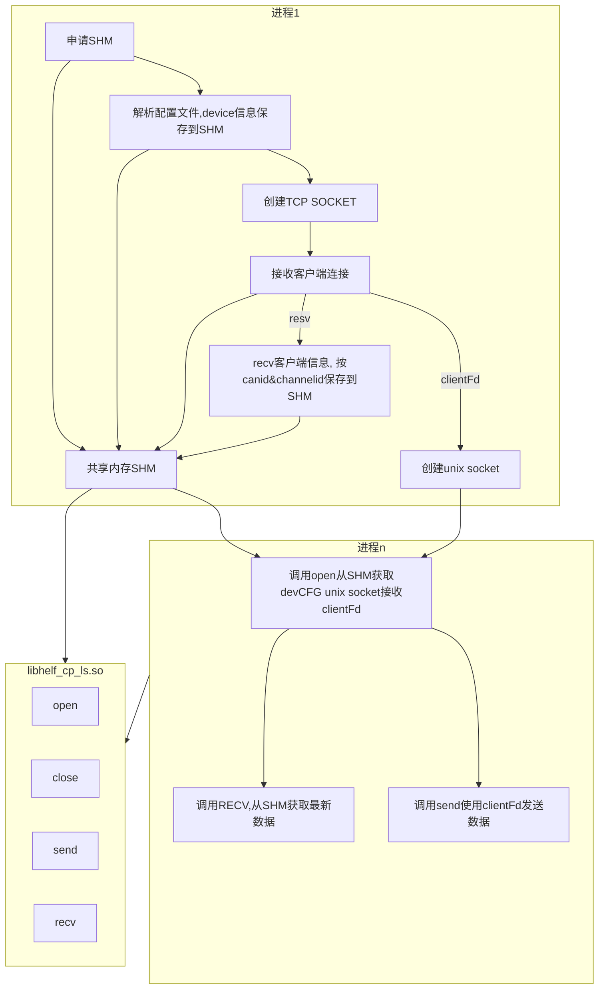
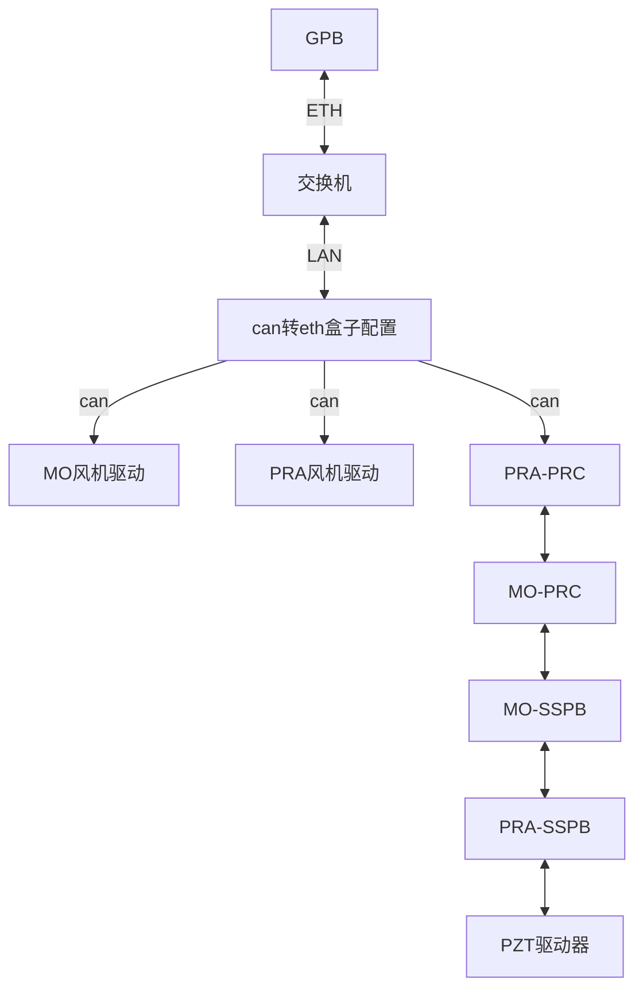

CAN转ETH盒子型号为CANFDNET-400U
GPB为 arm服务器芯片H1620

# 1 需求描述

【需求背景】LS子系统新增CAN转ETH模块，最终由用户态分控进程处理数据内容，时延要求低。通过交换机或者GPB面板GE口与1620通信，报文进GPB后由网口内核驱动模块收包，用户态由LTSensor通过标准Socket方式从内核网口收包，并解析报文内容后，封装功能接口给分控调用。
【Actor】 分控
【周边依赖】
【需求详情】 
1、CAN转ETH盒子当Client，支持GPB当Server，配置CAN转ETH盒子主动通过socket连接Server端，提供配置指导手册SOP，包括配置client端模式，两端静态IP地址等。
2、Service端起socket监听任务，接受Client的主动连接请求，支持多个连接请求，记录连接断开日志信息。
3、提供公共的报文收发功能，供其他模块使用（互锁、风机、PRC、SSPB等），以RAWDATA方式直接从内核 L2层收发报文。
4、提供DFX功能，包括连接断开计数、报文TXRX计数、根据报文长度、类型等维护统计报文计数；支持报文内容打印功能并通过开关控制是否启用打印。
5、需长时间验证收发包可靠性，需要长时间验证不丢包，具体时间参考评论更新要求。默认（2*24小时）
【使用限制】NA
【性能规格】NA
【可测性需求】NA
【非功能需求】
1、可靠性需求：长时间验证不丢包，具体时间参考评论更新要求。默认（2*24小时）
2、可维护性需求：NA
【输入】
【处理】
1、CAN转ETH盒子当Client，支持GPB当Server，配置CAN转ETH盒子主动通过socket连接Server端，提供配置指导手册SOP，包括配置client端模式，两端静态IP地址等。
2、Service端起socket监听任务，接受Client的主动连接请求，支持多个连接请求，记录连接断开日志信息。
3、提供公共的报文收发功能，供其他模块使用（互锁、风机、PRC、SSPB等），以RAWDATA方式直接从内核 L2层收发报文。
4、提供DFX功能，包括连接断开计数、报文TXRX计数、根据报文长度、类型等维护统计报文计数；支持报文内容打印功能并通过开关控制是否启用打印。
5、需长时间验证收发包可靠性，需要长时间验证不丢包，具体时间参考评论更新要求。默认（2*24小时）
【输出】


## 开发功能点

1、CAN转ETH盒子当Client，支持GPB当Server，配置CAN转ETH盒子主动通过socket连接Server端。

2、Service端起socket监听任务，接受Client的主动连接请求，支持多个连接请求，记录连接断开日志信息。

3、提供公共的报文收发功能，供其他模块使用（风机、PRC、SSPB、P3电机），使用socket从内核协议栈收发报文。

4、提供DFX功能，包括连接断开计数、报文TXRX计数、根据报文长度、类型等维护统计报文计数；支持报文内容打印功能并通过开关控制是否启用打印。

# 软件功能设计

## 总体功能描述
总体结构时许图

客户端和服务端框架图


进程视角图


1. GPB做为server，can转eth盒子做为client，通过tcp协议通信；
2. Can2Eth配置文件中配置的canId和channelId（can盒的通道）共同组成唯一标识；
3. Server监听进程接收数据，保存到共享内存，只保存最新（通过LTR\_ShmMap申请）；
4. 读接口从共享内存中读取数据；
5. can转eth盒子配置：

（1）设置工作模式为：tcp客户端，配置目标IP、port；

（2）CAN转以太网—查看高级配置，打包帧数改成1，实时发送;

（3）波特率设置为125kbps;


## 接口设计

### 接口定义

VOID \*LTBUS\_ETH\_ServerInit(); --创建socket，监听消息

VOID \*LTBUS\_ ETH\_OpenDevice(const CHAR \*deviceName); --打开设备

INT32 LTBUS\_ ETH\_GetDeviceDataLen(VOID \*handle, UINT32 \*len); --获取数据长度

INT32 LTBUS\_ ETH\_CloseDevice(VOID \*handle); --关闭设备

INT32 LTBUS\_ ETH\_DeviceSend(VOID \*handle, const VOID \*data, UINT32 len, INT32 timeout); --发送数据

INT32 LTBUS\_ ETH\_DeviceRecv(VOID \*handle, VOID \*buff, UINT32 \*len, INT32 timeout); --接收数据

代码存放路径：ltdrv/ltbus

### 使用场景



使用can2eth的模块:

（1）PZT驱动器:升级

（2）PRA-SSPB:升级、基本功能

（3）MO-SSPB:升级、基本功能
针对高压模块的有三种指令:

1. 主控制器发给高压模块的操作及查询指令, 指令SSPB-MO ID=0X0003; SSPB-PA ID=0X0013
2. 高压模块响应主控制器的指令, 指令SSPB-MO ID=0X0103; SSPB-PA ID=0X0113;
3. 高压模块定时上传给主控制器的参数, 指令SSPB-MO ID=0X0203; SSPB-PA ID=0X0213;


（4）MO-PRC: 基本功能

（5）PRA-PRC: 基本功能

Gpb->prc:

MO\_PRC:CANID 0x23、PRA-PRC CANID :0x33

prc->gpb:

MO\_PRC:CANID 0x123、PRA-PRC CANID :0x133

（6）PRA风机: 基本功能：

（7）MO风机: 基本功能：

| 序号 | 控制器类型 | 控制器编号 | 报文           | ID           | 长度(BYTE) | 发送周期(ms) |
| ---- | ---------- | ---------- | -------------- | ------------ | ---------- | ------------ |
| 1    | 控制器     | 1,2        | 电机控制器状态 | 0x101, 0x102 | 8          | 100          |
| 2    | 控制器     | 1,2        | 控制指令       | 0x100        | 8          | 100          |

## 数据结构

### 结构定义

#define CAN\_DATA\_LEN     8

#define LTBUS\_CAN\_DEV\_CFG\_SHM\_NAME "ltbus\_can\_dev\_cfg\_shm"

typedef enum {

LTBUS\_ETH\_DEV\_TYPE\_CAN = 0,

LTBUS\_ETH\_DEV\_TYPE\_MAX

} LTBUS\_ETH\_DEV\_TYPE\_E;

typedef struct {

UINT32 canId;

UINT32 channelId;

INT32 clientFd;

UINT32 dataLen;

UINT8 recvData[CAN\_DATA\_LEN];

UINT32 txCnt;

UINT32 rxCnt;//共享内存有锁

} LTBUS\_CanDevInfo;

typedef union {

LTBUS\_CanDevInfo canDevInfo;

} LTBUS\_ETH\_DeviceInfo;

typedef struct {

CHAR deviceName[MAX\_LTBUS\_DEVICENAME\_LEN];

LTBUS\_ETH\_DEV\_TYPE\_E devType;

LTBUS\_ETH\_DeviceInfo deviceInfo;

} LTBUS\_ETH\_DeviceCfg;

typedef struct {

CHAR cfgPath[LTBUS\_CFG\_PATH\_MAX\_LENGTH];

UINT32 devCnt;

LTBUS\_ETH\_DeviceCfg deviceList[LTBUS\_MAX\_DEV\_CNT];

} LTBUS\_ETH\_DeviceListCfg;

ret = LTR\_ShmMap((INT32)LTR\_SHM\_ALL\_SHARE, LTBUS\_CAN\_DEV\_CFG\_SHM\_NAME, devCnt\*sizeof(LTBUS\_ETH\_DeviceListCfg),

(VOID \*\*)&ltbusEthDeviceListCfg);

typedef struct DeviceHandle {

INT32 clientFd;;

} LTBUS\_ETH\_HandleInfo;

typedef struct DeviceHandle {

LTBUS\_ETH\_DeviceCfg \*deviceCfg;

LTBUS\_ETH\_HandleInfo handleInfo;

} LTBUS\_ETH\_DevHandle;

### 使用场景
CANFDNET定义了网络包格式来实现报文传输, 包格式见图所示, 包参数定义见表1.

| 包头     | 包头   | 包头     | 包头 | 包头     | 数据区 | 数据区 | 数据区   | 数据区   | 数据区   | 数据区 | 校验位 |
| -------- | ------ | -------- | ---- | -------- | ------ | ------ | -------- | -------- | -------- | ------ | ------ |
| 起始标志 | 包类型 | 类型参数 | 保留 | 数据长度 | 视角戳 | 报文ID | 报文信息 | 报文通道 | 数据长度 | 数据   | 校验位 |
| 1        | 1      | 1        | 1    | 2        | 8      | 8      | 2        | 1        | 1        | 8/64   | 1      |

包参数说明
| 包参数   | 大小(byte) | 说明                                                         |
| -------- | ---------- | ------------------------------------------------------------ |
| 起始标识 | 1          | 固定为0x55                                                   |
| 包类型   | 1          | 指示该包类型                                                 |
| 类型参数 | 1          | 包类型对应参数                                               |
| 保留     | 1          | 默认0                                                        |
| 数据长度 | 2          | 只是数据长度                                                 |
| 数据区   | 不定       | 包类型不同, 数据不同                                         |
| 校验码   | 1          | 采用BCC(异或校验), 校验范围从起始标识开始直到校验码前一字节位置. |
55 00 00 00 00 18 00 00 00 28 a8 d7 7e 63 00 00 02 06 00 00 01 08 06 00 00 00 00 00 00 06 0a

## 配置文件

新增配置文件EthDeviceListCfg\_LS\_CP.json保存can设备

格式如下：

```json
{
    "DeviceCfgList": [
        {
            "BUS_PATH": {
                "ETH": 0,
                "ServerIP": "0.0.0.0",
                "ServerPort": 8000,
                "ClientIP": "192.168.2.178"
            },
            "DeviceList": [
                {
                    "DeviceName": "LEFT_T_upload",
                    "DevType": "CAN",
                    "DeviceInfo": {
                        "CanId": "0x206",
                        "ChannelId": 1,
                        "DeviceDataLen": 8
                    }
                },
                {
                    "DeviceName": "LEFT_T_cmd",
                    "DevType": "CAN",
                    "DeviceInfo": {
                        "CanId": "0x006",
                        "ChannelId": 1,
                        "DeviceDataLen": 8
                    }
                },
                {
                    "DeviceName": "LEFT_T_ack",
                    "DevType": "CAN",
                    "DeviceInfo": {
                        "CanId": "0x106",
                        "ChannelId": 1,
                        "DeviceDataLen": 8
                    }
                }
            ]
        }
    ]
}
```

新增解析配置文件函数


# 代码实现
ltbus_eth_device_list_cfg_parse.c
```c
#include "ltbus_eth_device_opt.h"
#include <sys/un.h>
#include <fcntl.h>
#include "securec.h"
#include "ltbus_api.h"
#include "ltr_shm_api.h"
#include "ltbus_type.h"
#include "ltr_log_common.h"
#include "ltmisc_operate_data.h"
#include "ls_common.h"
#include "ltbus_eth_error_code.h"

UINT64 NTOHLL(UINT64 value)
{
    UINT32 high = htonl((UINT32)(value >> BIT32));
    UINT32 low  = htonl((UINT32)(value & 0xFFFFFFFF));
    return ((UINT64)high << BIT32) | low;
}

VOID *LTBUS_ETH_MallocDevListCfgShm(VOID)
{
    INT32 ret;
    LTBUS_ETH_DeviceListCfg *devListCfg = NULL;

    ret = LTR_ShmMap((INT32)LTR_SHM_ALL_SHARE, LTBUS_ETH_DEV_CFG_SHM_NAME, sizeof(LTBUS_ETH_DeviceListCfg),
        (VOID **)&devListCfg);
    if (ret < 0) {
        LTR_Err("ltbus eth device info shm maped fail(0x%x).\n", LOG_PH, (UINT64)(UINT32)ret, LOG_PH, LOG_PH);
        return NULL;
    }
    return devListCfg;
}

INT32 LTBUS_ETH_FreeDevListCfgShm(LTBUS_ETH_DeviceListCfg *devListCfg)
{
    if (devListCfg == NULL) {
        LTR_Err("ltbus eth device info shm not maped.\n", LOG_PH, LOG_PH, LOG_PH, LOG_PH);
        return LTBUS_ETH_HWCFG_ERRNO(HELF_ENULLPOINTER);
    }

    return LTR_ShmUnmap(devListCfg);
}

STATIC INT32 LTBUS_ETH_IsNameValid(const CHAR *name)
{
    size_t nameLen;

    if (name == NULL) {
        LTR_StrErr("Error: name is null.\n");
        return LTBUS_ETH_GENERAL_ERRNO(HELF_ENULLPOINTER);
    }

    nameLen = strlen(name);
    if (nameLen >= MAX_LTBUS_DEVICENAME_LEN || nameLen == 0) {
        LTR_Err("Name length Invalid, len:%zu, name is: X.\n", LOG_PH, (UINT32)strlen(name), LOG_PH, LOG_PH);
        LTR_StrErr(name);
        return LTBUS_ETH_GENERAL_ERRNO(HELF_EINVAL);
    }

    return HELF_EOK;
}

STATIC INT32 LTBUS_ETH_GetDevCfg(const CHAR *deviceName, LTBUS_ETH_DeviceCfg **deviceCfg)
{
    UINT32 i;
    UINT32 devCnt;
    LTBUS_ETH_DeviceCfg *deviceCfgItem = NULL;
    LTBUS_ETH_DeviceListCfg *devListCfg = LTBUS_ETH_MallocDevListCfgShm();

    if (devListCfg == NULL) {
        LTR_Err("get eth devListCfg fail, deviceName:\n", LOG_PH, LOG_PH, LOG_PH, LOG_PH);
        LTR_StrErr(deviceName);
        return LTBUS_ETH_GENERAL_ERRNO(HELF_ENODEV);
    }

    devCnt = devListCfg->devCnt;
    for (i = 0; i < devCnt; i++) {
        deviceCfgItem = &devListCfg->deviceList[i];
        if (strcmp(deviceCfgItem->deviceName, deviceName) == 0) {
            *deviceCfg = deviceCfgItem;
            return HELF_EOK;
        }
    }

    LTR_Err("eth device is not exist, devCnt=%d, deviceName:\n", LOG_PH, devCnt, LOG_PH, LOG_PH);
    LTR_StrErr(deviceName);
    return LTBUS_ETH_GENERAL_ERRNO(HELF_ENODEV);
}

STATIC INT32 LTBUS_ETH_GetTcpClientFd(INT32 *clientFd)
{
    INT32 i, ret, flags;
    CHAR dummy;
    INT32 unixFd;
    CHAR cmsgbuf[CMSG_SPACE(sizeof(INT32))];
    struct msghdr msg = { 0 };
    struct cmsghdr *cmsg = NULL;
    struct iovec iov;
    struct sockaddr_un unixAddr = { 0 };

    // 创建Unix域socket
    unixFd = socket(AF_UNIX, SOCK_STREAM, 0);
    if (unixFd < 0) {
        LTR_Err("create unix socket failed! errno=%u\n", LOG_PH, errno, LOG_PH, LOG_PH);
        return errno;
    }

    flags = fcntl(unixFd, F_GETFL, 0);
    if (flags == -1) {
        LTR_Err("fcntl get failed! errno=%u\n", LOG_PH, errno, LOG_PH, LOG_PH);
        return errno;
    }

    // 设置非阻塞模式
    flags |= O_NONBLOCK;
    if (fcntl(unixFd, F_SETFL, flags) == -1) {
        LTR_Err("fcntl set failed! errno=%u\n", LOG_PH, errno, LOG_PH, LOG_PH);
        return errno;
    }

    unixAddr.sun_family = AF_UNIX;
    ret = strncpy_s(unixAddr.sun_path, sizeof(unixAddr.sun_path), UNIX_PATH, sizeof(unixAddr.sun_path) - 1);
    if (ret != HELF_EOK) {
        LTR_Err("copy UNIX_PATH failed! ret=%u\n", LOG_PH, (UINT32)ret, LOG_PH, LOG_PH);
        return ret;
    }

    if (connect(unixFd, (struct sockaddr *)&unixAddr, sizeof(unixAddr)) < 0) {
        LTR_Err("unix socket connect failed! errno=%u\n", LOG_PH, errno, LOG_PH, LOG_PH);
        return errno;
    }

    // 准备接收消息
    iov.iov_base = &dummy;
    iov.iov_len = 1;
    msg.msg_iov = &iov;
    msg.msg_iovlen = 1;
    msg.msg_control = cmsgbuf;
    msg.msg_controllen = sizeof(cmsgbuf);

    for (i = 0; i < TRY_TIME_MAX; i++) {
        if (recvmsg(unixFd, &msg, 0) > 0) {
            break;
        }
        LTR_UsDelay(1);
    }
    if (i == TRY_TIME_MAX) {
        LTR_Err("unix socket recvmsg failed! errno=%u\n", LOG_PH, errno, LOG_PH, LOG_PH);
        return LTBUS_ETH_GENERAL_ERRNO(HELF_ERECV);
    }

    // 提取fd
    cmsg = CMSG_FIRSTHDR(&msg);
    if (cmsg == NULL || cmsg->cmsg_type != SCM_RIGHTS) {
        LTR_Err("unix socket get fd failed! errno=%u\n", LOG_PH, errno, LOG_PH, LOG_PH);
        return LTBUS_ETH_GENERAL_ERRNO(HELF_ENOMSG);
    }
    *clientFd = *(INT32 *)CMSG_DATA(cmsg);

    close(unixFd);

    return HELF_EOK;
}

VOID *LTBUS_ETH_OpenDevice(const CHAR *deviceName)
{
    INT32 ret;
    LTBUS_ETH_DevHandle *devHandle = NULL;
    LTBUS_ETH_DeviceCfg *deviceCfg;

    ret = LTBUS_ETH_IsNameValid(deviceName);
    if (ret != HELF_EOK) {
        LTR_Err("call LTBUS_ETH_IsNameValid failed, ret=0x%x\n", LOG_PH, (UINT64)(UINT32)ret, LOG_PH, LOG_PH);
        return NULL;
    }

    ret = LTBUS_ETH_GetDevCfg(deviceName, &deviceCfg);
    if (ret != HELF_EOK) {
        LTR_Err("Call LTBUS_ETH_GetDevCfg failed, ret=0x%x, devName=\n", LOG_PH, (UINT64)(UINT32)ret, LOG_PH, LOG_PH);
        LTR_StrErr(deviceName);
        return NULL;
    }

    devHandle = (LTBUS_ETH_DevHandle *)malloc(sizeof(LTBUS_ETH_DevHandle));
    if (devHandle == NULL) {
        LTR_Err("Malloc dev handle failed, devName:\n", LOG_PH, LOG_PH, LOG_PH, LOG_PH);
        LTR_StrErr(deviceName);
        return NULL;
    }
    (VOID)memset_s(devHandle, sizeof(LTBUS_ETH_DevHandle), 0, sizeof(LTBUS_ETH_DevHandle));

    devHandle->deviceCfg = deviceCfg;

    ret = LTBUS_ETH_GetTcpClientFd(&devHandle->handleInfo.clientFd);
    if (ret != HELF_EOK) {
        LTR_Err("get tcp clientFd failed, ret = 0x%x, devName:\n", LOG_PH, (UINT64)(UINT32)ret, LOG_PH, LOG_PH);
        LTR_StrErr(deviceName);
        return NULL;
    }

    return devHandle;
}

INT32 LTBUS_ETH_CloseDevice(VOID *handle)
{
    if (handle == NULL) {
        LTR_Err("LTBUS_ETH_CloseDevice Input handle is null pointer.\n", LOG_PH, LOG_PH, LOG_PH, LOG_PH);
        return LTBUS_ETH_GENERAL_ERRNO(HELF_ENULLPOINTER);
    }

    free(handle);
    handle = NULL;

    return HELF_EOK;
}

STATIC INT32 LTBUS_ETH_CheckDevHandle(VOID *handle)
{
    LTBUS_ETH_DevHandle *devHandle = (LTBUS_ETH_DevHandle *)handle;

    if (devHandle == NULL) {
        LTR_Err("LTBUS_ETH_CheckDevHandle Input handle is null pointer.\n", LOG_PH, LOG_PH, LOG_PH, LOG_PH);
        return LTBUS_ETH_GENERAL_ERRNO(HELF_ENULLPOINTER);
    }

    if (devHandle->deviceCfg == NULL) {
        LTR_Err("Dev cfg is null pointer.\n", LOG_PH, LOG_PH, LOG_PH, LOG_PH);
        return LTBUS_ETH_GENERAL_ERRNO(HELF_ENULLPOINTER);
    }

    return HELF_EOK;
}

STATIC INT32 LTBUS_ETH_CheckPara(VOID *handle, const VOID *buff)
{
    INT32 ret;

    if (buff == NULL) {
        LTR_StrErr("Input buff is null pointer.\n");
        return LTBUS_ETH_GENERAL_ERRNO(HELF_ENULLPOINTER);
    }

    ret = LTBUS_ETH_CheckDevHandle(handle);
    if (ret != HELF_EOK) {
        LTR_Err("Call LTBUS_ETH_CheckDevHandle failed, ret=0x%x.\n", LOG_PH, (UINT64)(UINT32)ret, LOG_PH, LOG_PH);
        return ret;
    }

    return ret;
}

STATIC INT32 LTBUS_ETH_ReviseTimeout(INT32 *timeout, INT32 maxTimeout)
{
    if (*timeout >= 0 && *timeout <= maxTimeout) {
        return HELF_EOK;
    }

    if (*timeout == HELF_TIMEOUT_MAX) {
        *timeout = maxTimeout;
        return HELF_EOK;
    }

    LTR_Err("Timeout is overflow, timeout=%d\r\n", LOG_PH, (UINT64)(UINT32)(*timeout), LOG_PH, LOG_PH);
    return LTBUS_ETH_GENERAL_ERRNO(HELF_EOVERFLOW);
}

STATIC INT32 CheckParaAndReviseTimeOut(LTBUS_ETH_DevHandle *handle, const VOID *data, INT32 *timeout, INT32 maxTimeout)
{
    INT32 ret;

    ret = LTBUS_ETH_CheckPara(handle, data);
    if (ret != HELF_EOK) {
        LTR_Err("Check rw para failed, ret=0x%x.\n", LOG_PH, (UINT64)(UINT32)ret, LOG_PH, LOG_PH);
        return ret;
    }

    ret = LTBUS_ETH_ReviseTimeout(timeout, maxTimeout);
    if (ret != HELF_EOK) {
        LTR_Err("Call LTBUS_ReviseTimeout failed, ret=0x%x.\n", LOG_PH, (UINT64)(UINT32)ret, LOG_PH, LOG_PH);
    }
    return ret;
}

INT32 CalculateBcc(const UINT8 *data, UINT32 len)
{
    UINT8 bcc = 0;
    UINT32 i;

    for (i = 0; i < len; i++) {
        bcc ^= data[i];  // 逐字节异或
    }

    return bcc;
}

STATIC INT32 LTBUS_ETH_CreateCanFrame(const LTBUS_CanDevInfo *canDevInfo, const UINT8 *data, UINT32 len,
    LTBUS_ETH_Frame *ethFrame)
{
    INT32 ret;

    if (len > CAN_DATA_LEN) {
        LTR_Err("Eth device recv data too long, inputLen:%d, recvlen:%d.\n", LOG_PH, len, CAN_DATA_LEN, LOG_PH);
        return LTBUS_ETH_GENERAL_ERRNO(HELF_EREMOTEIO);
    }

    ret = memcpy_s(ethFrame->data.data, len, data, len);
    if (ret != EOK) {
        LTR_Err("CreateCanFrame memcpy_s failed, ret:%u\n", LOG_PH, (UINT32)ret, LOG_PH, LOG_PH);
        return LTBUS_ETH_GENERAL_ERRNO(HELF_EMEMCPYFAILED);
    }
    ethFrame->header.startFlag = CAN_FRAME_START_FLAG;
    ethFrame->header.canType = CAN_FRAME_CAN_TYPE;
    ethFrame->header.typePara = CAN_FRAME_TYPE_PARA;
    ethFrame->header.rsv = CAN_FRAME_RSV;
    ethFrame->header.dataLen = htons(CAN_FRAME_DATA_SEG_LEN);
    ethFrame->data.timeStamp = NTOHLL(CAN_FRAME_TIME_STAMP);
    ethFrame->data.canId = htonl(canDevInfo->canId);
    ethFrame->data.msg = htons(CAN_FRAME_MSG);
    ethFrame->data.channelId = canDevInfo->channelId;
    ethFrame->data.dataLen = CAN_FRAME_DATA_LEN;
    ethFrame->bcc = CalculateBcc((UINT8 *)ethFrame, CAN_FRAME_LENGTH_WITHOUT_BCC);

    return HELF_EOK;
}

STATIC BOOL LTBUS_ETH_CheckTimeout(UINT64 t1, UINT64 t2, INT32 timeout)
{
    if (timeout < 0) {
        return FALSE;
    }

    if (t1 > t2) {
        return ((t1 - t2) * NS_PER_TSC) >= ((UINT64)timeout * NS_PER_US);
    }

    return ((t2 - t1) * NS_PER_TSC) >= ((UINT64)timeout * NS_PER_US);
}

INT32 LTBUS_ETH_GetDeviceDataLen(VOID *handle, UINT32 *len)
{
    INT32 ret;
    LTBUS_ETH_DevHandle *devHandle = (LTBUS_ETH_DevHandle *)handle;

    if (len == NULL) {
        LTR_StrErr("Input len is null pointer.");
        return LTBUS_ETH_GENERAL_ERRNO(HELF_ENULLPOINTER);
    }

    ret = LTBUS_ETH_CheckDevHandle(devHandle);
    if (ret != HELF_EOK) {
        LTR_Err("Call LTBUS_ETH_CheckDevHandle failed, ret=0x%x.\n", LOG_PH, (UINT64)(UINT32)ret, LOG_PH, LOG_PH);
        return ret;
    }

    *len = devHandle->deviceCfg->deviceInfo.canDevInfo.dataLen;

    return HELF_EOK;
}

INT32 LTBUS_ETH_DeviceSend(VOID *handle, const VOID *data, UINT32 len, INT32 timeout)
{
    INT32 ret;
    INT32 clientFd;
    LTBUS_ETH_DevHandle *devHandle = (LTBUS_ETH_DevHandle *)handle;
    INT32 formatTimeout = timeout;
    LTBUS_ETH_Frame ethFrame = {0};
    LTBUS_CanDevInfo *devInfo = &devHandle->deviceCfg->deviceInfo.canDevInfo;

    ret = CheckParaAndReviseTimeOut(devHandle, data, &formatTimeout, MAX_LTBUS_ETH_TIMEOUT);
    if (ret != HELF_EOK) {
        LTR_Err("Uart send call CheckParaAndReviseTimeOut failed, ret=0x%x.\n", LOG_PH, (UINT64)(UINT32)ret, LOG_PH,
            LOG_PH);
        return ret;
    }

    ret = LTBUS_ETH_CreateCanFrame(devInfo, (UINT8 *)data, len, &ethFrame);
    if (ret != HELF_EOK) {
        LTR_Err("Fail to write eth device data, ret=0x%x. dev:\n", LOG_PH, (UINT64)(UINT32)ret, LOG_PH, LOG_PH);
        LTR_StrErr(devHandle->deviceCfg->deviceName);
        return ret;
    }

    clientFd = devHandle->handleInfo.clientFd;
    ret = send(clientFd, (UINT8 *)&ethFrame, CAN_FRAME_LENGTH, 0);
    if (ret <= 0) {
        LTR_Err("eth device send failed, ret=0x%x. dev:\n", LOG_PH, (UINT64)(UINT32)ret, LOG_PH, LOG_PH);
        LTR_StrErr(devHandle->deviceCfg->deviceName);
        return ret;
    }

    devInfo->stats.lastsendTime = LTR_GetCurrentTsc();
    devInfo->stats.txCnt++;

    return HELF_EOK;
}

INT32 LTBUS_ETH_DeviceRecv(VOID *handle, VOID *buff, UINT32 *len, INT32 timeout)
{
    INT32 ret;
    UINT64 currentTime;
    INT32 formatTimeout = timeout;
    INT32 tmpTimeout;
    LTBUS_ETH_DevHandle *devHandle = (LTBUS_ETH_DevHandle *)handle;
    LTBUS_CanDevInfo *devInfo = &devHandle->deviceCfg->deviceInfo.canDevInfo;

    ret = CheckParaAndReviseTimeOut(devHandle, buff, &formatTimeout, MAX_LTBUS_ETH_TIMEOUT);
    if (ret != HELF_EOK) {
        LTR_Err("Eth recv call CheckParaAndReviseTimeOut failed, ret=0x%x.\n", LOG_PH, (UINT64)(UINT32)ret, LOG_PH,
            LOG_PH);
        return ret;
    }

    if (len == NULL) {
        LTR_StrErr("Eth recv len is null pointer.\n");
        return LTBUS_ETH_GENERAL_ERRNO(HELF_ENULLPOINTER);
    }

    if (*len == 0) {
        LTR_Err("Eth device recv buffLen is 0\n", LOG_PH, LOG_PH, LOG_PH, LOG_PH);
        return LTBUS_ETH_GENERAL_ERRNO(HELF_EREMOTEIO);
    }

    if (*len > CAN_DATA_LEN) {
        *len = CAN_DATA_LEN;
    }

    currentTime = LTR_GetCurrentTsc();
    tmpTimeout = formatTimeout;
    do {
        if (LTBUS_ETH_CheckTimeout(currentTime, devInfo->stats.lastRecvTime, formatTimeout)) { // 数据太老, 等数据更新
            LTR_UsDelay(1);
            tmpTimeout--;
            continue;
        }
        ret = memcpy_s((UINT8 *)buff, *len, devInfo->canFrame.data, *len);
        if (ret != HELF_EOK) {
            LTR_Err("memcpy_s failed, ret:%d, Error Code:0x%x\n", LOG_PH, (UINT64)(UINT32)ret, LOG_PH, LOG_PH);
            return LTBUS_ETH_GENERAL_ERRNO(HELF_EMEMCPYFAILED);
        }
        return HELF_EOK;
    } while (tmpTimeout > 0);

    LTR_Err("LTBUS_ETH_DeviceRecv timeout, timeout = %d us\n", LOG_PH, (UINT32)timeout, LOG_PH, LOG_PH);

    return LTBUS_ETH_GENERAL_ERRNO(HELF_ETIMEOUT);
}
```

ltbus_eth_device_list_cfg_parse.h
```c
 /**
 * @file eth_device_list_cfg_parse.h
 * @author
 * @brief eth设备配置文件解析接口及数据结构
 * @version 1.0
 */
#ifndef LTBUS_ETH_DEVICE_LIST_CFG_PARSE_H
#define LTBUS_ETH_DEVICE_LIST_CFG_PARSE_H

#include <netinet/in.h>
#include "ltbus_api.h"
#include "ltmisc_operate_data.h"
#include "ltbus_eth_device_list_cfg.h"

INT32 LTBUS_ETH_ParseEthCfg(LTBUS_ETH_DeviceListCfg *devListCfg);

#endif
```

ltbus_eth_device_list_cfg.h
```c
 /**
 * @file ltbus_eth_device_list_cfg.h
 * @author
 * @brief eth设备数据结构
 * @version 1.0
 */
#ifndef LTBUS_ETH_DEVICE_LIST_CFG_H
#define LTBUS_ETH_DEVICE_LIST_CFG_H

#include <netinet/in.h>
#include "ltbus_api.h"
#include "ltmisc_operate_data.h"

#define UNIX_PATH "/tmp/uds_passfd.sock"

#define LS_ETH_DEV_CFG_FILE_PATH "/helf/subsystem/ls/config/EthDeviceListCfg_LS_CP.json"

#define LTBUS_ETH_DEVICE_CFG_LIST "DeviceCfgList"
#define LTBUS_ETH_DEVICE_CFG_BUS_PATH "BUS_PATH"
#define LTBUS_ETH_DEVICE_ETH "ETH"
#define LTBUS_ETH_DEVICE_SERVER_IP "ServerIP"
#define LTBUS_ETH_DEVICE_SERVER_PORT "ServerPort"
#define LTBUS_ETH_DEVICE_CLIENT_IP "ClientIP"

#define LTBUS_ETH_DEVICE_CFG_DEVICE_LIST "DeviceList"
#define LTBUS_ETH_DEVICE_NAME "DeviceName"
#define LTBUS_ETH_DEVICE_TYPE "DevType"
#define LTBUS_ETH_DEVICE_INFO "DeviceInfo"
#define LTBUS_ETH_DEVICE_DATA_LEN "DeviceDataLen"

#define LTBUS_ETH_DEVICE_CAN_ID "CanId"
#define LTBUS_ETH_DEVICE_CAN_CHANNEL_ID "ChannelId"

#define LTBUS_ETH_CHN_MAX_CNT 8
#define LTBUS_ETH_MAX_DEV_CNT 16
#define CAN_DATA_LEN          8
#define ETH_START_FLAG        0x55


typedef enum {
    LTBUS_ETH_INVALID_DEV = 0,
    LTBUS_ETH_DEV_TYPE_CAN,
    LTBUS_ETH_DEV_TYPE_MAX
} LTBUS_ETH_DEV_TYPE_E;

typedef struct {
    CHAR devTypeName[MAX_LTBUS_DEVICENAME_LEN];
    LTBUS_ETH_DEV_TYPE_E devType;
} LTBUS_ETH_DevTypeInfo;

typedef struct {
    UINT32 ethId;
    UINT32 serverPort;
    in_addr_t serverIP;
    in_addr_t clientIP;
} LTBUS_ETH_DeviceBusPathData;

typedef struct {
    UINT64 lastsendTime;
    UINT64 lastRecvTime;
    UINT32 txCnt;
    UINT32 rxCnt;
} LTBUS_ETH_Statistics;

#pragma pack(push, 1)
typedef struct {
    UINT8 startFlag;
    UINT8 canType;
    UINT8 typePara;
    UINT8 rsv;
    UINT16 dataLen;
} LTBUS_ETH_Header;
#pragma pack(pop)

#pragma pack(push, 1)
typedef struct {
    UINT64 timeStamp;
    UINT32 canId;
    UINT16 msg;
    UINT8 channelId;
    UINT8 dataLen;
    UINT8 data[CAN_DATA_LEN];
} LTBUS_ETH_CanFrame;
#pragma pack(pop)

#pragma pack(push, 1)
typedef struct {
    LTBUS_ETH_Header header;
    LTBUS_ETH_CanFrame data;
    UINT8 bcc;
} LTBUS_ETH_Frame;
#pragma pack(pop)

typedef struct {
    UINT32 canId;
    UINT32 channelId;
    UINT32 dataLen;
    LTBUS_ETH_CanFrame canFrame;
    LTBUS_ETH_Statistics stats;
    LTBUS_ETH_DeviceBusPathData ethChannelData;
} LTBUS_CanDevInfo;

typedef union {
    LTBUS_CanDevInfo canDevInfo;
} LTBUS_ETH_DeviceInfo;

typedef struct {
    CHAR deviceName[MAX_LTBUS_DEVICENAME_LEN];
    LTBUS_ETH_DEV_TYPE_E devType;
    LTBUS_ETH_DeviceInfo deviceInfo;
    INT32 clientFd;
} LTBUS_ETH_DeviceCfg;

typedef INT32 (*LTBUS_ETH_DevInfoParseProc)(const cJSON *devItemHandle, LTBUS_ETH_DeviceInfo *deviceInfo);

typedef struct {
    LTBUS_ETH_DEV_TYPE_E devType;
    LTBUS_ETH_DevInfoParseProc devInfoParseProc;
} LTBUS_ETH_DevInfoParse;

typedef struct {
    UINT32 devCnt;
    LTBUS_ETH_DeviceCfg deviceList[LTBUS_ETH_MAX_DEV_CNT];
} LTBUS_ETH_DeviceListCfg;

typedef struct {
    INT32 clientFd;;
} LTBUS_ETH_HandleInfo;

typedef struct {
    LTBUS_ETH_DeviceCfg *deviceCfg;
    LTBUS_ETH_HandleInfo handleInfo;
} LTBUS_ETH_DevHandle;

INT32 LTBUS_ETH_ParseEthCfg(LTBUS_ETH_DeviceListCfg *devListCfg);

#endif
```

ltbus_eth_device_opt.c
```c
#include "ltbus_eth_device_opt.h"
#include <sys/un.h>
#include <fcntl.h>
#include "securec.h"
#include "ltbus_api.h"
#include "ltr_shm_api.h"
#include "ltbus_type.h"
#include "ltr_log_common.h"
#include "ltmisc_operate_data.h"
#include "ls_common.h"
#include "ltbus_eth_error_code.h"

UINT64 NTOHLL(UINT64 value)
{
    UINT32 high = htonl((UINT32)(value >> BIT32));
    UINT32 low  = htonl((UINT32)(value & 0xFFFFFFFF));
    return ((UINT64)high << BIT32) | low;
}

VOID *LTBUS_ETH_MallocDevListCfgShm(VOID)
{
    INT32 ret;
    LTBUS_ETH_DeviceListCfg *devListCfg = NULL;

    ret = LTR_ShmMap((INT32)LTR_SHM_ALL_SHARE, LTBUS_ETH_DEV_CFG_SHM_NAME, sizeof(LTBUS_ETH_DeviceListCfg),
        (VOID **)&devListCfg);
    if (ret < 0) {
        LTR_Err("ltbus eth device info shm maped fail(0x%x).\n", LOG_PH, (UINT64)(UINT32)ret, LOG_PH, LOG_PH);
        return NULL;
    }
    return devListCfg;
}

INT32 LTBUS_ETH_FreeDevListCfgShm(LTBUS_ETH_DeviceListCfg *devListCfg)
{
    if (devListCfg == NULL) {
        LTR_Err("ltbus eth device info shm not maped.\n", LOG_PH, LOG_PH, LOG_PH, LOG_PH);
        return LTBUS_ETH_HWCFG_ERRNO(HELF_ENULLPOINTER);
    }

    return LTR_ShmUnmap(devListCfg);
}

STATIC INT32 LTBUS_ETH_IsNameValid(const CHAR *name)
{
    size_t nameLen;

    if (name == NULL) {
        LTR_StrErr("Error: name is null.\n");
        return LTBUS_ETH_GENERAL_ERRNO(HELF_ENULLPOINTER);
    }

    nameLen = strlen(name);
    if (nameLen >= MAX_LTBUS_DEVICENAME_LEN || nameLen == 0) {
        LTR_Err("Name length Invalid, len:%zu, name is: X.\n", LOG_PH, (UINT32)strlen(name), LOG_PH, LOG_PH);
        LTR_StrErr(name);
        return LTBUS_ETH_GENERAL_ERRNO(HELF_EINVAL);
    }

    return HELF_EOK;
}

STATIC INT32 LTBUS_ETH_GetDevCfg(const CHAR *deviceName, LTBUS_ETH_DeviceCfg **deviceCfg)
{
    UINT32 i;
    UINT32 devCnt;
    LTBUS_ETH_DeviceCfg *deviceCfgItem = NULL;
    LTBUS_ETH_DeviceListCfg *devListCfg = LTBUS_ETH_MallocDevListCfgShm();

    if (devListCfg == NULL) {
        LTR_Err("get eth devListCfg fail, deviceName:\n", LOG_PH, LOG_PH, LOG_PH, LOG_PH);
        LTR_StrErr(deviceName);
        return LTBUS_ETH_GENERAL_ERRNO(HELF_ENODEV);
    }

    devCnt = devListCfg->devCnt;
    for (i = 0; i < devCnt; i++) {
        deviceCfgItem = &devListCfg->deviceList[i];
        if (strcmp(deviceCfgItem->deviceName, deviceName) == 0) {
            *deviceCfg = deviceCfgItem;
            return HELF_EOK;
        }
    }

    LTR_Err("eth device is not exist, devCnt=%d, deviceName:\n", LOG_PH, devCnt, LOG_PH, LOG_PH);
    LTR_StrErr(deviceName);
    return LTBUS_ETH_GENERAL_ERRNO(HELF_ENODEV);
}

STATIC INT32 LTBUS_ETH_GetTcpClientFd(INT32 *clientFd)
{
    INT32 i, ret, flags;
    CHAR dummy;
    INT32 unixFd;
    CHAR cmsgbuf[CMSG_SPACE(sizeof(INT32))];
    struct msghdr msg = { 0 };
    struct cmsghdr *cmsg = NULL;
    struct iovec iov;
    struct sockaddr_un unixAddr = { 0 };

    // 创建Unix域socket
    unixFd = socket(AF_UNIX, SOCK_STREAM, 0);
    if (unixFd < 0) {
        LTR_Err("create unix socket failed! errno=%u\n", LOG_PH, errno, LOG_PH, LOG_PH);
        return errno;
    }

    flags = fcntl(unixFd, F_GETFL, 0);
    if (flags == -1) {
        LTR_Err("fcntl get failed! errno=%u\n", LOG_PH, errno, LOG_PH, LOG_PH);
        return errno;
    }

    // 设置非阻塞模式
    flags |= O_NONBLOCK;
    if (fcntl(unixFd, F_SETFL, flags) == -1) {
        LTR_Err("fcntl set failed! errno=%u\n", LOG_PH, errno, LOG_PH, LOG_PH);
        return errno;
    }

    unixAddr.sun_family = AF_UNIX;
    ret = strncpy_s(unixAddr.sun_path, sizeof(unixAddr.sun_path), UNIX_PATH, sizeof(unixAddr.sun_path) - 1);
    if (ret != HELF_EOK) {
        LTR_Err("copy UNIX_PATH failed! ret=%u\n", LOG_PH, (UINT32)ret, LOG_PH, LOG_PH);
        return ret;
    }

    if (connect(unixFd, (struct sockaddr *)&unixAddr, sizeof(unixAddr)) < 0) {
        LTR_Err("unix socket connect failed! errno=%u\n", LOG_PH, errno, LOG_PH, LOG_PH);
        return errno;
    }

    // 准备接收消息
    iov.iov_base = &dummy;
    iov.iov_len = 1;
    msg.msg_iov = &iov;
    msg.msg_iovlen = 1;
    msg.msg_control = cmsgbuf;
    msg.msg_controllen = sizeof(cmsgbuf);

    for (i = 0; i < TRY_TIME_MAX; i++) {
        if (recvmsg(unixFd, &msg, 0) > 0) {
            break;
        }
        LTR_UsDelay(1);
    }
    if (i == TRY_TIME_MAX) {
        LTR_Err("unix socket recvmsg failed! errno=%u\n", LOG_PH, errno, LOG_PH, LOG_PH);
        return LTBUS_ETH_GENERAL_ERRNO(HELF_ERECV);
    }

    // 提取fd
    cmsg = CMSG_FIRSTHDR(&msg);
    if (cmsg == NULL || cmsg->cmsg_type != SCM_RIGHTS) {
        LTR_Err("unix socket get fd failed! errno=%u\n", LOG_PH, errno, LOG_PH, LOG_PH);
        return LTBUS_ETH_GENERAL_ERRNO(HELF_ENOMSG);
    }
    *clientFd = *(INT32 *)CMSG_DATA(cmsg);

    close(unixFd);

    return HELF_EOK;
}

VOID *LTBUS_ETH_OpenDevice(const CHAR *deviceName)
{
    INT32 ret;
    LTBUS_ETH_DevHandle *devHandle = NULL;
    LTBUS_ETH_DeviceCfg *deviceCfg;

    ret = LTBUS_ETH_IsNameValid(deviceName);
    if (ret != HELF_EOK) {
        LTR_Err("call LTBUS_ETH_IsNameValid failed, ret=0x%x\n", LOG_PH, (UINT64)(UINT32)ret, LOG_PH, LOG_PH);
        return NULL;
    }

    ret = LTBUS_ETH_GetDevCfg(deviceName, &deviceCfg);
    if (ret != HELF_EOK) {
        LTR_Err("Call LTBUS_ETH_GetDevCfg failed, ret=0x%x, devName=\n", LOG_PH, (UINT64)(UINT32)ret, LOG_PH, LOG_PH);
        LTR_StrErr(deviceName);
        return NULL;
    }

    devHandle = (LTBUS_ETH_DevHandle *)malloc(sizeof(LTBUS_ETH_DevHandle));
    if (devHandle == NULL) {
        LTR_Err("Malloc dev handle failed, devName:\n", LOG_PH, LOG_PH, LOG_PH, LOG_PH);
        LTR_StrErr(deviceName);
        return NULL;
    }
    (VOID)memset_s(devHandle, sizeof(LTBUS_ETH_DevHandle), 0, sizeof(LTBUS_ETH_DevHandle));

    devHandle->deviceCfg = deviceCfg;

    ret = LTBUS_ETH_GetTcpClientFd(&devHandle->handleInfo.clientFd);
    if (ret != HELF_EOK) {
        LTR_Err("get tcp clientFd failed, ret = 0x%x, devName:\n", LOG_PH, (UINT64)(UINT32)ret, LOG_PH, LOG_PH);
        LTR_StrErr(deviceName);
        return NULL;
    }

    return devHandle;
}

INT32 LTBUS_ETH_CloseDevice(VOID *handle)
{
    if (handle == NULL) {
        LTR_Err("LTBUS_ETH_CloseDevice Input handle is null pointer.\n", LOG_PH, LOG_PH, LOG_PH, LOG_PH);
        return LTBUS_ETH_GENERAL_ERRNO(HELF_ENULLPOINTER);
    }

    free(handle);
    handle = NULL;

    return HELF_EOK;
}

STATIC INT32 LTBUS_ETH_CheckDevHandle(VOID *handle)
{
    LTBUS_ETH_DevHandle *devHandle = (LTBUS_ETH_DevHandle *)handle;

    if (devHandle == NULL) {
        LTR_Err("LTBUS_ETH_CheckDevHandle Input handle is null pointer.\n", LOG_PH, LOG_PH, LOG_PH, LOG_PH);
        return LTBUS_ETH_GENERAL_ERRNO(HELF_ENULLPOINTER);
    }

    if (devHandle->deviceCfg == NULL) {
        LTR_Err("Dev cfg is null pointer.\n", LOG_PH, LOG_PH, LOG_PH, LOG_PH);
        return LTBUS_ETH_GENERAL_ERRNO(HELF_ENULLPOINTER);
    }

    return HELF_EOK;
}

STATIC INT32 LTBUS_ETH_CheckPara(VOID *handle, const VOID *buff)
{
    INT32 ret;

    if (buff == NULL) {
        LTR_StrErr("Input buff is null pointer.\n");
        return LTBUS_ETH_GENERAL_ERRNO(HELF_ENULLPOINTER);
    }

    ret = LTBUS_ETH_CheckDevHandle(handle);
    if (ret != HELF_EOK) {
        LTR_Err("Call LTBUS_ETH_CheckDevHandle failed, ret=0x%x.\n", LOG_PH, (UINT64)(UINT32)ret, LOG_PH, LOG_PH);
        return ret;
    }

    return ret;
}

STATIC INT32 LTBUS_ETH_ReviseTimeout(INT32 *timeout, INT32 maxTimeout)
{
    if (*timeout >= 0 && *timeout <= maxTimeout) {
        return HELF_EOK;
    }

    if (*timeout == HELF_TIMEOUT_MAX) {
        *timeout = maxTimeout;
        return HELF_EOK;
    }

    LTR_Err("Timeout is overflow, timeout=%d\r\n", LOG_PH, (UINT64)(UINT32)(*timeout), LOG_PH, LOG_PH);
    return LTBUS_ETH_GENERAL_ERRNO(HELF_EOVERFLOW);
}

STATIC INT32 CheckParaAndReviseTimeOut(LTBUS_ETH_DevHandle *handle, const VOID *data, INT32 *timeout, INT32 maxTimeout)
{
    INT32 ret;

    ret = LTBUS_ETH_CheckPara(handle, data);
    if (ret != HELF_EOK) {
        LTR_Err("Check rw para failed, ret=0x%x.\n", LOG_PH, (UINT64)(UINT32)ret, LOG_PH, LOG_PH);
        return ret;
    }

    ret = LTBUS_ETH_ReviseTimeout(timeout, maxTimeout);
    if (ret != HELF_EOK) {
        LTR_Err("Call LTBUS_ReviseTimeout failed, ret=0x%x.\n", LOG_PH, (UINT64)(UINT32)ret, LOG_PH, LOG_PH);
    }
    return ret;
}

INT32 CalculateBcc(const UINT8 *data, UINT32 len)
{
    UINT8 bcc = 0;
    UINT32 i;

    for (i = 0; i < len; i++) {
        bcc ^= data[i];  // 逐字节异或
    }

    return bcc;
}

STATIC INT32 LTBUS_ETH_CreateCanFrame(const LTBUS_CanDevInfo *canDevInfo, const UINT8 *data, UINT32 len,
    LTBUS_ETH_Frame *ethFrame)
{
    INT32 ret;

    if (len > CAN_DATA_LEN) {
        LTR_Err("Eth device recv data too long, inputLen:%d, recvlen:%d.\n", LOG_PH, len, CAN_DATA_LEN, LOG_PH);
        return LTBUS_ETH_GENERAL_ERRNO(HELF_EREMOTEIO);
    }

    ret = memcpy_s(ethFrame->data.data, len, data, len);
    if (ret != EOK) {
        LTR_Err("CreateCanFrame memcpy_s failed, ret:%u\n", LOG_PH, (UINT32)ret, LOG_PH, LOG_PH);
        return LTBUS_ETH_GENERAL_ERRNO(HELF_EMEMCPYFAILED);
    }
    ethFrame->header.startFlag = CAN_FRAME_START_FLAG;
    ethFrame->header.canType = CAN_FRAME_CAN_TYPE;
    ethFrame->header.typePara = CAN_FRAME_TYPE_PARA;
    ethFrame->header.rsv = CAN_FRAME_RSV;
    ethFrame->header.dataLen = htons(CAN_FRAME_DATA_SEG_LEN);
    ethFrame->data.timeStamp = NTOHLL(CAN_FRAME_TIME_STAMP);
    ethFrame->data.canId = htonl(canDevInfo->canId);
    ethFrame->data.msg = htons(CAN_FRAME_MSG);
    ethFrame->data.channelId = canDevInfo->channelId;
    ethFrame->data.dataLen = CAN_FRAME_DATA_LEN;
    ethFrame->bcc = CalculateBcc((UINT8 *)ethFrame, CAN_FRAME_LENGTH_WITHOUT_BCC);

    return HELF_EOK;
}

STATIC BOOL LTBUS_ETH_CheckTimeout(UINT64 t1, UINT64 t2, INT32 timeout)
{
    if (timeout < 0) {
        return FALSE;
    }

    if (t1 > t2) {
        return ((t1 - t2) * NS_PER_TSC) >= ((UINT64)timeout * NS_PER_US);
    }

    return ((t2 - t1) * NS_PER_TSC) >= ((UINT64)timeout * NS_PER_US);
}

INT32 LTBUS_ETH_GetDeviceDataLen(VOID *handle, UINT32 *len)
{
    INT32 ret;
    LTBUS_ETH_DevHandle *devHandle = (LTBUS_ETH_DevHandle *)handle;

    if (len == NULL) {
        LTR_StrErr("Input len is null pointer.");
        return LTBUS_ETH_GENERAL_ERRNO(HELF_ENULLPOINTER);
    }

    ret = LTBUS_ETH_CheckDevHandle(devHandle);
    if (ret != HELF_EOK) {
        LTR_Err("Call LTBUS_ETH_CheckDevHandle failed, ret=0x%x.\n", LOG_PH, (UINT64)(UINT32)ret, LOG_PH, LOG_PH);
        return ret;
    }

    *len = devHandle->deviceCfg->deviceInfo.canDevInfo.dataLen;

    return HELF_EOK;
}

INT32 LTBUS_ETH_DeviceSend(VOID *handle, const VOID *data, UINT32 len, INT32 timeout)
{
    INT32 ret;
    INT32 clientFd;
    LTBUS_ETH_DevHandle *devHandle = (LTBUS_ETH_DevHandle *)handle;
    INT32 formatTimeout = timeout;
    LTBUS_ETH_Frame ethFrame = {0};
    LTBUS_CanDevInfo *devInfo = &devHandle->deviceCfg->deviceInfo.canDevInfo;

    ret = CheckParaAndReviseTimeOut(devHandle, data, &formatTimeout, MAX_LTBUS_ETH_TIMEOUT);
    if (ret != HELF_EOK) {
        LTR_Err("Uart send call CheckParaAndReviseTimeOut failed, ret=0x%x.\n", LOG_PH, (UINT64)(UINT32)ret, LOG_PH,
            LOG_PH);
        return ret;
    }

    ret = LTBUS_ETH_CreateCanFrame(devInfo, (UINT8 *)data, len, &ethFrame);
    if (ret != HELF_EOK) {
        LTR_Err("Fail to write eth device data, ret=0x%x. dev:\n", LOG_PH, (UINT64)(UINT32)ret, LOG_PH, LOG_PH);
        LTR_StrErr(devHandle->deviceCfg->deviceName);
        return ret;
    }

    clientFd = devHandle->handleInfo.clientFd;
    ret = send(clientFd, (UINT8 *)&ethFrame, CAN_FRAME_LENGTH, 0);
    if (ret <= 0) {
        LTR_Err("eth device send failed, ret=0x%x. dev:\n", LOG_PH, (UINT64)(UINT32)ret, LOG_PH, LOG_PH);
        LTR_StrErr(devHandle->deviceCfg->deviceName);
        return ret;
    }

    devInfo->stats.lastsendTime = LTR_GetCurrentTsc();
    devInfo->stats.txCnt++;

    return HELF_EOK;
}

INT32 LTBUS_ETH_DeviceRecv(VOID *handle, VOID *buff, UINT32 *len, INT32 timeout)
{
    INT32 ret;
    UINT64 currentTime;
    INT32 formatTimeout = timeout;
    INT32 tmpTimeout;
    LTBUS_ETH_DevHandle *devHandle = (LTBUS_ETH_DevHandle *)handle;
    LTBUS_CanDevInfo *devInfo = &devHandle->deviceCfg->deviceInfo.canDevInfo;

    ret = CheckParaAndReviseTimeOut(devHandle, buff, &formatTimeout, MAX_LTBUS_ETH_TIMEOUT);
    if (ret != HELF_EOK) {
        LTR_Err("Eth recv call CheckParaAndReviseTimeOut failed, ret=0x%x.\n", LOG_PH, (UINT64)(UINT32)ret, LOG_PH,
            LOG_PH);
        return ret;
    }

    if (len == NULL) {
        LTR_StrErr("Eth recv len is null pointer.\n");
        return LTBUS_ETH_GENERAL_ERRNO(HELF_ENULLPOINTER);
    }

    if (*len == 0) {
        LTR_Err("Eth device recv buffLen is 0\n", LOG_PH, LOG_PH, LOG_PH, LOG_PH);
        return LTBUS_ETH_GENERAL_ERRNO(HELF_EREMOTEIO);
    }

    if (*len > CAN_DATA_LEN) {
        *len = CAN_DATA_LEN;
    }

    currentTime = LTR_GetCurrentTsc();
    tmpTimeout = formatTimeout;
    do {
        if (LTBUS_ETH_CheckTimeout(currentTime, devInfo->stats.lastRecvTime, formatTimeout)) { // 数据太老, 等数据更新
            LTR_UsDelay(1);
            tmpTimeout--;
            continue;
        }
        ret = memcpy_s((UINT8 *)buff, *len, devInfo->canFrame.data, *len);
        if (ret != HELF_EOK) {
            LTR_Err("memcpy_s failed, ret:%d, Error Code:0x%x\n", LOG_PH, (UINT64)(UINT32)ret, LOG_PH, LOG_PH);
            return LTBUS_ETH_GENERAL_ERRNO(HELF_EMEMCPYFAILED);
        }
        return HELF_EOK;
    } while (tmpTimeout > 0);

    LTR_Err("LTBUS_ETH_DeviceRecv timeout, timeout = %d us\n", LOG_PH, (UINT32)timeout, LOG_PH, LOG_PH);

    return LTBUS_ETH_GENERAL_ERRNO(HELF_ETIMEOUT);
}
```
ltbus_eth_device_opt.h
```c
 /**
 * @file ltbus_eth_device_opt.h
 * @author
 * @brief eth设备操作接口
 * @version 1.0
 */
#ifndef LTBUS_ETH_DEVICE_OPT_H
#define LTBUS_ETH_DEVICE_OPT_H

#include "helf_type.h"
#include "ltbus_eth_device_list_cfg.h"

#define LTBUS_ETH_DEV_CFG_SHM_NAME "LS_ETH_DEV_CFG_SHM"

#define MAX_LTBUS_ETH_TIMEOUT   15000000  /* timeout eth口设备最大为15s = 15 * 10^6μs */
#define HELF_TIMEOUT_MAX        (-1)
#define TRY_TIME_MAX            1000

#define CAN_FRAME_START_FLAG                   0x55
#define CAN_FRAME_CAN_TYPE                     0x0
#define CAN_FRAME_TYPE_PARA                    0x0
#define CAN_FRAME_RSV                          0x0
#define CAN_FRAME_DATA_SEG_LEN                 0x18
#define CAN_FRAME_TIME_STAMP                   0x0
#define CAN_FRAME_MSG                          0x0
#define CAN_FRAME_DATA_LEN                     0x8
#define CAN_FRAME_LENGTH_WITHOUT_BCC           30
#define CAN_FRAME_LENGTH                       31

UINT64 NTOHLL(UINT64 val);
INT32 CalculateBcc(const UINT8 *data, UINT32 len);
VOID *LTBUS_ETH_MallocDevListCfgShm(VOID);
INT32 LTBUS_ETH_FreeDevListCfgShm(LTBUS_ETH_DeviceListCfg *devListCfg);
VOID *LTBUS_ETH_OpenDevice(const CHAR *deviceName);
INT32 LTBUS_ETH_CloseDevice(VOID *handle);
INT32 LTBUS_ETH_GetDeviceDataLen(VOID *handle, UINT32 *len);
INT32 LTBUS_ETH_DeviceSend(VOID *handle, const VOID *data, UINT32 len, INT32 timeout);
INT32 LTBUS_ETH_DeviceRecv(VOID *handle, VOID *buff, UINT32 *len, INT32 timeout);

#endif
```
ltbus_eth_error_code.h
```c
/**
 * @file ltbus_eth_error_code.h
 * @author
 * @brief ltbus eth错误码
 * @version 1.0
 */

#ifndef LTBUS_ETH_ERROR_CODE_H
#define LTBUS_ETH_ERROR_CODE_H

#include "helf_errno.h"

#define NA LOG_PH       /* 重定义日志占位符LOG_PH */
#define HELF_MOD_LTBUS_ETH_HWCFG 0x1
#define HELF_MOD_LTBUS_ETH_LOCK 0x2
#define HELF_MOD_LTBUS_ETH_GENERAL 0x3
#define HELF_MOD_LTBUS_ETH_FRAMEWORK 0x4
#define HELF_MOD_LTBUS_ETH_INIT 0x5
#define HELF_MOD_LTBUS_ETH_XIL 0x6
#define HELF_MOD_LTBUS_ETH_DMA 0x7
#define HELF_MOD_LTBUS_ETH_PCIE 0x8
#define HELF_MOD_LTBUS_ETH_SERVO 0x9
#define HELF_MOD_LTBUS_ETH_GPIO 0xA
#define HELF_MOD_LTBUS_ETH_CALIBRATION 0xB
#define HELF_MOD_LTBUS_ETH_FLASH 0xC
#define HELF_MOD_LTBUS_ETH_OPCUA 0xD
#define HELF_MOD_LTBUS_ETH_HARDWARE_CHECK 0xE
#define HELF_MOD_LTBUS_ETH_SERVO_SYNC 0xF
#define HELF_MOD_LTBUS_ETH_CXP_REG 0x10
#define HELF_MOD_LTBUS_ETH_GENET 0x11
#define HELF_MOD_LTBUS_ETH_HARDWARE_INIT 0x12
#define HELF_MOD_LTBUS_ETH_I2C_COMM 0x13
#define HELF_MOD_LTBUS_ETH_REG_LOG 0x14
#define HELF_MOD_LTBUS_ETH_REG_BMC_OVER_HSSL 0x15
#define HELF_MOD_LTBUS_ETH_GPB_TRANSMISSION 0x16

/* ltrdrv module erro code definition: */
#define LTBUS_ETH_HWCFG_ERRNO(errCode) HELF_ERRNO(HELF_MOD_LTBUS, HELF_MOD_LTBUS_ETH_HWCFG, errCode)
#define LTBUS_ETH_LOCK_ERRNO(errCode) HELF_ERRNO(HELF_MOD_LTBUS, HELF_MOD_LTBUS_ETH_LOCK, errCode)
#define LTBUS_ETH_GENERAL_ERRNO(errCode) HELF_ERRNO(HELF_MOD_LTBUS, HELF_MOD_LTBUS_ETH_GENERAL, errCode)
#endif
```

ltbus_eth_server.c
```c
#include "ltbus_eth_server.h"
#include <sys/shm.h>
#include <sys/un.h>
#include <stdio.h>
#include <string.h>
#include <unistd.h>
#include <signal.h>
#include <sys/select.h>
#include <arpa/inet.h>
#include "helf_errno.h"
#include "securec.h"
#include "ltr_cp_api.h"
#include "ltr_time_api.h"
#include "ltr_log_common.h"
#include "ltbus_api.h"
#include "ltr_shm_api.h"
#include "hardware_check_init.h"
#include "ls_common.h"
#include "ltbus_eth_error_code.h"
#include "ltbus_eth_device_list_cfg.h"
#include "ltbus_eth_device_opt.h"

STATIC volatile sig_atomic_t g_sigSwitch = SIG_ON;

LTBUS_ETH_SocketInfo g_socketInfo;

/* signal callback function */
STATIC VOID LTBUS_ETH_StopHandler(INT32 sign)
{
    (VOID)sign;

    g_sigSwitch = SIG_OFF;
}

STATIC VOID AccpetTcpClientRequst(LTBUS_ETH_SocketInfo *socketInfo)
{
    INT32 i;
    INT32 clientFd;
    struct sockaddr_in clientAddr;
    socklen_t clientLen = (socklen_t)sizeof(struct sockaddr_in);

    if ((clientFd = accept(socketInfo->tcpSocketFd, (struct sockaddr *)&clientAddr, &clientLen)) < 0) {
        LTR_Err("tcp socket accept failed! errno=%u\n", LOG_PH, errno, LOG_PH, LOG_PH);
        return;
    }

    /* 将客户链接套接字描述符添加到数组 */
    for (i = 0; i < LTBUS_ETH_SOCKET_LISTEN_NUM; i++) {
        if (socketInfo->client[i] < 0) {
            socketInfo->client[i] = clientFd;
            break;
        }
    }

    if (i == LTBUS_ETH_SOCKET_LISTEN_NUM) {
        LTR_Err("too many client connection tcp server!\n", LOG_PH, errno, LOG_PH, LOG_PH);
        return;
    }

    FD_SET(clientFd, &socketInfo->allSet);
    if (clientFd > socketInfo->maxfd) {
        socketInfo->maxfd = clientFd;
    }
    if (i > socketInfo->maxClientNum) {
        socketInfo->maxClientNum = i;
    }
}

STATIC VOID AccpetUnixClientRequst(LTBUS_ETH_SocketInfo *socketInfo)
{
    CHAR cmsgbuf[CMSG_SPACE(sizeof(int))];
    CHAR dummy = 'A';  // 任意数据
    INT32 clientFd;
    struct iovec iov;
    struct msghdr msg = {0};
    struct cmsghdr *cmsg;

    if ((clientFd = accept(socketInfo->unixSocketFd, NULL, NULL)) < 0) {
        LTR_Err("unix socket accept failed! errno=%u\n", LOG_PH, errno, LOG_PH, LOG_PH);
        return;
    }

    // 准备发送消息（包含 fd）
    iov.iov_base = &dummy;
    iov.iov_len = 1;
    msg.msg_iov = &iov;
    msg.msg_iovlen = 1;

    // 设置控制消息（SCM_RIGHTS）
    msg.msg_control = cmsgbuf;
    msg.msg_controllen = sizeof(cmsgbuf);

    cmsg = CMSG_FIRSTHDR(&msg);
    cmsg->cmsg_len = CMSG_LEN(sizeof(int));
    cmsg->cmsg_level = SOL_SOCKET;
    cmsg->cmsg_type = SCM_RIGHTS;
    *(int *)CMSG_DATA(cmsg) = socketInfo->client[0];  // 要传递的 fd

    // 发送消息
    if (sendmsg(clientFd, &msg, 0) < 0) {
        LTR_Err("unix sendmsg failed! errno=%u\n", LOG_PH, errno, LOG_PH, LOG_PH);
    }
    close(clientFd);
}

STATIC VOID RecordClientMsg(LTBUS_ETH_DeviceListCfg *devListCfg, UINT8 *buff, UINT32 len)
{
    INT32 ret;
    UINT32 i;
    UINT32 canId;
    UINT32 channelId;
    LTBUS_CanDevInfo *devInfo;
    LTBUS_ETH_CanFrame *canFrame = (LTBUS_ETH_CanFrame *)buff;

    canId = ntohl(canFrame->canId);
    channelId = canFrame->channelId;

    for (i = 0; i < devListCfg->devCnt; i++) {
        devInfo = &devListCfg->deviceList[i].deviceInfo.canDevInfo;
        if (canId == devInfo->canId && channelId == devInfo->channelId) {
            ret = memcpy_s((UINT8 *)&devInfo->canFrame, len, buff, len);
            if (ret != HELF_EOK) {
                LTR_Err("RecordClientMsg memcpy_s failed, ret:0x%x\n", LOG_PH, (UINT64)(UINT32)ret, LOG_PH, LOG_PH);
                return;
            }
            devInfo->stats.lastRecvTime = LTR_GetCurrentTsc();
            devInfo->stats.rxCnt++;
            break;
        }
    }
}

STATIC VOID ProcessMessage(LTBUS_ETH_SocketInfo *socketInfo, LTBUS_ETH_DeviceListCfg *devListCfg)
{
    INT32 ret;
    UINT32 i = 0, j;
    UINT16 dataLen;
    UINT8 *tmpBuff;
    UINT32 dataCnt;
    LTBUS_ETH_Header *header;
    UINT8 *buff = socketInfo->buff;
    UINT32 len = socketInfo->recvDataLen + socketInfo->noSaveDataLen;

    while (i < len) {
        if (buff[i] != ETH_START_FLAG) {
            LTR_Info("can data head mismatch, datalen:%u, header[%x]\n", LOG_PH, len, buff[i], LOG_PH);
            i++;
            continue;
        }
        if (len - i < ETH_PACKET_HEADER_LEN) {
            ret = memmove_s(buff, len - i, buff + i, len - i);
            if (ret != HELF_EOK) {
                socketInfo->noSaveDataLen = 0;
                LTR_Err("noSaveData memmove_s failed, ret:0x%x\n", LOG_PH, (UINT32)ret, LOG_PH, LOG_PH);
                return;
            }
            socketInfo->noSaveDataLen = len - i;
            return;
        }
        header = (LTBUS_ETH_Header *)(buff + i);
        dataLen = ntohs(header->dataLen);
        if (len - i - ETH_PACKET_HEADER_LEN < dataLen + 1U) {
            ret = memmove_s(buff, len - i, buff + i, len - i);
            if (ret != HELF_EOK) {
                socketInfo->noSaveDataLen = 0;
                LTR_Err("noSaveData memmove_s failed, ret:0x%x\n", LOG_PH, (UINT32)ret, LOG_PH, LOG_PH);
                return;
            }
            socketInfo->noSaveDataLen = len - i;
            return;
        }
        if (CalculateBcc(buff + i, ETH_PACKET_HEADER_LEN + dataLen + 1) != 0) {
            LTR_StrErr("receive data bcc check error\n");
            socketInfo->noSaveDataLen = 0;
            return;
        }
        dataCnt = dataLen / ETH_PACKET_DATA_LEN;
        if (dataCnt == 0 || dataLen % ETH_PACKET_DATA_LEN != 0) {
            LTR_Err("dataLen error, dataLen:%u\n", LOG_PH, (UINT32)dataLen, LOG_PH, LOG_PH);
            socketInfo->noSaveDataLen = 0;
            return;
        }
        for (j = 0; j < dataCnt; j++) {
            tmpBuff = buff + i + ETH_PACKET_HEADER_LEN + j * ETH_PACKET_DATA_LEN;
            RecordClientMsg(devListCfg, tmpBuff, ETH_PACKET_DATA_LEN);
        }
        i += ETH_PACKET_HEADER_LEN + dataLen + 1;
    }
    socketInfo->noSaveDataLen = 0;
}

STATIC VOID ReceiveClientMsg(LTBUS_ETH_SocketInfo *socketInfo, LTBUS_ETH_DeviceListCfg *devListCfg, fd_set *readFds,
    INT32 readyNum)
{
    INT32 i;
    INT32 clientFd;
    ssize_t recvLen;
    UINT8 *buff = socketInfo->buff;
    UINT32 noSaveDataLen = socketInfo->noSaveDataLen;

    for (i = 0; i <= socketInfo->maxClientNum; i++) {
        clientFd = socketInfo->client[i];
        if (clientFd < 0 || FD_ISSET(clientFd, readFds) == FALSE) {
            continue;
        }
        /* 处理客户请求 */
        recvLen = recv(clientFd, buff + noSaveDataLen, RECEIVE_BUFF_LEN_MAX - noSaveDataLen, 0);
        if (recvLen <= 0) {
            LTR_Err("tcp client[%u] fd[%u] disconnected.\n", LOG_PH, (UINT32)i, (UINT32)clientFd, LOG_PH);
            FD_CLR(clientFd, &socketInfo->allSet);
            close(clientFd);
            socketInfo->client[i] = -1;
        } else {
            socketInfo->recvDataLen = recvLen;
            ProcessMessage(socketInfo, devListCfg);
        }
        readyNum--;
        if (readyNum <= 0) {
            break;
        }
    }
}

STATIC VOID ListenClient(LTBUS_ETH_SocketInfo *socketInfo, LTBUS_ETH_DeviceListCfg *devListCfg)
{
    fd_set readFds;
    INT32 readyNum;

    /* 设置select */
    socketInfo->maxfd = socketInfo->tcpSocketFd > socketInfo->unixSocketFd ? socketInfo->tcpSocketFd :
        socketInfo->unixSocketFd;
    socketInfo->maxClientNum = -1;
    FD_ZERO(&socketInfo->allSet);
    FD_SET(socketInfo->tcpSocketFd, &socketInfo->allSet);
    FD_SET(socketInfo->unixSocketFd, &socketInfo->allSet);

    /* 进入服务器接收请求死循环 */
    while (g_sigSwitch == SIG_ON) {
        readFds = socketInfo->allSet;
        readyNum = select(socketInfo->maxfd+1, &readFds, NULL, NULL, NULL);
        if (g_sigSwitch != SIG_ON) {
            break;
        }
        if (FD_ISSET(socketInfo->tcpSocketFd, &readFds)) {
            AccpetTcpClientRequst(socketInfo);
            readyNum--;
            if (readyNum < 0) {
                continue;
            }
        }
        if (FD_ISSET(socketInfo->unixSocketFd, &readFds)) {
            AccpetUnixClientRequst(socketInfo);
            readyNum--;
            if (readyNum < 0) {
                continue;
            }
        }
        ReceiveClientMsg(socketInfo, devListCfg, &readFds, readyNum);
    }
    LTR_Info("stop listen client\n", LOG_PH, LOG_PH, LOG_PH, LOG_PH);
}

STATIC INT32 LTBUS_ETH_CreatUnixSocket(LTBUS_ETH_SocketInfo *socketInfo)
{
    struct sockaddr_un unixAddr = {0};
    // 创建Unix域监听socket，用于传递tcp fd
    socketInfo->unixSocketFd = socket(AF_UNIX, SOCK_STREAM, 0);
    if (socketInfo->unixSocketFd < 0) {
        printf("create unix socket failed! %s errno(%d)\n", strerror(errno), errno);
        return errno;
    }

    unixAddr.sun_family = AF_UNIX;
    strncpy_s(unixAddr.sun_path, sizeof(unixAddr.sun_path), UNIX_PATH, sizeof(unixAddr.sun_path) - 1);

    // 删除旧的socket文件（如果存在）
    unlink(UNIX_PATH);
    if (bind(socketInfo->unixSocketFd, (struct sockaddr *)&unixAddr, sizeof(unixAddr)) < 0) {
        printf("unix socket bind failed! %s errno(%d)\n", strerror(errno), errno);
        return errno;
    }

    if (listen(socketInfo->unixSocketFd, LTBUS_ETH_UNIX_SOCKET_LISTEN_NUM) < 0) {
        printf("unix socket listen failed! %s errno(%d)\n", strerror(errno), errno);
        return errno;
    }

    printf("unix server init success, waiting for client to connect...\n");

    return HELF_EOK;
}

STATIC INT32 LTBUS_ETH_CreatTcpSocket(LTBUS_ETH_SocketInfo *socketInfo, LTBUS_ETH_DeviceListCfg *devListCfg)
{
    INT32 i;
    struct sockaddr_in serverAddr;
    LTBUS_ETH_DeviceBusPathData *ethChannelData;

    if (socketInfo== NULL || devListCfg == NULL) {
        LTR_StrErr("LTBUS_ETH_CreatTcpSocket input para is null pointer.\n");
        return LTBUS_ETH_GENERAL_ERRNO(HELF_ENULLPOINTER);
    }
    if (devListCfg->devCnt == 0) {
        LTR_StrErr("LTBUS_ETH_CreatTcpSocket devCnt is 0.\n");
        return LTBUS_ETH_GENERAL_ERRNO(HELF_ENODEV);
    }

    ethChannelData = &devListCfg->deviceList[0].deviceInfo.canDevInfo.ethChannelData;

    socketInfo->tcpSocketFd = socket(AF_INET, SOCK_STREAM, 0);
    if (socketInfo->tcpSocketFd < 0) {
        printf("create tcp socket failed! %s errno(%d)\n", strerror(errno), errno);
        return errno;
    }

    bzero(&serverAddr, sizeof(serverAddr));
    serverAddr.sin_family = AF_INET;
    serverAddr.sin_addr.s_addr = ethChannelData->serverIP;
    serverAddr.sin_port = htons(ethChannelData->serverPort);

    bind(socketInfo->tcpSocketFd, (struct sockaddr *)&serverAddr, sizeof(serverAddr));

    if (listen(socketInfo->tcpSocketFd, LTBUS_ETH_SOCKET_LISTEN_NUM) < 0) {
        printf("tcp socket listen failed! %s errno(%d)\n", strerror(errno), errno);
        return errno;
    }

    for (i = 0; i < LTBUS_ETH_SOCKET_LISTEN_NUM; i++) {
        socketInfo->client[i] = -1;
    }

    printf("tcp server init success, waiting for client to connect...\n");

    return HELF_EOK;
}

STATIC INT32 LTBUS_ETH_ServerInit(LTBUS_ETH_SocketInfo *socketInfo, LTBUS_ETH_DeviceListCfg *devListCfg)
{
    INT32 ret;

    ret = LTBUS_ETH_CreatTcpSocket(socketInfo, devListCfg);
    if (ret != HELF_EOK) {
        printf("LTBUS_ETH_CreatTcpSocket failed! ret=%d\n", ret);
        return ret;
    }

    ret = LTBUS_ETH_CreatUnixSocket(socketInfo);
    if (socketInfo->tcpSocketFd < 0) {
        printf("LTBUS_ETH_CreatUnixSocket failed! ret=%d\n", ret);
        return ret;
    }

    ListenClient(socketInfo, devListCfg);

    return HELF_EOK;
}

INT32 main(INT32 argc, CHAR **argv)
{
    INT32 ret;
    LTBUS_ETH_DeviceListCfg *devListCfg = NULL;

    (VOID)argc;
    (VOID)argv;

    (VOID)fflush(stdout);
    (VOID)setvbuf(stdout, NULL, _IONBF, 0);

    ret = LTR_Init(0);
    if (ret != HELF_EOK) {
        (VOID)printf("\033[31mh ltbus eth ltr init error, ret = %#x. \033[0m \n\n", (UINT32)ret);
        return HELF_EINVAL;
    }

    /* register thread exit signal callback func */
    (VOID)signal(SIGINT, LTBUS_ETH_StopHandler);
    (VOID)signal(SIGTERM, LTBUS_ETH_StopHandler);

    devListCfg = LTBUS_ETH_MallocDevListCfgShm();
    if (devListCfg == NULL) {
        LTR_Err("malloc LTBUS eth devList cfg failed!r\n", LOG_PH, LOG_PH, LOG_PH, LOG_PH);
        return HELF_ENOSPACE;
    }

    ret = LTBUS_ETH_ParseEthCfg(devListCfg);
    if (ret != HELF_EOK) {
        LTR_Err("parse eth cfg file failed! ret(0x%x)\n", LOG_PH, (UINT32)ret, LOG_PH, LOG_PH);
        (VOID)LTBUS_ETH_FreeDevListCfgShm(devListCfg);
        return ret;
    }

    ret =  LTBUS_ETH_ServerInit(&g_socketInfo, devListCfg);
    if (ret != HELF_EOK) {
        LTR_Err("LTBUS_ETH_ServerInit failed! ret(0x%x)\n", LOG_PH, (UINT32)ret, LOG_PH, LOG_PH);
        (VOID)LTBUS_ETH_FreeDevListCfgShm(devListCfg);
        return ret;
    }

    (VOID)LTBUS_ETH_FreeDevListCfgShm(devListCfg);

    return HELF_EOK;
}
```

ltbus_eth_server.h
```c
 /**
 * @file ltbus_eth_server.h
 * @author
 * @brief eth设备服务端数据定义
 * @version 1.0
 */
#ifndef LTBUS_ETH_SERVER_H
#define LTBUS_ETH_SERVER_H

#include <sys/socket.h>
#include "helf_type.h"

#define LTBUS_ETH_SOCKET_LISTEN_NUM        2
#define LTBUS_ETH_UNIX_SOCKET_LISTEN_NUM   128
#define ETH_PACKET_HEADER_LEN              6
#define ETH_PACKET_DATA_LEN                24
#define ETH_PACKET_LEN_MIN                 31
#define RECEIVE_BUFF_LEN_MAX               2048
#define INVALID_FD                         (-1)
#define DEBUG_PACKET_HEADER_LEN            4

#define SIG_ON (TRUE)
#define SIG_OFF (FALSE)

typedef struct {
    INT32 client[LTBUS_ETH_SOCKET_LISTEN_NUM];
    fd_set allSet;
    INT32 maxfd;
    INT32 tcpSocketFd;
    INT32 unixSocketFd;
    INT32 maxClientNum;
    UINT32 noSaveDataLen;
    UINT32 recvDataLen;
    UINT8 buff[RECEIVE_BUFF_LEN_MAX];
} LTBUS_ETH_SocketInfo;

#endif
```
