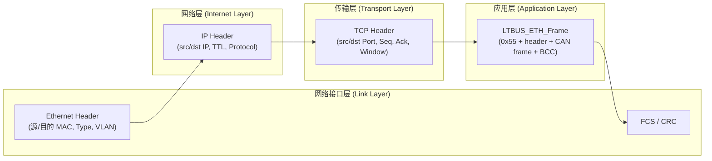

# 四层结构代码实现
我按“**从 APP 到 CAN 盒的一条报文**”来拆，你就能看到：在你这套代码里，**真正你写的只到应用层 + 调 TCP API**，再往下都是内核/驱动干的。

---

## 1. 先画一条完整调用链（分控侧）

以 **“APP 发一帧 CAN 数据”** 为例，从上往下是：

1. **APP / 分控进程（你业务代码）**

   ```c
   void *h = LTBUS_ETH_OpenDevice("LEFT_T_cmd");      // 打开“设备”（其实是CAN+通道抽象）
   ...
   UINT8 canData[8] = {...};
   LTBUS_ETH_DeviceSend(h, canData, sizeof(canData), timeout_us);
   LTBUS_ETH_DeviceRecv(h, canData, &len, timeout_us);
   ```

   这一层全部是 **应用层(应用协议 + 业务逻辑)**。

2. **libhelf_cp_ls.so 里的 ETH 封装（应用层协议）**

   你上面这些 API 的实现都在 `ltbus_eth_device_opt.c` 里：

   * `LTBUS_ETH_OpenDevice`

     * `LTBUS_ETH_IsNameValid`（检查名字）
     * `LTBUS_ETH_GetDevCfg` → 从 SHM 里找到对应 `LTBUS_ETH_DeviceCfg`
     * `LTBUS_ETH_GetTcpClientFd` → 走 UDS 拿到真正的 TCP client fd
   * `LTBUS_ETH_DeviceSend`

     * `CheckParaAndReviseTimeOut`（参数检查+timeout 修正）

       * `LTBUS_ETH_CheckPara` / `LTBUS_ETH_CheckDevHandle`
       * `LTBUS_ETH_ReviseTimeout`
     * `LTBUS_ETH_CreateCanFrame` → **把 8 字节 CAN 数据封成 `LTBUS_ETH_Frame`**
     * `send(clientFd, &ethFrame, CAN_FRAME_LENGTH, 0)` → 交给 **TCP/IP 协议栈**
   * `LTBUS_ETH_DeviceRecv`

     * 参数检查 + timeout
     * 从 `devInfo->canFrame.data` 拷贝数据给 APP（从 SHM 里读最新）

   **这一整块就是“应用层协议”和你的库封装。**

3. **UNIX 域 socket 传 fd（本机 IPC，也属应用层机制）**

   客户端 handle 里的 `clientFd` 是靠 `LTBUS_ETH_GetTcpClientFd` 拿到的：

   ```c
   unixFd = socket(AF_UNIX, SOCK_STREAM, 0);          // Unix 域 socket
   connect(unixFd, (struct sockaddr *)&unixAddr, ...);
   recvmsg(unixFd, &msg, 0);                          // 带 SCM_RIGHTS 控制消息
   *clientFd = *(INT32 *)CMSG_DATA(cmsg);             // 这里拿到 TCP fd
   ```

   这一段是 **纯本机进程间通信(IPC)**，不在 TCP/IP 四层模型里，抽象上也归到应用层。

4. **传输层 / 网络层 / 链路层**

   对 APP 而言，这里你就只看到一个整数 `clientFd`，真正的 **TCP/IP、IP 路由、以太网** 都在内核和网卡里跑了。

---

## 2. 服务端进程 `ltbus_eth_server` 每一层对应哪段代码

### 2.1 应用层：你的协议 + 业务逻辑

**入口 main：**

```c
int main(...) {
    LTR_Init(0);                          // 日志/平台初始化
    signal(SIGINT, LTBUS_ETH_StopHandler);
    ...

    devListCfg = LTBUS_ETH_MallocDevListCfgShm();     // 映射 SHM
    LTBUS_ETH_ParseEthCfg(devListCfg);                // 解析 EthDeviceListCfg_LS_CP.json

    LTBUS_ETH_ServerInit(&g_socketInfo, devListCfg);  // 建立 TCP + UDS server, 进入主循环
}
```

**ServerInit → 建两个 server：**

```c
STATIC INT32 LTBUS_ETH_ServerInit(...) {
    LTBUS_ETH_CreatTcpSocket(socketInfo, devListCfg);   // TCP server (CAN 盒连进来)
    LTBUS_ETH_CreatUnixSocket(socketInfo);              // UDS server (给 lib 传 fd)
    ListenClient(socketInfo, devListCfg);               // select 主循环
}
```

**1）处理 TCP 客户端（CAN 盒）数据：**

* `LTBUS_ETH_CreatTcpSocket`

  ```c
  socketInfo->tcpSocketFd = socket(AF_INET, SOCK_STREAM, 0);  // 后面讲：这是传输层入口
  bind(tcpSocketFd, ... serverAddr ...);
  listen(tcpSocketFd, ...);
  ```

* `ListenClient` 主循环 + `AccpetTcpClientRequst`

  ```c
  readyNum = select(maxfd+1, &readFds, ...);

  if (FD_ISSET(tcpSocketFd, &readFds)) {
      AccpetTcpClientRequst(socketInfo);  // accept 新 TCP client
  }

  ReceiveClientMsg(socketInfo, devListCfg, &readFds, readyNum); // 收数据
  ```

* `ReceiveClientMsg`

  ```c
  recvLen = recv(clientFd, buff + noSaveDataLen, ...);   // 读 TCP 字节流
  ProcessMessage(socketInfo, devListCfg);                // 解析成你的 LTBUS_ETH_Frame
  ```

* `ProcessMessage`：按你定义的 **ETH_START_FLAG(0x55) + header + data + bcc** 解析

  ```c
  if (buff[i] != ETH_START_FLAG) ...                // 找包头 0x55
  header = (LTBUS_ETH_Header *)(buff + i);
  dataLen = ntohs(header->dataLen);                 // 获取数据段长度
  ...
  if (CalculateBcc(...) != 0) ...                   // BCC 校验
  dataCnt = dataLen / ETH_PACKET_DATA_LEN;          // 根据帧长算有几条CAN frame
  for (j = 0; j < dataCnt; j++) {
      tmpBuff = buff + i + ETH_PACKET_HEADER_LEN + j * ETH_PACKET_DATA_LEN;
      RecordClientMsg(devListCfg, tmpBuff, ETH_PACKET_DATA_LEN);
  }
  ```

* `RecordClientMsg`：根据 `{canId, channelId}` 找到 SHM 里的条目，更新数据：

  ```c
  canId = ntohl(canFrame->canId);
  channelId = canFrame->channelId;

  for (i=0; i<devListCfg->devCnt; i++) {
      devInfo = &devListCfg->deviceList[i].deviceInfo.canDevInfo;
      if (canId == devInfo->canId && channelId == devInfo->channelId) {
          memcpy_s(&devInfo->canFrame, len, buff, len);     // 写入最新 CAN frame
          devInfo->stats.lastRecvTime = LTR_GetCurrentTsc();
          devInfo->stats.rxCnt++;                           // Rx 计数 (DFX)
          break;
      }
  }
  ```

  这整套：`ProcessMessage` / `RecordClientMsg` / `devInfo->stats`，都是 **应用层协议 + DFX 逻辑**。

**2）处理 UDS 客户端（lib）拿 TCP fd：**

* `LTBUS_ETH_CreatUnixSocket`

  ```c
  unixSocketFd = socket(AF_UNIX, SOCK_STREAM, 0);
  bind(unixSocketFd, "/tmp/uds_passfd.sock");
  listen(unixSocketFd, ...);
  ```

* `ListenClient` 中：

  ```c
  if (FD_ISSET(unixSocketFd, &readFds)) {
      AccpetUnixClientRequst(socketInfo);   // 有 lib 来要 fd
  }
  ```

* `AccpetUnixClientRequst`：把 TCP client fd 塞进 SCM_RIGHTS 发出去

  ```c
  clientFd = accept(unixSocketFd, ...);      // UDS client
  cmsg = CMSG_FIRSTHDR(&msg);
  cmsg->cmsg_type = SCM_RIGHTS;
  *(int *)CMSG_DATA(cmsg) = socketInfo->client[0];   // 把第一个 TCP client fd 传过去
  sendmsg(clientFd, &msg, 0);
  ```

这块也是 **应用层 IPC 逻辑**，只是帮库拿到真实 TCP fd。

---

## 3. 对照 TCP/IP 四层：每一层“调用点”在哪

我按层给你列个表（**只列你能看到/写到的地方**）：

### 3.1 应用层（Application Layer）

你自己的协议 & 业务全部在这层：

* **客户端（分控 / LTSENSOR 侧）**

  * `LTBUS_ETH_OpenDevice`

    * 读 SHM 配置 (`LTBUS_ETH_MallocDevListCfgShm` + `LTBUS_ETH_GetDevCfg`)
    * UDS 拿 TCP fd (`LTBUS_ETH_GetTcpClientFd`)
  * `LTBUS_ETH_DeviceSend`

    * `LTBUS_ETH_CreateCanFrame`（组 `LTBUS_ETH_Frame`，相当于你的“应用层 PDU”）
    * `send(clientFd, ...)`
  * `LTBUS_ETH_DeviceRecv`

    * 从 `devInfo->canFrame.data` 拷贝最新数据给 APP

* **服务端（ltbus_eth_server）**

  * `LTBUS_ETH_ParseEthCfg`（解析 JSON 配置文件）
  * `ListenClient` / `ReceiveClientMsg` / `ProcessMessage` / `RecordClientMsg`

    * 按 0x55 / dataLen / BCC 解析、拆分多条 CAN frame，写 SHM，更新统计
  * 所有 DFX（`txCnt/rxCnt/lastRecvTime/lastsendTime`）

* **本机 IPC（不属于 TCP/IP，但同层级）**

  * UDS：`LTBUS_ETH_CreatUnixSocket` / `AccpetUnixClientRequst` / `LTBUS_ETH_GetTcpClientFd`

> 换句话说：**你所有能改的协议都是应用层；下面 TCP/IP 都是“库函数入口 + 配置”**。

### 3.2 传输层（Transport Layer – TCP）

你在“传输层”唯一能看到的，就是这些 **系统调用(system call)**：

* **服务端：`ltbus_eth_server.c`**

  * 建 TCP server：

    ```c
    socket(AF_INET, SOCK_STREAM, 0);      // 创建 TCP socket
    bind(tcpSocketFd, ...);               // 绑定 ServerIP + Port
    listen(tcpSocketFd, ...);             // 监听
    accept(tcpSocketFd, ...);             // 接受 CAN 盒连接
    ```
  * 收数据：

    ```c
    recv(clientFd, buff, ...);
    ```

* **客户端：`ltbus_eth_device_opt.c`**

  * 真正发数据：

    ```c
    send(clientFd, (UINT8 *)&ethFrame, CAN_FRAME_LENGTH, 0);
    ```

* **CANFDNET-400U 盒子内部**

  * 你不写代码，但它固件肯定是：

    ```c
    socket(AF_INET, SOCK_STREAM, 0);
    connect(...ServerIP, ServerPort...);
    send/recv(...);
    ```

这些调用一进内核，就进入 **TCP 协议栈**：三次握手、滑动窗口、重传、流量控制……你不用自己管。

### 3.3 网络层（Internet Layer – IP）

你对 IP 层唯一的“代码上的触点”，就是设置 `sockaddr_in`：

```c
struct sockaddr_in serverAddr;
serverAddr.sin_family = AF_INET;
serverAddr.sin_addr.s_addr = ethChannelData->serverIP;   // 来自 JSON → ParseEthCfg
serverAddr.sin_port = htons(ethChannelData->serverPort);
bind(tcpSocketFd, (struct sockaddr *)&serverAddr, sizeof(serverAddr));
```

* `serverIP` / `clientIP` 字段在 `EthDeviceListCfg_LS_CP.json` 里配置，
  解析后塞进 `LTBUS_ETH_DeviceBusPathData.ethChannelData.serverIP/clientIP`。
* 真正的 **IP 头构造、路由查表、ARP、TTL** 等全部在内核和网关/交换机/路由器里实现，你看不到 IP header 本身。

### 3.4 网络接口层（Link Layer – Ethernet）

这一层你在用户态没有直接操作：

* 真实的以太网帧：`[MAC 头][IP][TCP][你的 LTBUS_ETH_Frame][FCS]`
* 是 **Linux 网卡驱动 + PHY + 交换机** 做的。
* 你代码里的：

  ```c
  #define ETH_START_FLAG 0x55
  typedef struct {
      UINT8 startFlag;
      ...
  } LTBUS_ETH_Header;
  ```

  是 **你自己的应用层“帧头”**，不是以太网 MAC 头。

只有当你用 `socket(PF_PACKET, SOCK_RAW, ...)` 这种 raw socket 才会直接碰到 L2。你现在全是 `AF_INET/SOCK_STREAM`，所以链路层完全被 TCP/IP 栈隐藏掉了。

---

## 4. 总结一句话记忆

* **应用层**：
  所有 `LTBUS_ETH_*`、`ltbus_eth_server.c`、`LTBUS_ETH_Frame`、JSON 配置、SHM、UDS 传 fd，全在这一层。

* **传输层 (TCP)**：
  你写的只是 `socket/bind/listen/accept/connect/send/recv` 这些调用点，真正 TCP 逻辑在内核。

* **网络层 (IP)**：
  你只负责填 `ServerIP/ClientIP` → `sockaddr_in`，IP header & 路由都是协议栈干。

* **链路层 (Ethernet)**：
  完全看不到代码，由网卡驱动、PHY、交换机/路由器处理。

如果你愿意，下一步我可以帮你把这些整理成 **文档里的一个小节**，比如“*本模块在 TCP/IP 四层中的实现对应关系*”，直接可贴到设计文档里。

那我直接给你一段**可以往设计文档里粘的章节**，你按需要改编号就行。

---

# 4.3 本协议在 TCP/IP 四层模型中的映射

本节说明本项目中各模块在 TCP/IP 四层模型中的位置，以及每一层在代码中的实现位置和调用关系，便于后续定位问题与扩展协议。

#### 4.3.1 通信参与方与分层关系

表 4-X 给出了主要参与模块在 TCP/IP 模型中的定位：

| 模块/角色                              | 所在层次                    | 说明                                                 |
| ---------------------------------- | ----------------------- | -------------------------------------------------- |
| 分控进程 / APP                         | 应用层 (Application Layer) | 调用 `LTSENSOR` 接口发送/接收 CAN 业务数据                     |
| LTSENSOR                           | 应用层                     | 业务库，调用 `libhelf_cp_ls.so` 中 ETH 封装接口               |
| `libhelf_cp_ls.so` (`LTBUS_ETH_*`) | 应用层                     | 实现自定义应用层协议：`LTBUS_ETH_Frame` 打包/解包、设备抽象            |
| `ltbus_eth_server` 进程              | 应用层                     | 作为 TCP server 端，解析 `LTBUS_ETH_Frame`，读写 SHM，统计 DFX |
| SHM / UDS (AF_UNIX)                | 应用层 IPC (进程间通信)         | 用于本机进程间传递配置与 TCP fd，不属于 TCP/IP 四层                  |
| CANFDNET-400U 设备内部协议               | 应用层                     | 固件实现 CAN↔以太网转换，解析/生成 `LTBUS_ETH_Frame`             |
| TCP (`SOCK_STREAM`)                | 传输层 (Transport Layer)   | 提供可靠字节流，内核实现，用户态通过 `socket/send/recv` 调用           |
| IPv4                               | 网络层 (Internet Layer)    | 负责寻址与路由，内核实现，用户态通过 `sockaddr_in` 配置 IP/端口          |
| 以太网 MAC / 网卡 / 交换机                 | 网络接口层 (Link Layer)      | 负责帧转发与物理收发，由网卡驱动与交换机实现                             |

#### 4.3.2 报文封装关系

在本协议中，自定义的以太网 CAN 报文格式定义如下（示意）：

```c
typedef struct {
    UINT8  startFlag;   // 0x55
    UINT8  canType;
    UINT8  typePara;
    UINT8  rsv;
    UINT16 dataLen;
} LTBUS_ETH_Header;

typedef struct {
    UINT64 timeStamp;
    UINT32 canId;
    UINT16 msg;
    UINT8  channelId;
    UINT8  dataLen;
    UINT8  data[CAN_DATA_LEN];  // 8 bytes CAN data
} LTBUS_ETH_CanFrame;

typedef struct {
    LTBUS_ETH_Header  header;
    LTBUS_ETH_CanFrame data;
    UINT8             bcc;
} LTBUS_ETH_Frame;
```

在 TCP/IP 模型中的封装关系为：

* 应用层：`LTBUS_ETH_Frame`
* 传输层：`TCP Header`
* 网络层：`IP Header`
* 链路层：`Ethernet Header + FCS`

对应关系如下图所示：



因此，本项目中真正“自定义”的协议全部位于 **应用层**，下层均为现成 TCP/IP 协议栈与网卡驱动实现。

#### 4.3.3 各层在代码中的实现对应

本小节从“每一层调用哪段代码”的视角，对应列出关键模块与接口。

##### 4.3.3.1 应用层 (Application Layer)

**1）分控 / LTSENSOR 侧**

* 主要文件：

  * `ltbus_eth_device_opt.c`（示意文件名，以实际工程为准）
* 关键结构：

  * `LTBUS_ETH_DeviceHandle` / `LTBUS_ETH_DeviceCfg` / `LTBUS_CanDevInfo` 等
* 关键接口：

  * `LTBUS_ETH_OpenDevice(const char *deviceName)`

    * 校验设备名：`LTBUS_ETH_IsNameValid`
    * 从 SHM 读取设备配置：`LTBUS_ETH_GetDevCfg`
    * 通过 UDS 获取 TCP client fd：`LTBUS_ETH_GetTcpClientFd`
  * `LTBUS_ETH_DeviceSend(LTBUS_ETH_DeviceHandle *handle, const UINT8 *data, UINT32 len, UINT32 timeoutUs)`

    * 参数检查与超时修正：`LTBUS_ETH_CheckPara` / `LTBUS_ETH_ReviseTimeout`
    * 组包：`LTBUS_ETH_CreateCanFrame` → 构造 `LTBUS_ETH_Frame`
    * 调用传输层入口：`send(handle->clientFd, &ethFrame, CAN_FRAME_LENGTH, 0);`
  * `LTBUS_ETH_DeviceRecv(...)`

    * 从 SHM 中对应 `devInfo->canFrame.data` 拷贝最新 CAN 数据返回给 APP

**2）服务端 `ltbus_eth_server` 进程**

* 主要文件：

  * `ltbus_eth_server.c`
* 关键初始化流程：

  * `LTBUS_ETH_MallocDevListCfgShm()`：创建/映射 SHM，保存设备列表与统计信息
  * `LTBUS_ETH_ParseEthCfg(devListCfg)`：解析 `EthDeviceListCfg_LS_CP.json`，填充 `serverIP/serverPort/canId/channelId` 等
  * `LTBUS_ETH_ServerInit(&g_socketInfo, devListCfg)`：创建 TCP/UDS server 并进入主循环
* 主循环与报文处理：

  * `ListenClient(socketInfo, devListCfg)`

    * 使用 `select()` 监听：

      * TCP server socket：有新 CANFDNET client 连接时 → `AccpetTcpClientRequst`
      * 已连接的 TCP client：有数据时 → `ReceiveClientMsg`
      * UDS server socket：有 lib 连接时 → `AccpetUnixClientRequst`
  * `ReceiveClientMsg(socketInfo, devListCfg, &readFds, readyNum)`

    * 调用 `recv(clientFd, buff + noSaveDataLen, ...)` 读取 TCP 字节流
    * 调用 `ProcessMessage(socketInfo, devListCfg)` 做应用层帧解析
  * `ProcessMessage(...)`

    * 查找帧头 `ETH_START_FLAG (0x55)`
    * 解析 `LTBUS_ETH_Header`，获取 `dataLen`
    * 校验 BCC：`CalculateBcc(...)`
    * 按 `ETH_PACKET_DATA_LEN` 拆分多个 `LTBUS_ETH_CanFrame`
    * 逐条调用 `RecordClientMsg(devListCfg, tmpBuff, ETH_PACKET_DATA_LEN)`
  * `RecordClientMsg(...)`

    * 根据 `canId/channelId` 匹配 `devListCfg->deviceList[i].deviceInfo.canDevInfo`
    * 更新 `devInfo->canFrame` / `devInfo->stats.lastRecvTime` / `devInfo->stats.rxCnt` 等 DFX 信息

**3）本机 IPC：UDS 传递 TCP fd**

* 主要函数：

  * `LTBUS_ETH_CreatUnixSocket(socketInfo)`

    * `socket(AF_UNIX, SOCK_STREAM, 0);`
    * `bind()` 到固定 UDS 路径
    * `listen()` 等待 lib 连接
  * `AccpetUnixClientRequst(socketInfo)`

    * `accept(unixSocketFd, ...)` 接收 lib 侧连接
    * 通过 `sendmsg()` + `SCM_RIGHTS` 将 `socketInfo->client[0]` 等 TCP fd 传给 `libhelf_cp_ls.so`
  * `LTBUS_ETH_GetTcpClientFd(...)`（lib 侧）

    * `socket(AF_UNIX, SOCK_STREAM, 0);`
    * `connect()` 到 UDS 路径
    * `recvmsg()` 获取 TCP fd，保存到 `handle->clientFd`

> 以上内容均为应用层逻辑，涵盖了自定义协议、配置管理、业务状态与进程间通信。

##### 4.3.3.2 传输层 (Transport Layer – TCP)

传输层由内核 TCP 协议栈实现，用户态仅通过以下系统调用进行访问：

**1）TCP server 端（`ltbus_eth_server`）**

* 创建 socket：

  ```c
  int tcpSocketFd = socket(AF_INET, SOCK_STREAM, 0);  // 创建 TCP socket
  ```
* 绑定本地 IP 与端口：

  ```c
  struct sockaddr_in serverAddr;
  serverAddr.sin_family = AF_INET;
  serverAddr.sin_addr.s_addr = ethChannelData->serverIP;   // 从 JSON 解析
  serverAddr.sin_port = htons(ethChannelData->serverPort); // 如 8000
  bind(tcpSocketFd, (struct sockaddr *)&serverAddr, sizeof(serverAddr));
  ```
* 监听与接受连接：

  ```c
  listen(tcpSocketFd, BACKLOG);
  int clientFd = accept(tcpSocketFd, (struct sockaddr *)&clientAddr, &len);
  ```
* 收取 CANFDNET-400U 发来的数据：

  ```c
  ssize_t recvLen = recv(clientFd, buff, sizeof(buff), 0);
  ```

**2）TCP client 端（CANFDNET-400U 设备）**

* 固件侧典型流程（示意）：

  ```c
  int fd = socket(AF_INET, SOCK_STREAM, 0);
  connect(fd, (struct sockaddr *)&serverAddr, sizeof(serverAddr));
  send(fd, frame, len, 0);
  recv(fd, buff, sizeof(buff), 0);
  ```

**3）库侧发送（`libhelf_cp_ls.so`）**

* 通过 `send()` 将 `LTBUS_ETH_Frame` 交给 TCP 层：

  ```c
  send(handle->clientFd, &ethFrame, CAN_FRAME_LENGTH, 0);
  ```

> 自此之后，TCP 协议栈负责三次握手、重传、滑动窗口、拥塞控制等，应用层无需关心。

##### 4.3.3.3 网络层 (Internet Layer – IP)

网络层主要由内核 IP 协议栈与路由器实现，用户态只在配置 `sockaddr_in` 与路由表时有所涉及。

* IP 地址配置：

  * 来自 `EthDeviceListCfg_LS_CP.json` 中的 `ServerIP/ClientIP` 字段；
  * 在 `LTBUS_ETH_ParseEthCfg()` 时解析并填充到 `ethChannelData->serverIP/clientIP`；
  * 在创建 TCP server 时绑定 `serverIP`，CAN 盒端使用 `serverIP + serverPort` 建立连接。
* 内核按路由表选择下一跳；若跨网段则经由三层路由器转发，若同一网段则仅做二层转发。

> IP 头（源/目的 IP、TTL、校验和等）的构建与解析全部由 IP 协议栈内部完成，代码中看不到具体实现。

##### 4.3.3.4 网络接口层 (Link Layer – Ethernet)

网络接口层包括以太网 MAC 帧格式、网卡驱动与交换机转发逻辑：

* 实际链路层帧格式为：

  ```text
  [Ethernet Header][IP Header][TCP Header][LTBUS_ETH_Frame][FCS]
  ```
* 以太网帧头（源/目的 MAC、Type/VLAN）及 FCS 均由网卡硬件与驱动处理；
* 应用层使用 `AF_INET/SOCK_STREAM` socket 时，看不到以太网头与 FCS 细节；
* 仅在使用 `PF_PACKET/SOCK_RAW` 等 raw socket 时，应用层才需要手工处理链路层。

本项目中不直接操作链路层，相关配置仅限于：

* 网卡 IP/子网掩码/网关配置；
* 必要时配置 VLAN/速率/双工模式等网络参数。

#### 4.3.4 小结

* **自定义协议与业务逻辑**：全部位于应用层，包括 `LTBUS_ETH_Frame` 帧格式、设备配置 JSON、SHM 结构、`LTBUS_ETH_*` 接口以及 `ltbus_eth_server` 进程。
* **传输层 (TCP)**：通过 `socket/bind/listen/accept/send/recv` 系统调用访问，由内核提供可靠传输能力。
* **网络层 (IP)**：仅通过 `serverIP/serverPort` 等参数进行配置，真正的 IP 头构建与路由由内核和网络设备完成。
* **网络接口层 (Ethernet)**：由网卡与交换机负责，以太网帧对应用层透明。

通过上述映射，可以在排查问题时快速判断：**是应用层协议/逻辑问题（看 `LTBUS_ETH_*` 和 `ltbus_eth_server`），还是 TCP/IP 或网络环境问题（看 socket 状态、路由、网卡与交换机）。**
