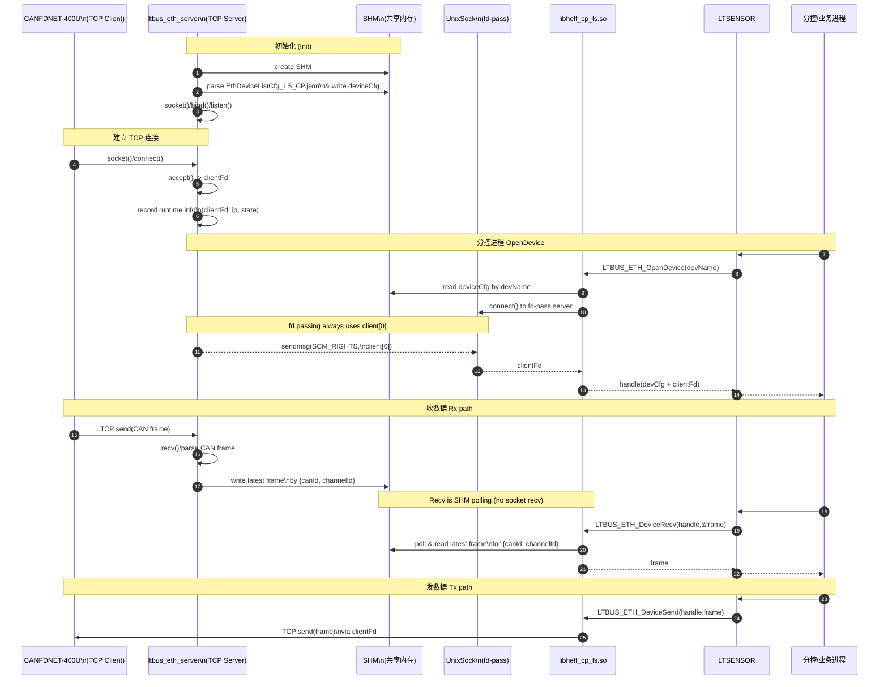
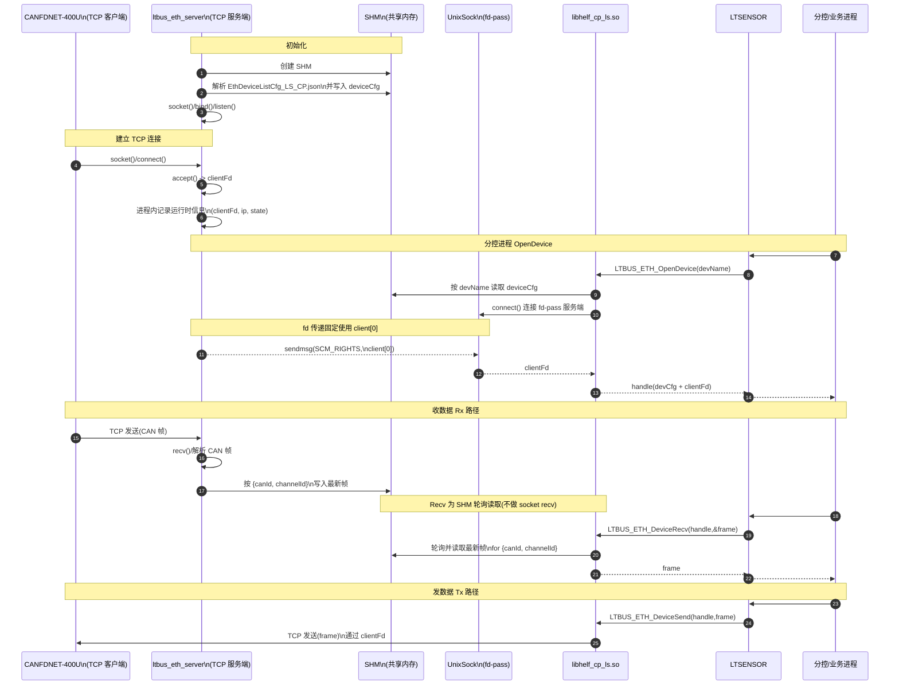
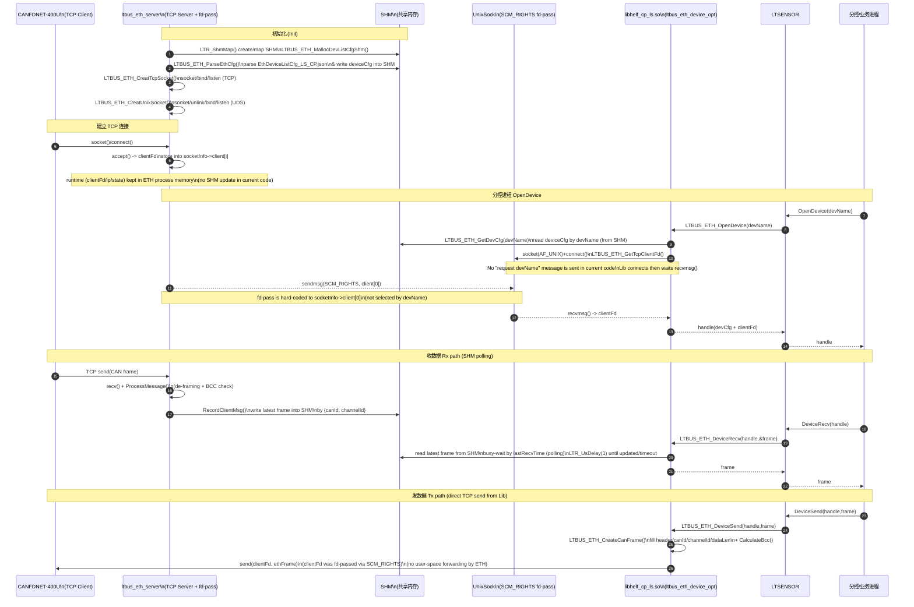

# 时序图与代码映射
## 时序图简化版

## 时序图简化中文版

下面把你这张时序图里每一条“箭头”，落实到**实际代码里的函数/系统调用**，再给出**真实的层级关系**（谁调用谁、谁依赖谁），并指出**和你图里不一致/需要修正的点**。

---

## 1) Init：ETH 进程启动 + SHM 初始化 + 监听

### 你图里的

* `ETH->>SHM: create SHM`
* `ETH->>SHM: parse json & write deviceCfg`
* `ETH->>ETH: socket()/bind()/listen()`

### 实际代码对应

* **create SHM / map SHM**：`LTBUS_ETH_MallocDevListCfgShm()` 内部 `LTR_ShmMap(...)`（共享内存 shared memory）来拿到 `devListCfg` 指针（server 和 lib 都用同一个 SHM 名称）。
* **parse json & write deviceCfg**：`main()` 里调用 `LTBUS_ETH_ParseEthCfg(devListCfg)`，把配置解析结果写进 `devListCfg`（它在 SHM 里）。
* **socket/bind/listen**：

  * TCP：`LTBUS_ETH_CreatTcpSocket()`：`socket(AF_INET, SOCK_STREAM)` + `bind()` + `listen()`（监听 CAN 盒子的 TCP 连接）
  * UDS：`LTBUS_ETH_CreatUnixSocket()`：`socket(AF_UNIX, SOCK_STREAM)` + `unlink()` + `bind()` + `listen()`（用于 fd-pass）
  * 主循环：`ListenClient()` 用 `select()` 同时监听 tcpSocketFd + unixSocketFd + clientFd[]。

---

## 2) 建立 TCP：CAN 盒子 connect() → ETH accept()

### 你图里的

* `CAN->>ETH: socket()/connect()`
* `ETH->>ETH: accept() -> clientFd`
* `ETH->>SHM: update runtime info (clientFd, ip, state)`

### 实际代码对应

* `accept()`：`AccpetTcpClientRequst()` 里 `accept(socketInfo->tcpSocketFd, ...)`，把 `clientFd` 放进 `socketInfo->client[i]`，并 `FD_SET()` 进 `allSet`。
* **你图里的“update runtime info 到 SHM”目前代码里没有做**：accept 后没有把 `clientFd/ip/state` 写到 SHM（至少你贴出来的实现里没有）。这一点你图需要下调为“仅在 server 进程内记录”。

---

## 3) OpenDevice：APP → LTSENSOR → Lib → (SHM + UDS fd-pass)

### 你图里的

* `Lib->>SHM: read deviceCfg by devName`
* `Lib->>UDS: connect() to fd-pass server`
* `Lib->>UDS: request clientFd(devName)`
* `ETH-->>UDS: sendmsg(SCM_RIGHTS, clientFd)`
* `UDS-->>Lib: clientFd`

### 实际代码对应（**完整调用链**）

* `LTBUS_ETH_OpenDevice(deviceName)`：

  1. 校验名字 `LTBUS_ETH_IsNameValid()`
  2. 从 SHM 找 cfg：`LTBUS_ETH_GetDevCfg(deviceName, &deviceCfg)`，它内部会 `LTBUS_ETH_MallocDevListCfgShm()` + 遍历 `deviceList[]` 匹配 `deviceName`（也就是“read deviceCfg by devName”）。
  3. 申请 handle 并保存 `deviceCfg`
  4. 通过 UDS 拿 `clientFd`：`LTBUS_ETH_GetTcpClientFd(&handleInfo.clientFd)`。

* `LTBUS_ETH_GetTcpClientFd()` 细节（fd-pass / SCM_RIGHTS）：

  * `socket(AF_UNIX, SOCK_STREAM)` 创建 unixFd
  * `fcntl(F_GETFL/F_SETFL)` 把 unixFd 设成 `O_NONBLOCK`
  * `connect(unixFd, UNIX_PATH, ...)`
  * 循环 `recvmsg()` 等待控制消息（control message）里带回来的 fd，最多 `TRY_TIME_MAX` 次，每次 `LTR_UsDelay(1)`（1us）。
  * `CMSG_FIRSTHDR` + 校验 `SCM_RIGHTS` + `CMSG_DATA` 取出 `clientFd`。

* UDS server 端的“发 fd”：

  * `ListenClient()` 发现 unixSocketFd 可读 → `AccpetUnixClientRequst()` → `sendmsg(... SCM_RIGHTS ...)` 把 tcp fd 传给对端。 

### 和你图不一致的关键点（必须标出来）

1. **“Lib->UDS: request clientFd(devName)”这一步在代码里不存在**：`LTBUS_ETH_GetTcpClientFd()` 只 `connect()` 然后直接 `recvmsg()`，没有发送 deviceName/请求报文。
2. **UDS server 端也没有按 devName 选择 fd**：它写死发 `socketInfo->client[0]` 给任何来连 UDS 的进程。

   * 结论：你现在的实现语义是 **“拿到第 0 个 TCP client 的 fd”**，而不是“按设备名拿对应 fd”。

---

## 4) Rx：CAN → ETH recv()/parse → 写 SHM → APP 读 SHM

### 你图里的

* `ETH->>ETH: recv()/parse CAN frame`
* `ETH->>SHM: write latest frame by {canId, channelId}`
* `Lib->>SHM: read latest frame for {canId, channelId}`

### 实际代码对应

* **server 收包**：`ReceiveClientMsg()` 对每个 `clientFd` 调 `recv()`，然后 `ProcessMessage()` 做粘包/拆包解析。

* **parse**：`ProcessMessage()`：

  * 检查帧头 `ETH_START_FLAG`
  * 检查 `ETH_PACKET_HEADER_LEN`
  * 用 `CalculateBcc()` 校验 BCC（xor）不过就丢弃
  * 按 `dataLen / ETH_PACKET_DATA_LEN` 拆出多个 payload。

* **写 SHM 最新帧**：`RecordClientMsg()`：

  * 从 payload 取 `canId/channelId`
  * 遍历 `devListCfg->deviceList[]` 找到匹配的 `devInfo`
  * `memcpy_s(&devInfo->canFrame, ...)` 写入最新帧，同时更新 `lastRecvTime` 和 `rxCnt`。

* **Lib 侧读 SHM**：`LTBUS_ETH_DeviceRecv()` 完全不读 socket，它是：

  * 看 `devInfo->stats.lastRecvTime` 是否“太老”（stale）
  * 太老就 `LTR_UsDelay(1)` 自旋等更新，直到超时
  * 然后 `memcpy_s(buff, ..., devInfo->canFrame.data, ...)` 把 SHM 里的 data 拷贝给上层。

> 所以你的 Rx path 本质是 **“server 进程把 socket 数据搬运到 SHM；业务侧轮询 SHM”**。

---

## 5) Tx：APP → Lib send() → (同一条 TCP 连接) → CAN

### 你图里的

* `Lib->>ETH: TCP send(frame) via clientFd`
* `ETH->>CAN: forward ...`

### 实际代码对应（重要语义）

* `LTBUS_ETH_DeviceSend()`：

  * `LTBUS_ETH_CreateCanFrame()` 组包：填 header/canId/channelId/dataLen + 计算 BCC 
  * `send(clientFd, &ethFrame, CAN_FRAME_LENGTH, 0)` 直接往 tcp fd 发数据 
  * 更新 `lastsendTime/txCnt`。

**关键解释**：这里的 `clientFd` 是从 ETH 进程通过 `SCM_RIGHTS` “复制”(fd passing) 过来的一个 fd，它指向同一个内核 socket（kernel socket）。所以 **Tx 实际上不需要 ETH 进程转发**；Lib/业务进程直接把数据写进 TCP 连接，远端 CAN 盒子就能收到。

> 因此你图里“Lib->ETH: send”更准确的表达是：
> **Lib -> (kernel TCP stack) -> CAN**，ETH 进程并不参与这次 send 的用户态路径。

---

## 6) 最真实的“层级关系”（谁依赖谁）

从“上层到下层”按调用/依赖梳理：

1. **分控/业务进程 (APP)**
   ↓（业务调用）
2. **LTSENSOR（你的封装层）**
   ↓（库接口）
3. **libhelf_cp_ls.so / ltbus_eth_device_opt.c**

   * Open：读 SHM cfg + 走 UDS fd-pass 拿 `clientFd` 
   * Recv：读 SHM 最新帧（轮询）
   * Send：直接 `send()` TCP fd 
     ↓（OS IPC + OS network）
4. **OS 机制**

   * SHM（shared memory）：`LTR_ShmMap` 的共享结构体
   * UDS（Unix domain socket）：`sendmsg/recvmsg` + `SCM_RIGHTS` fd passing 
   * TCP/IP 协议栈（kernel TCP stack）
5. **ltbus_eth_server 进程（只负责：收包→解析→写 SHM + fd-pass 服务）**

   * `select()` loop + `recv()` + `ProcessMessage()` + `RecordClientMsg()`  

---

## 7) 你这张时序图建议立刻改的 3 个点（按代码事实）

1. **删掉/弱化 “request clientFd(devName)”**：目前 Lib 没发请求，server 也没解析请求。
2. **标注“UDS 发的是 client[0]”**：否则读者会以为支持按设备/按连接选择 fd（现在不是）。
3. **Tx path 不经过 ETH 用户态转发**：Lib 直接 `send()`；ETH 进程只在 Rx path 扮演搬运工。

---

如果你愿意我按“**不大改结构**”的原则，直接给你一版“与代码 100% 对齐”的 Mermaid 时序图（把上面 3 个点修正掉），并在图里用注释标注 **fd passing 是 client[0]**、**Recv 是 SHM polling**。

## 时序图详细版
