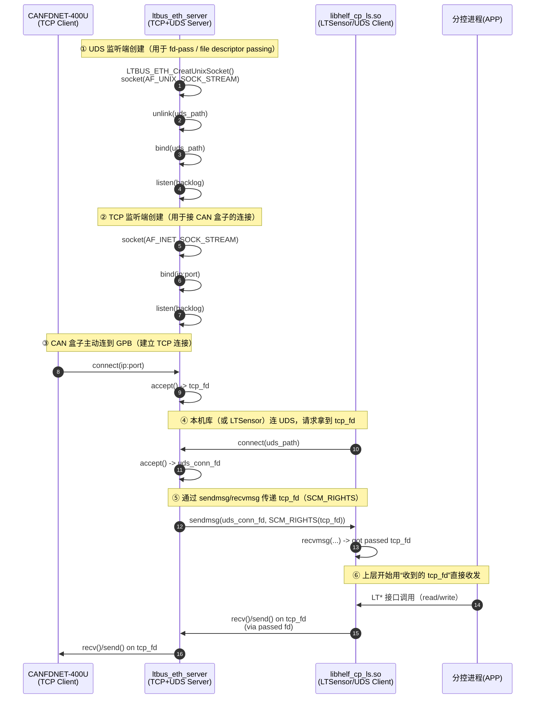

## UDS

UDS：LTBUS_ETH_CreatUnixSocket()：socket(AF_UNIX, SOCK_STREAM) + unlink() + bind() + listen()（用于 fd-pass）

这里的 **UDS** 指的是 **Unix Domain Socket（Unix 域套接字）**，不是汽车诊断那个 **UDS（Unified Diagnostic Services）**。

在你这套代码里，`LTBUS_ETH_CreatUnixSocket()` 做的事情是：**在本机上创建一个 Unix 域“服务端监听口”**（路径一般是类似 `/tmp/uds_passfd.sock`），专门用来 **fd-pass（file descriptor passing，文件描述符传递）**。

### 这串调用分别干嘛

* `socket(AF_UNIX, SOCK_STREAM, 0)`

  * 创建一个 **本机 IPC** 的连接型 socket（stream-oriented，类似 TCP 语义，但不走网卡、不走 IP）。

* `unlink(UNIX_PATH)`

  * Unix 域 socket 用 **文件路径** 作为“地址”。进程异常退出时，这个路径文件可能残留。
  * `unlink()` 先删掉旧文件，避免 `bind()` 报 **EADDRINUSE**。

* `bind(fd, {sun_family=AF_UNIX, sun_path=...})`

  * 把这个 socket 绑定到某个路径（会在文件系统里生成一个 socket 文件节点）。

* `listen(fd, backlog)`

  * 进入监听状态，允许别的进程 `connect()` 进来，然后你再 `accept()`。

### “用于 fd-pass”是什么意思

只有 **AF_UNIX** 支持用 `sendmsg()/recvmsg()` 携带 **SCM_RIGHTS** 控制消息，把一个已经打开的 **fd** 传给另一个进程。

你的整体意图一般是这样的：

1. `ltbus_eth_server` 进程：对外 `accept()` 到 TCP 客户端连接，拿到 `tcp_client_fd`
2. 同时起一个 UDS 监听（就是这个 `LTBUS_ETH_CreatUnixSocket()`）
3. 其他进程（或库函数 `OpenDevice`）用 UDS `connect()` 上来
4. server 用 `sendmsg(..., SCM_RIGHTS)` 把 `tcp_client_fd` 传过去
5. 接收方 `recvmsg()` 拿到这个 fd，以后就能直接 `send()/recv()` 操作那条 TCP 连接

### 使用时的关键注意点

* **这是“同一台机器内”进程间传 fd**：跨机器不行。
* fd 传过去后，两个进程共享同一个 socket 对象（kernel state）：一边 `close()` 可能会影响另一边（引用计数语义）。
* UDS 路径文件的 **权限/所有权** 会影响谁能连上来（常见要考虑 `umask` / `chmod` / 放到 `/run` 等）。

如果你愿意，我也可以直接按你这份代码把 **fd-pass 的完整时序**（server `accept`/`sendmsg` ↔ client `connect`/`recvmsg`）画成一张 sequence diagram，方便写进设计文档里。

下面给你一张 **sequence diagram（时序图）**，把 **TCP 通道**（CAN 盒子↔GPB）和 **UDS(fd-pass) 通道**（本机进程间）放在一起，并在每一步旁边标注“对应的代码/系统调用”。

---

## Sequence diagram（Mermaid）



---

## 和代码逐步对比（你已有的 + 必需补齐的）

### A) `LTBUS_ETH_CreatUnixSocket()`（你已经明确了）

你写的这段：

* `socket(AF_UNIX, SOCK_STREAM)` ✅（UDS / Unix Domain Socket）
* `unlink()` ✅（清理旧的 uds_path，防止 bind EADDRINUSE）
* `bind()` ✅（绑定到路径）
* `listen()` ✅（开始监听）

**缺的不是它本身，而是它后续“必须被使用”的两步：**

* `accept()`（接入 UDS client 连接）
* `sendmsg(... SCM_RIGHTS ...)`（真正把 fd 传出去）

> 如果你现在只做到 `listen()`，那就只是“开了个门”，但还没“让人进来”和“把钥匙交出去”。

---

### B) Server 侧（ltbus_eth_server）典型骨架对照

**TCP 部分（接 CAN 盒子）**

```c
tcp_listen_fd = socket(AF_INET, SOCK_STREAM, 0);
bind(tcp_listen_fd, ...);
listen(tcp_listen_fd, ...);

tcp_fd = accept(tcp_listen_fd, ...);   // <-- 对应图中第 ③ 步
```

**UDS + fd-pass 部分（给本机库/进程发 tcp_fd）**

```c
uds_listen_fd = LTBUS_ETH_CreatUnixSocket();   // <-- 图中第 ① 步

uds_conn_fd = accept(uds_listen_fd, ...);      // <-- 图中第 ④ 步
LTBUS_ETH_SendFd(uds_conn_fd, tcp_fd);         // <-- 图中第 ⑤ 步（关键）
```

---

### C) Client 侧（libhelf_cp_ls.so / LTSensor）典型骨架对照

```c
uds_fd = socket(AF_UNIX, SOCK_STREAM, 0);
connect(uds_fd, uds_path);               // <-- 图中第 ④ 步
tcp_fd = LTBUS_ETH_RecvFd(uds_fd);       // <-- 图中第 ⑤ 步
// 后续直接用 tcp_fd 做 recv/send         // <-- 图中第 ⑥ 步
```

---

## 关键实现点（最容易“代码对不上图”的地方）

1. **fd-pass 只能用 `sendmsg/recvmsg`**（不是 `send/recv`）

   * 必须带 `SCM_RIGHTS`（control message 控制消息）。

2. **`LTBUS_ETH_CreatUnixSocket()` 是“监听端(server)”函数**

   * client 侧必须是 `socket + connect`，不是 `bind/listen`。

3. **传完 fd 后，原进程要不要 `close(tcp_fd)`？**

   * 取决于你的 ownership（所有权）设计：

     * 如果 server 仍负责收发：不该关。
     * 如果希望“把连接移交给 LTSensor”：server 传完就可以关（但要确保移交时序正确）。

4. **并发/多连接**

   * 多个 CAN TCP 连接时：你要定义“哪个 tcp_fd 对应哪个 UDS 请求”（通常要先发一个小的 metadata，比如连接 ID，再传 fd）。

---

如果你把下面两段也贴出来（server 侧“传 fd”那段、client 侧“收 fd”那段），我可以逐行在图上标注到“第 N 步”，并指出哪里缺了 `accept()`、哪里用错了 `send()`、哪里需要 metadata 做关联：

* `ltbus_eth_server` 里 UDS accept / 发送 fd 的函数
* `libhelf_cp_ls.so` 里 UDS connect / 接收 fd 的函数

## 为什么需要一个 tcp一个uds

因为这两条“通道”解决的是 **两类完全不同的问题**：

## 1) TCP：解决“跨设备通信”

CANFDNET-400U 在网络上，它只能通过 **TCP/IP** 跟 GPB 建连接、传数据（走网卡、走 IP、能跨机器）。

所以 **TCP 是对外的业务链路**：
CAN 盒子 ⇄ GPB（网络）

## 2) UDS：解决“同一台机器内进程间交接连接”

`ltbus_eth_server` 和 `LTSensor/libhelf_cp_ls.so` 在 **同一台 GPB** 上，但它们是不同进程/模块。你想要的是：

* 由 server 统一 `accept()` 外部 TCP 连接（记录日志、管理多连接、重连策略、限流等）
* 但真正收发/解析业务数据在另一个进程（LTSensor/库）里做

这时候要把“已经 accept 到的那个 tcp_fd（文件描述符）”交给另一个进程继续用。**只有 Unix Domain Socket(AF_UNIX) 支持 fd-pass（SCM_RIGHTS）**，TCP 不支持“把一个现成连接的 fd 传给另一个进程”。

所以 **UDS 是本机控制/交接通道**：
server ⇄ worker（本机），用于传递 tcp_fd

## 3) 如果不用 UDS 会怎样？

你通常只能选下面几种（都各有代价）：

* **全塞进一个进程**：最简单，但耦合重、模块边界没了、稳定性/重启/权限隔离差。
* **让 worker 自己去 accept TCP**：那你就需要把监听/多连接/日志/断连处理也搬过去；或者多个进程抢 accept 还要处理并发与归属。
* **server 做 TCP 代理转发给 worker**（比如再开一个本机 TCP/管道转发数据）：能做，但会多一层转发/拷贝/时延，复杂度上升，而且 worker 仍拿不到“原始 tcp_fd”。

## 4) 一句话总结

* **TCP**：对外连 CAN 盒子（跨机器）
* **UDS**：对内把“已建立的 TCP 连接句柄（tcp_fd）”移交给另一个进程（fd-pass）

如果你愿意，我也可以按你当前架构给一个“何时用 fd-pass、何时不用”的判断表（比如：单进程/多进程、是否需要热重启、是否需要权限隔离、时延要求等）。
