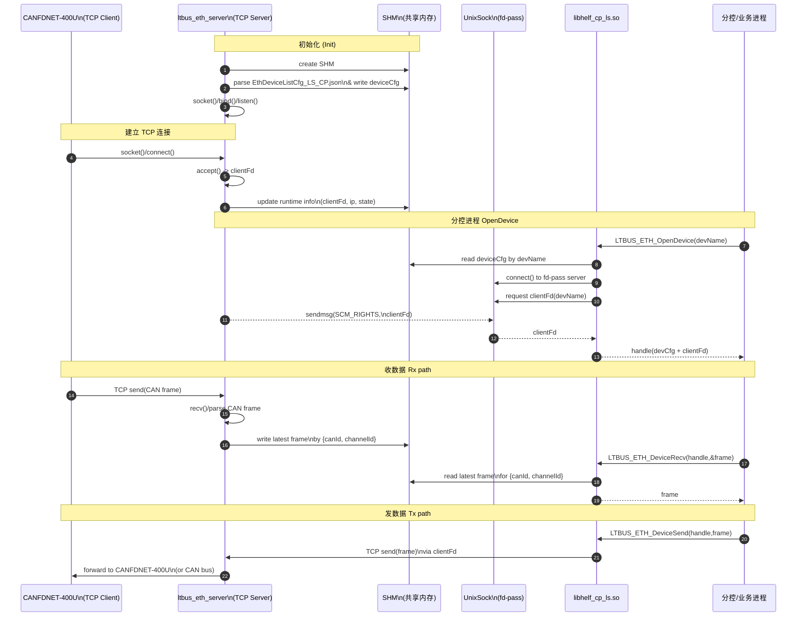

下面是一份围绕“整体时序图”的**设计+介绍文档草稿**，用 Markdown 写好，你可以直接丢进你现有文档里按需裁剪。

---

## 1 需求描述

### 1.1 背景

LS 子系统新增 CAN 转 ETH 模块，采用 CANFDNET-400U 作为 CAN→Ethernet 网关盒子。盒子通过 TCP/IP 与 GPB 板卡（Hi1620 CPU）通信，最终由用户态分控进程解析 CAN 报文并提供业务接口，整条链路对时延有较高要求。

### 1.2 通信链路概述

- 下位机：CANFDNET-400U（作为 TCP Client），连接 CAN 总线，并将 CAN 帧封装成自定义以太网帧，通过 TCP 主动连接 GPB。
    
- GPB：运行 `ltbus_eth_server` 守护进程（TCP Server），负责：
    
    - 监听 CAN 盒子 TCP 连接，接收并解析数据；
        
    - 根据 `CanId + ChannelId`（CAN 号 + 通道号）将数据写入共享内存（SHM）；
        
    - 通过 Unix Domain Socket（UDS）给业务进程传递 TCP client fd。
        
- 业务进程：通过 `libhelf_cp_ls.so` 提供的统一接口 `LTBUS_ETH_OpenDevice / DeviceSend / DeviceRecv / CloseDevice` 来访问 CAN-over-ETH 设备：
    
    - `OpenDevice`：根据 DeviceName 从 SHM 读取配置，并通过 UDS 获取对应的 TCP client fd；
        
    - `DeviceRecv`：从 SHM 中读取指定 `{CanId, ChannelId}` 的最新数据；
        
    - `DeviceSend`：将用户 payload 填充到 CAN 帧结构，再通过 TCP fd 下发给 CAN 盒子。
        

### 1.3 设计目标

- 统一对上暴露为“CAN 设备”接口（类似原生 CAN 设备的 open/read/write 语义）。
    
- 支持多个 CAN 盒子 / 多个逻辑 CAN 通道。
    
- 支持多个业务进程同时访问（通过 SHM 共享数据）。
    
- 对读路径进行缓存（最新帧）以降低时延。
    

---

## 2 名词与角色说明

- **CANFDNET-400U**：CAN 转以太网盒子，作为 TCP Client 主动连接 GPB。
    
- **ltbus_eth_server**：运行在 Hi1620 上的服务端进程，负责 TCP/Unix socket、选择多路复用（select）、数据解析和 SHM 更新。
    
- **SHM（Shared Memory，共享内存）**：通过 `LTBUS_ETH_MallocDevListCfgShm`/`LTBUS_ETH_FreeDevListCfgShm` 映射，用于保存设备配置及最新 CAN 帧。
    
- **UnixSock（UDS）**：Unix Domain Socket，本设计用来在 server 与业务进程之间传递 TCP client fd。
    
- **libhelf_cp_ls.so**：对分控/业务进程暴露统一接口的动态库实现（封装 open/close/send/recv 逻辑）。
    
- **分控/业务进程**：上层应用进程，通过库接口操作逻辑“CAN 设备”。
    

---

## 3 总体架构设计

### 3.1 组件划分

1. **配置与数据结构模块**
    
    - `LTBUS_ETH_DeviceListCfg`：保存所有逻辑设备的配置（DeviceName、DevType、CanId、ChannelId、数据长度等）。
        
    - `LTBUS_CanDevInfo`：单个 CAN 通道的运行态信息，包含 `canId`, `channelId`, `canFrame`, `stats`（统计信息）等。
        
    - `LTBUS_ETH_Frame / LTBUS_ETH_CanFrame / LTBUS_ETH_Header`：在线路上的自定义报文结构。
        
2. **服务端模块（ltbus_eth_server）**
    
    - 负责初始化 SHM，解析 JSON 配置文件 `EthDeviceListCfg_LS_CP.json`，创建 TCP/UDS 监听，使用 `select()` 管理多路连接，并将接收的 CAN 帧写入 SHM。
        
    - 关键结构：`LTBUS_ETH_SocketInfo`（包含 tcpSocketFd/unixSocketFd/client 数组/FD 集合/接收缓冲等）。
        
3. **设备操作库模块（libhelf_cp_ls.so 内实现）**
    
    - `LTBUS_ETH_OpenDevice()`：根据设备名从 SHM 查找 `LTBUS_ETH_DeviceCfg`，并通过 UDS 获取对应 TCP client fd，构建 `LTBUS_ETH_DevHandle` 返回。
        
    - `LTBUS_ETH_DeviceSend()`：根据 `LTBUS_CanDevInfo` 拼装 `LTBUS_ETH_Frame`，通过 `send()` 发送。
        
    - `LTBUS_ETH_DeviceRecv()`：从 SHM 的 `canFrame` 中拷贝最新数据，结合 timeout 做数据新鲜度判断。
        
4. **业务进程**
    
    - 调用库接口完成设备打开、数据收发，不关心底层 TCP/UDS/SHM 细节。
        

### 3.2 部署拓扑

- CANFDNET-400U 与 GPB 通过交换机或 GPB 面板 GE 口相连，使用静态 IP（ServerIP/ClientIP）和固定端口。
    
- GPB 上仅有一个 `ltbus_eth_server` 守护进程负责所有 CANETH 设备，其通过 SHM 向所有业务进程提供统一视图。
    

---

## 4 时序设计

### 4.1 总体时序图



### 4.2 关键步骤说明

1. **服务端初始化**
    
    - 通过 SHM 映射 `LTBUS_ETH_DeviceListCfg`，解析 `EthDeviceListCfg_LS_CP.json` 填充设备列表。
        
    - 创建 TCP 监听 socket（serverPort）和 UDS 监听 socket，进入 `ListenClient()` 主循环，使用 `select()` 同时监听 TCP/UDS。
        
2. **TCP 连接建立**
    
    - CANFDNET-400U 作为 client 主动 `connect(ServerIP:ServerPort)`。
        
    - server `accept()` 得到 `clientFd`，并将其记录到 SHM 中对应通道（可选，用于诊断）。
        
3. **分控进程 open**
    
    - `LTBUS_ETH_OpenDevice(devName)`：
        
        1. 从 SHM 的 `devListCfg->deviceList[]` 中查找 `deviceName == devName` 对应的 `LTBUS_ETH_DeviceCfg`。
            
        2. 通过 UDS 发送请求，server 使用 `sendmsg(SCM_RIGHTS)` 将对应的 TCP `clientFd` 传递给库。
            
        3. 库构造 `LTBUS_ETH_DevHandle`，内部包含 `deviceCfg` 指针和 `clientFd`。
            
4. **数据接收路径（Rx）**
    
    - TCP 收包：
        
        - `ltbus_eth_server` 在 `ListenClient()` 中 `select()` 到 TCP fd 可读，读取数据并调用 `ProcessMessage()` 解析定制报文，完成头校验、长度校验、BCC 校验等。
            
        - 解析得到 `LTBUS_ETH_CanFrame` 后，通过 `RecordClientMsg()` 按 `canId/channelId` 找到对应 `devInfo`，拷贝到 `devInfo->canFrame` 并更新时间戳与 rx 计数。
            
    - 业务侧读取：
        
        - 分控进程调用 `LTBUS_ETH_DeviceRecv(handle, buf, &len, timeout)`，库内部根据 `devHandle->deviceCfg->deviceInfo.canDevInfo` 判断 `lastRecvTime` 是否在超时范围内，如数据过旧则循环等待直到数据更新或超时。
            
5. **数据发送路径（Tx）**
    
    - 分控进程调用 `LTBUS_ETH_DeviceSend(handle, data, len, timeout)`：
        
        1. 校验参数与 timeout（`CheckParaAndReviseTimeOut` + `LTBUS_ETH_ReviseTimeout`）。
            
        2. 使用 `LTBUS_ETH_CreateCanFrame()` 拼装 `LTBUS_ETH_Frame`，设置头部、CAN ID、通道号、数据字段和 BCC。
            
        3. 通过 `send(clientFd, &ethFrame, CAN_FRAME_LENGTH, 0)` 下发。
            
        4. 更新 `lastsendTime`、tx 计数。
            

---

## 5 模块设计

### 5.1 服务端模块（ltbus_eth_server）

#### 5.1.1 主要数据结构

- `LTBUS_ETH_SocketInfo`：维护所有 socket 状态和接收缓冲。
    
- `LTBUS_ETH_DeviceListCfg`：SHM 中的设备配置列表，`devCnt` + `deviceList[]`。
    

#### 5.1.2 关键函数

- `LTBUS_ETH_ServerInit(LTBUS_ETH_SocketInfo *socketInfo, LTBUS_ETH_DeviceListCfg *devListCfg)`：
    
    - 创建 TCP/UDS 监听 socket；
        
    - 初始化 `socketInfo->client[]`、FD 集合和 buff。
        
- `ListenClient(LTBUS_ETH_SocketInfo *socketInfo, LTBUS_ETH_DeviceListCfg *devListCfg)`：
    
    - 主循环，`select()` 监听 TCP/UDS；
        
    - 处理新 TCP 连接（accept）、UDS fd 传递请求以及已有 TCP client 的数据读事件。
        
- `ProcessMessage()`：
    
    - 从 `socketInfo->buff` 中解析一个或多个 `LTBUS_ETH_Frame`，处理分包、黏包、残留数据及 BCC 校验。
        
- `RecordClientMsg()`：
    
    - 按 `canId/channelId` 匹配 `devListCfg->deviceList[i]`，更新 `canFrame`、`stats.lastRecvTime` 和 `stats.rxCnt`。
        

### 5.2 设备操作库模块（libhelf_cp_ls.so）

#### 5.2.1 Handle 结构

```c
typedef struct {
    LTBUS_ETH_DeviceCfg *deviceCfg;
    LTBUS_ETH_HandleInfo handleInfo; // 内含 clientFd
} LTBUS_ETH_DevHandle;
```

`LTBUS_ETH_DevHandle` 作为对外句柄，对上层屏蔽配置结构和 fd 传递细节。

#### 5.2.2 核心接口

- `VOID *LTBUS_ETH_OpenDevice(const CHAR *deviceName);`
    
    - 从 SHM 查找 deviceCfg，调用 `LTBUS_ETH_GetTcpClientFd` 从 UDS 获取 fd，并填充 `LTBUS_ETH_DevHandle`。
        
- `INT32 LTBUS_ETH_DeviceSend(VOID *handle, const VOID *data, UINT32 len, INT32 timeout);`
    
- `INT32 LTBUS_ETH_DeviceRecv(VOID *handle, VOID *buff, UINT32 *len, INT32 timeout);`
    
- `INT32 LTBUS_ETH_GetDeviceDataLen(VOID *handle, UINT32 *len);`（返回配置的 DeviceDataLen）。
    
- `INT32 LTBUS_ETH_CloseDevice(VOID *handle);`（释放 devHandle）。
    

### 5.3 配置解析模块

- 配置文件路径：`/helf/subsystem/ls/config/EthDeviceListCfg_LS_CP.json`。
    
- JSON 关键字段：`DeviceCfgList/BUS_PATH/ETH/ServerIP/ServerPort/ClientIP/DeviceList/DeviceName/DevType/CanId/ChannelId/DeviceDataLen`。
    
- `LTBUS_ETH_ParseEthCfg()` 使用 cJSON 解析 JSON，填充 `LTBUS_ETH_DeviceListCfg`。
    

---

## 6 数据结构和报文格式

### 6.1 报文格式（线上的 ETH Frame）

```c
typedef struct {
    UINT8  startFlag;   // 固定 0x55
    UINT8  canType;
    UINT8  typePara;
    UINT8  rsv;
    UINT16 dataLen;     // CAN 段长度
} LTBUS_ETH_Header;

typedef struct {
    UINT64 timeStamp;
    UINT32 canId;
    UINT16 msg;
    UINT8  channelId;
    UINT8  dataLen;
    UINT8  data[CAN_DATA_LEN]; // 8字节数据
} LTBUS_ETH_CanFrame;

typedef struct {
    LTBUS_ETH_Header   header;
    LTBUS_ETH_CanFrame data;
    UINT8              bcc;    // 异或校验
} LTBUS_ETH_Frame;
```

BCC 由 `CalculateBcc()` 对除 BCC 外所有字节按位 xor 得到。

### 6.2 SHM 中的设备配置与运行态

```c
typedef struct {
    UINT32 canId;
    UINT32 channelId;
    UINT32 dataLen;
    LTBUS_ETH_CanFrame    canFrame;
    LTBUS_ETH_Statistics  stats;
    LTBUS_ETH_DeviceBusPathData ethChannelData;
} LTBUS_CanDevInfo;

typedef union {
    LTBUS_CanDevInfo canDevInfo;
} LTBUS_ETH_DeviceInfo;

typedef struct {
    CHAR                  deviceName[MAX_LTBUS_DEVICENAME_LEN];
    LTBUS_ETH_DEV_TYPE_E  devType;
    LTBUS_ETH_DeviceInfo  deviceInfo;
    INT32                 clientFd;
} LTBUS_ETH_DeviceCfg;

typedef struct {
    UINT32               devCnt;
    LTBUS_ETH_DeviceCfg  deviceList[LTBUS_ETH_MAX_DEV_CNT];
} LTBUS_ETH_DeviceListCfg;
```

---

## 7 超时与错误处理

- **参数校验**：统一通过 `LTBUS_ETH_CheckPara()`/`LTBUS_ETH_CheckDevHandle()` 对 handle/buff 等入参做空指针检查。
    
- **超时处理**：
    
    - `LTBUS_ETH_ReviseTimeout()` 修正 timeout，支持 `HELF_TIMEOUT_MAX`（无限）和最大 15 秒边界。
        
    - `LTBUS_ETH_CheckTimeout()` 将 TSC 时间差换算为 us，与 timeout 比较，判断数据是否“太老”。
        
    - `DeviceRecv` 中通过 `lastRecvTime` 与当前时间比较，如果数据太旧则 `UsDelay(1)` 等待新数据直到超时。
        
- **错误码**：使用 `LTBUS_ETH_GENERAL_ERRNO(xx)` 族，以及 `HELF_E*` 通用错误码（空指针、溢出、远端 IO 错误等），通过日志打印详细错误信息，便于现场调试。
    

---

## 8 扩展与限制

- 当前 `LTBUS_ETH_SOCKET_LISTEN_NUM = 2`，意味着同时支持的 TCP client 数量有限，如后续增加 CAN 盒子数量需同步调整。
    
- `LTBUS_ETH_CHN_MAX_CNT` 和 `LTBUS_ETH_MAX_DEV_CNT` 限定了单板最大通道和设备数量。
    
- 本设计采用“最新帧覆盖”的缓存模式（per `{CanId,ChannelId}` 只有一帧最新数据），不保留历史队列，如业务需要多帧缓存可在分控侧自行扩展 buffer。
    

---

如果你愿意，下一步我可以帮你把这份文档再拆成「需求说明」「总体设计」「详细设计」三份子文档，或者帮你对接你现在已有的文档目录（比如对齐 1 需求描述 / 2 总体方案 / 3 模块设计 / 4 接口说明 等），把章节名改成你那套风格。