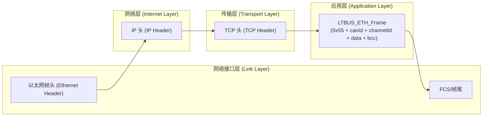

先把结论说在前面：
你现在这套 CANFDNET-400U ↔ GPB(TCP server) 的东西，真正“自己定义的协议”几乎全部都在 **应用层**（Application Layer）。
传输层/网络层/链路层都是 **现成 TCP/IP 协议栈 + 驱动 + 交换机/路由器** 帮你干的，你只是在配置它们（IP、端口、MAC 不在你自己协议格式里出现）。

下面我按“**一条 CAN 报文从分控发出去，到 CAN 盒，再回来**”的路径，把 TCP/IP 四层和你现在的设计一一对上去。

---

## 1. 先把几个角色按层摆一下

### 1.1 你的序列图里的角色，对应哪一层？

* `APP / 分控进程`
* `LTSENSOR`
* `libhelf_cp_ls.so (LTBUS_ETH_*)`
* `ltbus_eth_server` 进程
* `CANFDNET-400U` 里自带的 CAN 报文打包协议（0x55 开头那一堆字段）

👉 这些统统是 **应用层协议/应用层逻辑 (Application Layer)**。
哪怕里面用到 `socket()/send()/recv()`，那也只是“调用传输层服务”，本身逻辑还是应用层。

* `TCP`（socket 的连接/重传/滑动窗口等） → **传输层 (Transport Layer)**
* `IP`（源 IP / 目的 IP、路由） → **网络层 (Internet Layer)**
* `以太网 MAC 帧 + 物理电缆 / 光纤`
  → **网络接口层 / 链路层 (Link Layer)**

`AF_UNIX` + `SHM` 是**本机 IPC (进程间通信)**，严格来说不在 TCP/IP 模型里，只能算“操作系统提供的本地通信机制”，通常也归为“应用层里的实现细节”。

---

## 2. 把你的自定义帧放进 4 层里：它在哪一层？

你在代码里定义的以太网 CAN 盒帧：

```c
typedef struct {
    UINT8 startFlag;   // 0x55
    UINT8 canType;
    UINT8 typePara;
    UINT8 rsv;
    UINT16 dataLen;
} LTBUS_ETH_Header;

typedef struct {
    UINT64 timeStamp;
    UINT32 canId;
    UINT16 msg;
    UINT8 channelId;
    UINT8 dataLen;
    UINT8 data[CAN_DATA_LEN];  // 8 字节 CAN 数据
} LTBUS_ETH_CanFrame;

typedef struct {
    LTBUS_ETH_Header header;
    LTBUS_ETH_CanFrame data;
    UINT8 bcc;
} LTBUS_ETH_Frame;
```

这一整个 `LTBUS_ETH_Frame` 是 **完整地放在 “TCP payload(有效载荷)” 里面的**，也就是：

> 在 TCP/IP 模型里，它是 **应用层协议的数据单元 (Application-layer PDU)**。

所以在“封装”视角上，你现在实际是这样的：

* 应用层：`LTBUS_ETH_Frame = [L2 盒子应用头 + CAN frame + BCC]`
* 传输层：`TCP header`
* 网络层：`IP header`
* 链路层：`Ethernet header + FCS`

可以对照你画的封装图，把名字换成你自己的：



---

## 3. 结合你的序列图，一条报文走一遍 4 层

以 **“APP 发一条 CAN 命令给 CAN 盒”** 为例（Tx path）：

1. `APP` / 分控：

   * 只知道“我要给某个 deviceName 发送 8 字节 CAN 数据”
   * 调用：`LTSENSOR -> Lib -> LTBUS_ETH_DeviceSend(handle, data, len, timeout);`
     （应用层调用应用层 API）

2. `Lib (LTBUS_ETH_*)`（仍然是应用层）：

   * 根据 `handle->deviceCfg` 拿到 `canId / channelId / DeviceDataLen` 等
   * 调用 `LTBUS_ETH_CreateCanFrame()` 生成 `LTBUS_ETH_Frame`：

     * 写入 `startFlag=0x55`、`dataLen=0x18`、`timeStamp`、`canId`、`channelId`、`8字节CAN数据`、`bcc`
   * 调用 `send(clientFd, &ethFrame, CAN_FRAME_LENGTH, 0)`：
     这一步开始，数据交给内核的 **TCP/IP 协议栈**。

3. **传输层 (TCP)**（内核干）：

   * 在 `LTBUS_ETH_Frame` 前面加上 `TCP header`（源/目的端口、序号、ACK、窗口等）
   * 负责可靠传输、重传、乱序重组等

4. **网络层 (IP)**（内核干）：

   * 在 TCP 段前面加 `IP header`（源/目的 IP、TTL、协议号等）
   * 按路由表选下一跳

5. **网络接口层 (以太网 + 物理)**：

   * 网卡驱动在前面再包一层 `Ethernet header`（源/目的 MAC、Type 等），后面加 FCS 校验
   * 通过线缆/交换机/路由器，把以太网帧送到 CANFDNET 盒子所在端口

6. **CANFDNET-400U**（对它来说也是 TCP/IP 的应用层）：

   * 收到以太网帧 → IP → TCP → 得到你的 `LTBUS_ETH_Frame`
   * 再按内部算法解析 `canId/channelId/data`，转成 CAN 报文发到 CAN 总线上

**反向 Rx path** 也是完全对称，只是方向反过来：

* CAN 盒从 CAN 总线收到报文 → 用它的应用协议编码成 `LTBUS_ETH_Frame` →
  走 TCP/IP 四层 → 到 GPB `ltbus_eth_server` →
  解析 `LTBUS_ETH_Frame`，按 `{canId, channelId}` 写入 SHM →
  `Lib` 从 SHM 读最新 CAN 数据返回给 `APP`。

---

## 4. 各个“协议/模块”在四层里的位置清单

### 应用层（Application Layer）

这一层就是你“真正设计的协议”和使用方式：

* `LTBUS_ETH_Frame` 帧格式（0x55 开头、CANID、ChannelId、BCC 等）
* 设备抽象/配置：

  * `EthDeviceListCfg_LS_CP.json` (`DeviceCfgList`, `DeviceList`, `CanId`, `ChannelId`…)
  * `LTBUS_ETH_DeviceListCfg / LTBUS_ETH_DeviceCfg / LTBUS_CanDevInfo` 等结构体
* 应用 API：

  * `LTBUS_ETH_OpenDevice / CloseDevice / DeviceSend / DeviceRecv / GetDeviceDataLen`
* 进程框架：

  * `ltbus_eth_server` 进程：负责接 TCP、解析 `LTBUS_ETH_Frame`、写 SHM、fd-pass
  * `LTSENSOR` / `APP`：作为 CAN 逻辑的最终使用者
* 本机 IPC：

  * `SHM`（共享内存）
  * `AF_UNIX` + `sendmsg(SCM_RIGHTS)` 传 fd
    （严格说不在 TCP/IP 模型里，但从抽象层级上也可以当作“应用层工具”）

### 传输层（Transport Layer）

你只是在调用它，不需要自己设计协议头：

* `TCP (SOCK_STREAM)`：

  * `socket(AF_INET, SOCK_STREAM, 0)` / `bind` / `listen` / `accept` / `connect` / `send` / `recv`
  * `ServerPort` ＝ 8000（在 JSON 里配置）——这是 TCP 端口号
* 内核负责：

  * 建立连接（三次握手）
  * 重传、滑动窗口、拥塞控制
  * 按字节流顺序交付给 `ltbus_eth_server` / `CANFDNET` 的应用逻辑

### 网络层（Internet Layer）

* `IPv4`：

  * `ServerIP` / `ClientIP`（在 JSON 配置里）是你**配置 IP 层行为**的参数
  * 数据包中的 IP header（src/dst IP、TTL …）完全由 IP 栈生成和解析
* 交换机/路由（你 mermaid 图里的“路由”节点）：

  * 如果只是同一网段 + 普通交换机，基本只做二层转发
  * 如果跨子网，则三层路由器会处理 IP 层转发

### 网络接口层（Link Layer）

* 以太网 MAC 帧（Ethernet II 帧头 + FCS）
* Linux 的网卡驱动 / PHY / 交换机端口
* 你只是配置：

  * 网卡 up/down、速率、双工等
  * IP 层绑到这个网卡上
* **你的代码里看不到 Ether header/FCS**，因为你用的是 TCP socket，而不是 `PF_PACKET / SOCK_RAW`。

---

## 5. 你的“RAWDATA 从 L2 收发报文”与 TCP/IP 的关系

需求里有一句话：

> “以 RAWDATA 方式直接从内核 L2 层收发报文”

* 如果真的用 L2 raw socket（例如 `socket(PF_PACKET, SOCK_RAW, htons(ETH_P_ALL))`），那你就会在应用层直接看到：

  * `[Ethernet Header][LTBUS_ETH_Frame][FCS(?)]`
* 这种情况下：

  * 传输层/网络层可以不用（或者你自己在应用层解 IP/TCP 头）；
  * 你自己要处理重传、分片、乱序等，工作量大很多。
* 现在的实现是 **基于 TCP 的流式协议**，所以那句需求可以理解为“逻辑上当作 raw CAN 数据在你的应用协议里传”——物理上还是走 TCP/IP 四层。

---

## 6. 快速记忆版：你的协议在 4 层中的“位置”

你可以简单这样记：

* **应用层**：
  我定义的所有东西：
  `LTBUS_ETH_Frame + JSON 配置 + SHM 结构 + open/send/recv 接口 + UDS fd-pass + 分控业务逻辑`

* **传输层 (TCP)**：
  帮我把这些帧可靠搬过去，用 `socket()/connect()/send()/recv()` 访问。
  我只配 **端口号** 和 **连接方式(client/server)**。

* **网络层 (IP)**：
  帮我找对端机器，用 **IP 地址 + 子网/路由** 匹配路径。
  我只配 **ServerIP / ClientIP**。

* **链路层 (以太网)**：
  帮我在同一个物理网络里送帧，用 **MAC 地址、交换机端口** 带电流/光。
  我只插网线、设 VLAN/速率即可，一般不用编程。

如果你愿意，我可以下一步帮你把这段解释整理成你文档里的一个小节，比如：

> “4.3 本协议在 TCP/IP 模型中的层次关系”

里面配一张简化的 mermaid 图 + 上面这几段文字，直接丢到需求/设计文档里。
