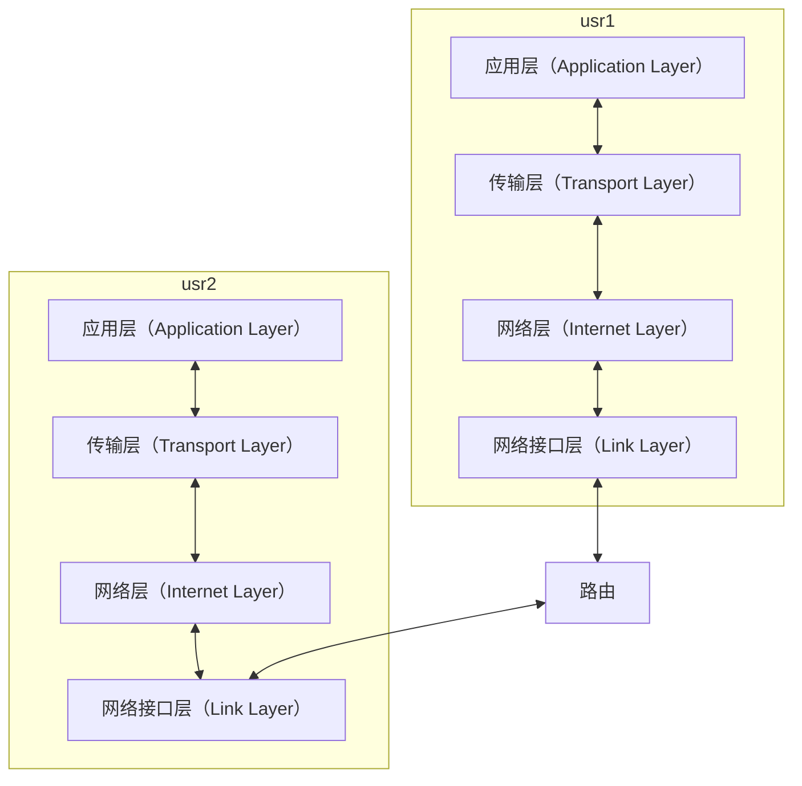
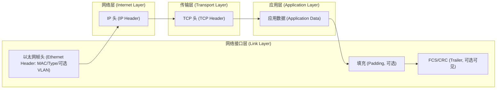
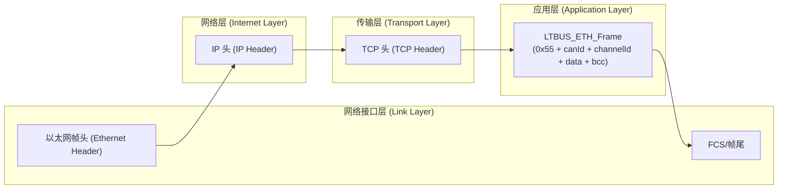
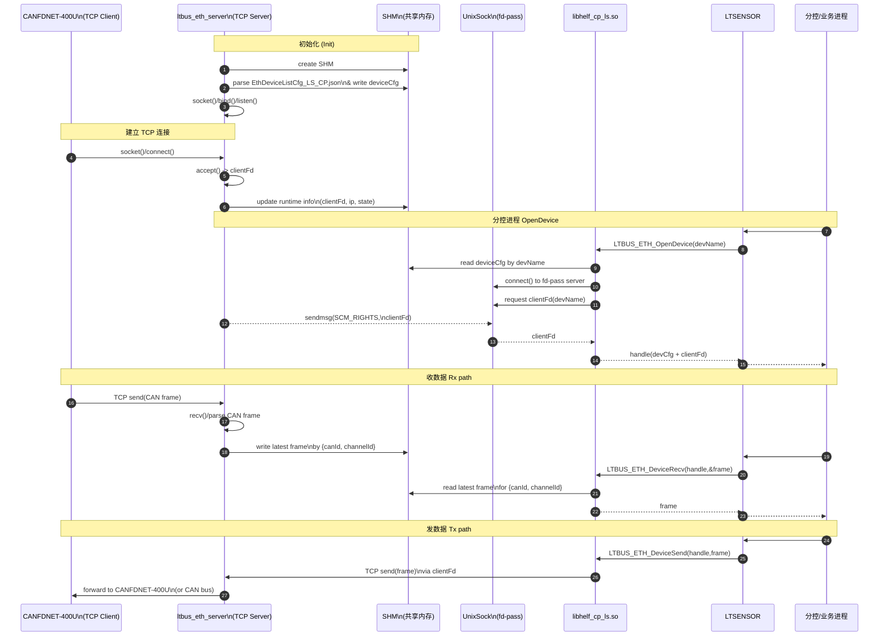

# TCP/IP 网络模型有哪几层？

应用层（Application Layer）
传输层（Transport Layer）
网络层（Internet Layer）
网络接口层（Link Layer）

```mermaid
graph
subgraph usr1
a1["应用层（Application Layer）"]
b1["传输层（Transport Layer）"]
c1["网络层（Internet Layer）"]
d1["网络接口层（Link Layer）"]
a1<-->b1<-->c1<-->d1
end
subgraph usr2
a2["应用层（Application Layer）"]
b2["传输层（Transport Layer）"]
c2["网络层（Internet Layer）"]
d2["网络接口层（Link Layer）"]
a2<-->b2<-->c2<-->d2
end
a3["路由"]
d1<-->a3<-->d2

```

```mermaid
graph LR
subgraph Link["网络接口层 (Link Layer)"]
  E["以太网帧头 (Ethernet Header: MAC/Type/可选VLAN)"]
  P["填充 (Padding, 可选)"]
  F["FCS/CRC (Trailer, 可选可见)"]
end
subgraph Net["网络层 (Internet Layer)"]
  D["IP 头 (IP Header)"]
end
subgraph Trans["传输层 (Transport Layer)"]
  C["TCP 头 (TCP Header)"]
end
subgraph App["应用层 (Application Layer)"]
  B["应用数据 (Application Data)"]
end

E --> D --> C --> B --> P --> F
```

（如果是 UDP，就把 TCP 头换成 UDP 头；如果是 IPv6，把 IP 头换成 IPv6 头 + 扩展头即可。）

```mermaid
graph LR
subgraph Link["网络接口层 (Link Layer)"]
    E["以太网帧头 (Ethernet Header)"]
    F["FCS/帧尾"]
end
subgraph Net["网络层 (Internet Layer)"]
    D["IP 头 (IP Header)"]
end
subgraph Trans["传输层 (Transport Layer)"]
    C["TCP 头 (TCP Header)"]
end
subgraph App["应用层 (Application Layer)"]
    B["LTBUS_ETH_Frame\n(0x55 + canId + channelId + data + bcc)"]
end

E --> D --> C --> B --> F
```

CAN 2 ETH时序图

```mermaid
sequenceDiagram
    autonumber
    participant CAN as CANFDNET-400U\n(TCP Client)
    participant ETH as ltbus_eth_server\n(TCP Server)
    participant SHM as SHM\n(共享内存)
    participant UDS as UnixSock\n(fd-pass)
    participant Lib as libhelf_cp_ls.so
    participant LTSENSOR
    participant APP as 分控/业务进程

    %% 初始化阶段
    note over ETH,SHM: 初始化 (Init)
    ETH->>SHM: create SHM
    ETH->>SHM: parse EthDeviceListCfg_LS_CP.json\n& write deviceCfg
    ETH->>ETH: socket()/bind()/listen()

    %% 建立 TCP 连接
    note over CAN,ETH: 建立 TCP 连接
    CAN->>ETH: socket()/connect()
    ETH->>ETH: accept() -> clientFd
    ETH->>SHM: update runtime info\n(clientFd, ip, state)

    %% 业务进程 open
    note over APP,ETH: 分控进程 OpenDevice
    APP->>LTSENSOR:
    LTSENSOR->>Lib: LTBUS_ETH_OpenDevice(devName)
    Lib->>SHM: read deviceCfg by devName
    Lib->>UDS: connect() to fd-pass server
    Lib->>UDS: request clientFd(devName)
    ETH-->>UDS: sendmsg(SCM_RIGHTS,\nclientFd)
    UDS-->>Lib: clientFd
    Lib-->>LTSENSOR: handle(devCfg + clientFd)
    LTSENSOR-->>APP:

    %% 收数据 Rx path
    note over CAN,APP: 收数据 Rx path
    CAN->>ETH: TCP send(CAN frame)
    ETH->>ETH: recv()/parse CAN frame
    ETH->>SHM: write latest frame\nby {canId, channelId}
    APP->>LTSENSOR:
    LTSENSOR->>Lib: LTBUS_ETH_DeviceRecv(handle,&frame)
    Lib->>SHM: read latest frame\nfor {canId, channelId}
    Lib-->>LTSENSOR: frame
    LTSENSOR-->>APP:

    %% 发数据 Tx path
    note over APP,CAN: 发数据 Tx path
    APP->>LTSENSOR:
    LTSENSOR->>Lib: LTBUS_ETH_DeviceSend(handle,frame)
    Lib->>ETH: TCP send(frame)\nvia clientFd
    ETH->>CAN: forward to CANFDNET-400U\n(or CAN bus)
```
