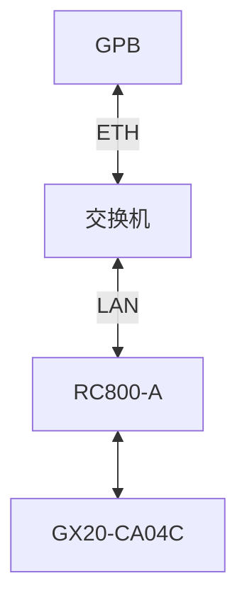
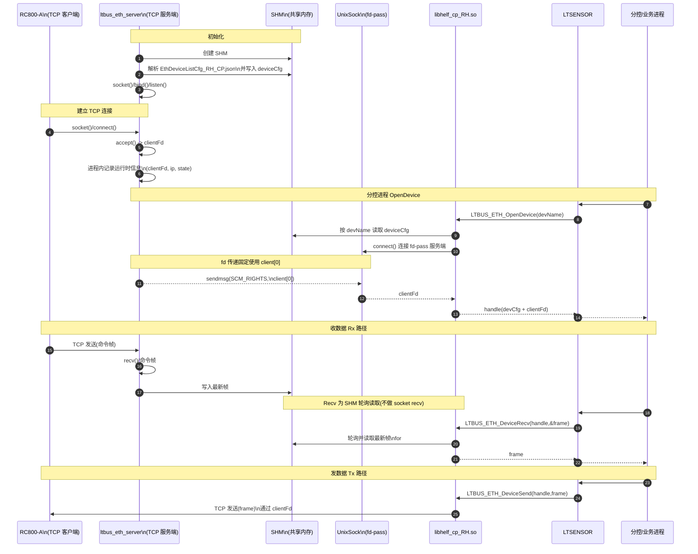

```mermaid
graph

GPB<-->|ETH|交换机<-->|LAN|RC800-A<-->GX20-CA04C
```
GX20-CA04C 为机械手
RC800-A 为对应的控制器
请根据现有的代码和架构分析网口驱动的方案

这样行吗?

```mermaid
sequenceDiagram
    autonumber
    participant CAN as RC800-A\n(TCP 客户端)
    participant ETH as ltbus_eth_server\n(TCP 服务端)
    participant SHM as SHM\n(共享内存)
    participant UDS as UnixSock\n(fd-pass)
    participant Lib as libhelf_cp_RH.so
    participant LTSENSOR
    participant APP as 分控/业务进程

    %% 初始化阶段
    note over ETH,SHM: 初始化
    ETH->>SHM: 创建 SHM
    ETH->>SHM: 解析 EthDeviceListCfg_RH_CP.json\n并写入 deviceCfg
    ETH->>ETH: socket()/bind()/listen()

    %% 建立 TCP 连接
    note over CAN,ETH: 建立 TCP 连接
    CAN->>ETH: socket()/connect()
    ETH->>ETH: accept() -> clientFd
    ETH->>ETH: 进程内记录运行时信息\n(clientFd, ip, state)

    %% 业务进程 open
    note over APP,ETH: 分控进程 OpenDevice
    APP->>LTSENSOR:
    LTSENSOR->>Lib: LTBUS_ETH_OpenDevice(devName)
    Lib->>SHM: 按 devName 读取 deviceCfg
    Lib->>UDS: connect() 连接 fd-pass 服务端
    Note over ETH,UDS: fd 传递固定使用 client[0]
    ETH-->>UDS: sendmsg(SCM_RIGHTS,\nclient[0])
    UDS-->>Lib: clientFd
    Lib-->>LTSENSOR: handle(devCfg + clientFd)
    LTSENSOR-->>APP:

    %% 收数据 Rx path
    note over CAN,APP: 收数据 Rx 路径
    CAN->>ETH: TCP 发送(命令帧)
    ETH->>ETH: recv()/命令帧
    ETH->>SHM: 写入最新帧
    Note over Lib,SHM: Recv 为 SHM 轮询读取(不做 socket recv)
    APP->>LTSENSOR:
    LTSENSOR->>Lib: LTBUS_ETH_DeviceRecv(handle,&frame)
    Lib->>SHM: 轮询并读取最新帧\nfor 
    Lib-->>LTSENSOR: frame
    LTSENSOR-->>APP:

    %% 发数据 Tx path
    note over APP,CAN: 发数据 Tx 路径
    APP->>LTSENSOR:
    LTSENSOR->>Lib: LTBUS_ETH_DeviceSend(handle,frame)
    Lib->>CAN: TCP 发送(frame)\n通过 clientFd

```

```mermaid
sequenceDiagram
    autonumber
    %% =========================
    %% Topology / roles
    %% =========================
    %% RC800-A: Epson robot controller, talks to GPB over Ethernet via switch.
    %% ltbus_eth_server: your resident daemon process on GPB. Owns TCP server socket.
    %% SHM: shared memory region used as fast data plane to publish latest received frame(s) + runtime stats.
    %% UnixSock(fd-pass): local Unix Domain Socket used to pass accepted TCP client fd to lib process (SCM_RIGHTS).
    %% libhelf_cp_RH.so: user-space driver API library used by LTSENSOR module and business process.
    %% LTSENSOR: your upper adapter layer (device abstraction), calls into lib.
    %% APP: business/control process.

    participant CAN as RC800-A\n(TCP 客户端)
    participant ETH as ltbus_eth_server\n(TCP 服务端/daemon)
    participant SHM as SHM\n(共享内存: cfg+runtime+latest-frame)
    participant UDS as UnixSock\n(fd-pass via SCM_RIGHTS)
    participant Lib as libhelf_cp_RH.so\n(driver API)
    participant LTSENSOR as LTSENSOR\n(adapter)
    participant APP as 分控/业务进程

    %% =========================
    %% Assumptions / constraints
    %% =========================
    Note over CAN,ETH: 假设：RC800-A 作为 TCP Client 主动连接 GPB 的 TCP Server。\n若实际为“控制器开端口/上位机 connect”，则建链方向需要反转。\n网络侧依赖交换机 L2 转发，IP 同网段，端口由协议定义(应用层协议自定义/或RC+通信模块实现)。

    Note over ETH: 设计意图：\n1) ETH 负责 socket recv + framing 解析 + DFX 统计 + 写 SHM\n2) 业务侧 Recv 不直接 recv socket，而是读 SHM（latest snapshot）\n3) 业务侧 Send 通过 fd-pass 获得 clientFd 并直接 send（Tx fast path）\n⚠ 该设计在重连/多连接时需额外机制保证 fd 正确性。

    %% =========================
    %% Initialization phase
    %% =========================
    %% ETH init includes: SHM create/mmap, config load, socket listen, optional keepalive/tuning.
    note over ETH,SHM: 初始化阶段（daemon 启动）
    ETH->>SHM: 创建/打开 SHM (shm_open/mmap)\n初始化 layout: header + deviceCfg + runtime + data area
    ETH->>SHM: 解析 EthDeviceListCfg_RH_CP.json\n写入 deviceCfg(devName->ip/port/mode/...) 和默认 runtime
    ETH->>ETH: socket(AF_INET,SOCK_STREAM)\nsetsockopt(REUSEADDR, TCP_NODELAY?, KEEPALIVE?)\nbind(listenIP:port) + listen(backlog)

    Note over ETH,SHM: SHM 语义建议（当前实现可为 latest-only）：\n- deviceCfg: 静态配置（devName/端口/模式等）\n- runtime: 连接状态(state)、ip、rxCnt/txCnt、lastRecvTime 等 DFX\n- data: latest frame（或 ring buffer）\n⚠ 若仅保存“最新帧”，适合状态遥测；不适合严格 request/response 关联。

    %% =========================
    %% TCP connection establishment
    %% =========================
    note over CAN,ETH: 建立 TCP 连接（RC800-A -> GPB）
    CAN->>CAN: socket()/connect(gpb_ip, gpb_port)\n(控制器侧网络任务/应用模块)
    CAN->>ETH: TCP SYN / connect()
    ETH->>ETH: accept() -> clientFd\n记录 peer ip/port
    ETH->>ETH: 进程内记录运行时信息\n(clientFd, ip, state=CONNECTED)\n更新 SHM.runtime (state/ip/connectCnt)

    Note over ETH: 重连/断线策略（需在实现中体现）：\n- detect: recv()==0/ECONNRESET/超时\n- on disconnect: state=DISCONNECTED, close(clientFd)\n- on reconnect: accept 新 fd，并更新 runtime\n⚠ 若业务侧持有旧 fd，send 会失败(EPIPE/ECONNRESET)，需要错误处理与重新 Open/获取 fd 的机制。

    %% =========================
    %% Business OpenDevice + fd-pass
    %% =========================
    note over APP,ETH: 业务进程 OpenDevice（获取 devCfg + clientFd）
    APP->>LTSENSOR: OpenDevice(devName)
    LTSENSOR->>Lib: LTBUS_ETH_OpenDevice(devName)\n(创建 handle: cfg + transport info)
    Lib->>SHM: 按 devName 查找 deviceCfg\n并读取 runtime/state 作为校验
    Lib->>UDS: connect() 到本地 fd-pass 服务端\n(Unix Domain Socket, stream)
    Note over ETH,UDS: fd-pass 语义：ETH 通过 sendmsg(SCM_RIGHTS)\n把某个已 accept 的 clientFd 复制到 Lib 进程。\n⚠ 当前实现固定使用 client[0]：\n- 默认只支持单连接/或“第0个连接”为目标设备\n- 多设备/多连接时会错配\n- 重连后 fd 变化，旧 fd 可能失效

    ETH-->>UDS: sendmsg(SCM_RIGHTS, client[0])\n(传递文件描述符副本)
    UDS-->>Lib: clientFd (process-local fd)\nLib 保存到 handle.transport
    Lib-->>LTSENSOR: handle(devCfg + clientFd)\n(后续 Send/Recv 使用)
    LTSENSOR-->>APP: device handle ready

    %% =========================
    %% RX path: controller -> daemon -> shm -> lib poll
    %% =========================
    note over CAN,APP: 收数据 Rx 路径（RC800-A -> ETH -> SHM -> Lib -> APP）
    CAN->>ETH: TCP 发送(frame)\n(状态/遥测/应答等)
    ETH->>ETH: recv() 读入 stream\n进行粘包/拆包 framing（按 start flag/len/CRC/BCC 等）
    ETH->>ETH: 校验失败丢弃 + DFX 计数\n校验通过分发到 RecordClientMsg/handler
    ETH->>SHM: 写入“最新帧/最新状态”\n更新 runtime.rxCnt/lastRecvTime/state
    Note over Lib,SHM: Recv 侧策略：不从 socket recv，而从 SHM 读取。\n当前是轮询(poll)读取 latest frame。\n⚠ 建议用 seq/version 或 ring buffer 避免丢帧；\n⚠ 轮询应有 sleep/backoff 或 futex/eventfd 避免 CPU 空转。

    APP->>LTSENSOR: Read/Recv request
    LTSENSOR->>Lib: LTBUS_ETH_DeviceRecv(handle, &frame)\n(从 SHM 获取)
    Lib->>SHM: 轮询读取最新帧\nfor(尝试N次){\n  if(new_frame_available) break \n  usleep/backoff\n}\n(可结合 lastRecvTime 或 seq/version)
    Lib-->>LTSENSOR: frame (latest snapshot)
    LTSENSOR-->>APP: frame/state delivered

    %% =========================
    %% TX path: app -> lib -> send on passed fd -> controller
    %% =========================
    note over APP,CAN: 发数据 Tx 路径（APP -> Lib -> TCP send -> RC800-A）
    APP->>LTSENSOR: SendCommand(frame)
    LTSENSOR->>Lib: LTBUS_ETH_DeviceSend(handle, frame)
    Lib->>Lib: 可选：对 frame 做封包\n(start flag/len/checksum) + DFX++
    Lib->>CAN: send(clientFd, frame)\n(直接用 fd-pass 得到的 clientFd)

    Note over Lib,CAN: Tx 风险点（必须在实现中处理）：\n- 若 daemon 断线重连，业务侧 fd 变 stale，send 可能返回 EPIPE/ECONNRESET\n- 多线程并发 send 需要互斥（mutex）避免帧交织\n- 如果未来 daemon 也需要发送（心跳/订阅/ACK），则必须统一发送路径，否则并发写更难控

```