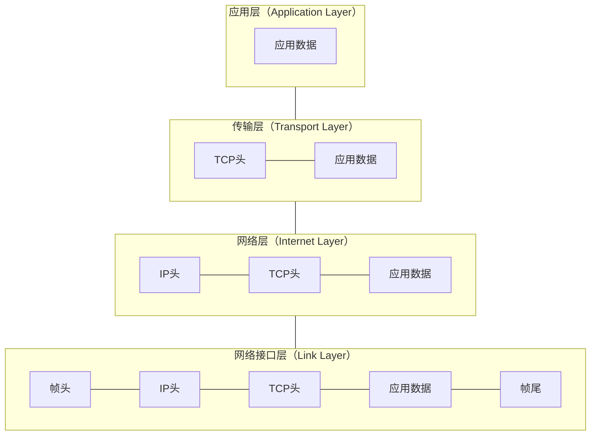
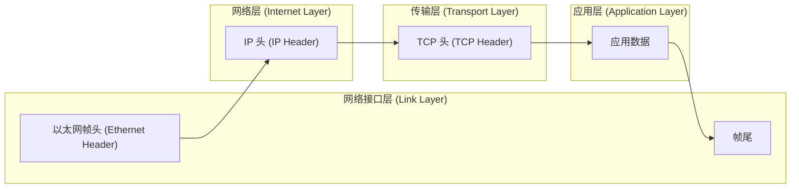

修改版应该比第一版更准确吧
每一层的封装格式

```mermaid
graph
subgraph sub1["应用层（Application Layer）"]
a1["应用数据"]

end
subgraph sub2["传输层（Transport Layer）"]
a2["TCP头"]
b2["应用数据"]

a2---b2
end
subgraph sub3["网络层（Internet Layer）"]
a3["TCP头"]
b3["应用数据"]
c3["IP头"]

c3---a3---b3
end
subgraph sub4["网络接口层（Link Layer）"]
a4["TCP头"]
b4["应用数据"]
c4["IP头"]
d4["帧头"]
e4["帧尾"]
d4---c4---a4---b4---e4
end
sub1---sub2---sub3---sub4
```
修改版:

```mermaid
graph LR
subgraph Link["网络接口层 (Link Layer)"]
    E["以太网帧头 (Ethernet Header)"]
    F["帧尾"]
end
subgraph Net["网络层 (Internet Layer)"]
    D["IP 头 (IP Header)"]
end
subgraph Trans["传输层 (Transport Layer)"]
    C["TCP 头 (TCP Header)"]
end
subgraph App["应用层 (Application Layer)"]
    B["应用数据"]
end

E --> D --> C --> B --> F
```