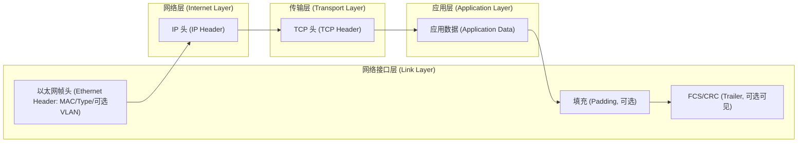

对，你这个“修改版”整体更接近真实的**线上比特流封装顺序（on-the-wire order）**，也更不容易让人误解。

你第一版的问题主要在于：它把上层已经封装好的内容，在每一层里又“展开画了一遍”，容易让人误以为**每一层都各自单独保存一份 TCP 头/应用数据**。更准确的理解是：

* **传输层的 payload = 应用数据**
* **网络层的 payload = 传输层整个报文（TCP头+应用数据）**
* **链路层的 payload = 网络层整个报文（IP头+TCP头+应用数据）**
* 每下沉一层，只是**在“整体 payload 外面再包一层头/尾”**

你修改版的线性表达（Ethernet Header → IP Header → TCP Header → App Data → Trailer）正是这个意思，所以更准确、更直观。

有两点小修正建议，让它更“工程级准确”：

1. **“帧尾”建议写清楚是 FCS（Frame Check Sequence）**

   * 以太网的尾部一般指 **FCS/CRC32**。
   * 但很多抓包（比如常见网卡/驱动）会把 FCS 剥离掉，你在抓包里可能看不到它——这不影响它在线上存在。

2. **链路层还可能有 Padding（填充）与 VLAN tag（可选）**

   * 以太网最小帧长要求可能导致 payload 不足时填充。
   * VLAN 会插在 Ethernet Header 里（严格说是扩展头）。

如果你想把这些也体现在图里，可以改成这样（仍然保持你修改版的风格）：

（如果是 UDP，就把 TCP 头换成 UDP 头；如果是 IPv6，把 IP 头换成 IPv6 头 + 扩展头即可。）
